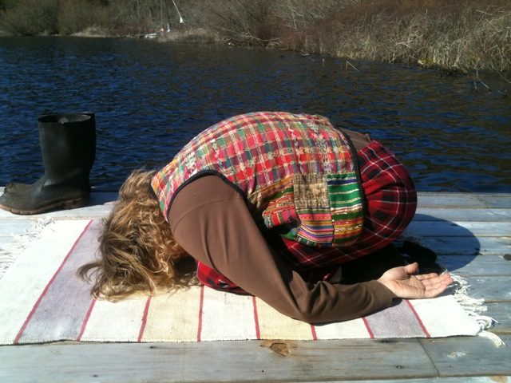
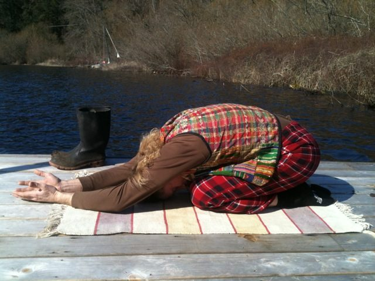
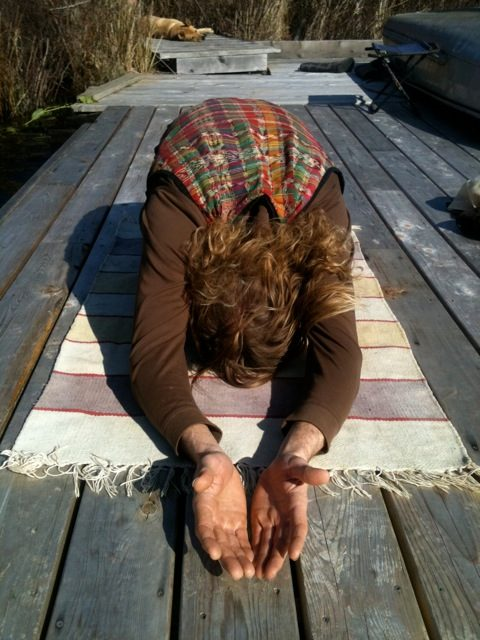
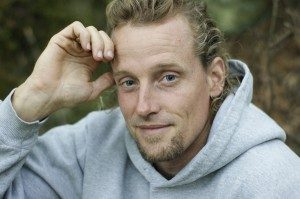

 Balakasana
The pose I commonly find myself in is Child’s Pose (Balakasana) and the many variations of having my knees pulled in close to my chest.
Physically it does many things; however, I notice these qualities:

- It lengthens the lower lumbar region, which is a common area that experiences contraction.
- When on the knees with the arms by the sides, it allows the shoulders to relax over the knees and lengthen the back of the neck, areas that can commonly hold stress and tension.
- Internally in the mid-section, it gives space to the kidney and adrenal gland area.
- It also brings more awareness to the breath as the lung capacity is reduced, offering a much quieter and softer breath.

Quite often Child’s Pose is the second posture I offer in a Yin Yoga class, right after Savasana. I find it to be a great starting point to the class as it offers the time to relax, slow down from the busyness of life, look inward and set some intentions.
 Balakasana, arms extended, palms up
**Progressing Through the Posture**There are a few stages I like to progress through with Child’s Pose:

1. Initially, knees are on the floor, toes extended, torso curled over the tops of the thighs with the arms relaxed by the sides of the legs, and if possible, the forehead lightly resting on the floor.
2. After a minute or two, extend the arms along the floor above the head with the elbows relaxed - and notice.
3. Walk the fingers away, extending the arms as far as feels comfortable, and notice, perhaps, a difference in the quality of the breath.
4. Bring the hands together with palms facing up with the pinky fingers touching. At this point there is a beautiful quality to the posture, with hands forward and open to the sky, as if making an offering to the divine. And, as many of you know, in the giving there is the receiving with hands open to catch the abundance.

 Balakasana
**Modifications**Here are some modifications for those who have challenges with their:

- **knees:** Place a bolster under the buttocks on top of the calves
- **ankles:** Put some support under the ankles, like a rolled up towel or the end of the yoga mat
- **neck:** Place a foam block under the forehead.

Child’s Pose has a humble quality that is nice to relish. I am not sure if you have ever found yourself down on your knees in a complete sense of helpless surrender. When that happens, what follows is usually very unexpected, perhaps even described as miraculous.
**About the instructor**Neil Mark is a SSCY YTT grad from 2003, a super jock gone yogi. Neil lives on Salt Spring and teaches regularly at the Centre’s Yoga Getaways and the Annual Community Yoga Retreat. He can can also be found chanting at satsangs on Sundays.
