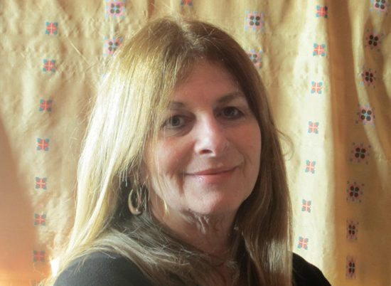 Candrika Lajeunesse, part of our satsang family
I was born on February 12, 1950, the same day as Abe Lincoln and Charles Darwin. Can you believe that those two were actually born in the very same year as each other? 1809, one in the USA and the other in England.
I grew up in Montreal with my brother who was five years older than I - Jerry (AD [Anand Dass] Tabachnick) and our mom and dad, Vivian and Louis. I have strong memories from our childhood, of playing scrabble with AD in his room, which usually had many orange peels lying about. We would also play a game of fast breathing - unbeknown to us at the time we were doing kapalbhati!
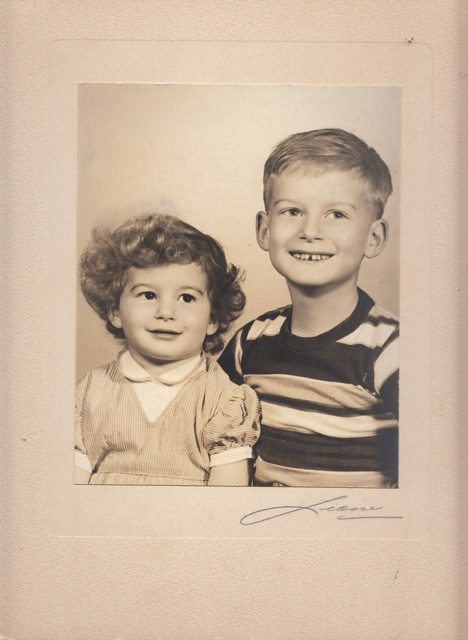 Chandrika and brother, AD
I recall AD inviting me to meet Ram Dass at a dinner, and shortly after that AD went to India to study with Babaji. I drove him to the train station. He was heading to New York, and from there to India. In typical AD fashion he had his belongings in only a large paper bag.
AD has always been a teacher for me. When he came back from India, he’d talk about yoga very naturally in our conversations, and I always appreciated that he shared it with me.
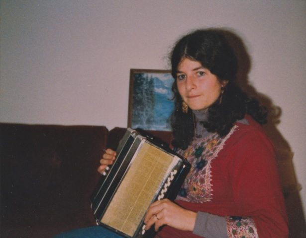 Early 80's, ("I still can't play this - one day!")
I graduated from McGill with a BA in psychology and then moved to the Gaspesie to do homesteading with my French Quebecois boy friend and close friends. During this time I attended a yoga retreat with Babaji in Ontario. I flew out to attend Dharma Sara’s first yoga retreat in White Rock, and AD and Ravi Dass met me at the airport; they were sitting on the ground in lotus position. That felt very natural to me as I was living in a French hippy community in the Gaspesie at the time.
When I met Babaji at the retreat, it was clear to me that there was a special energy in his presence. Several years later I moved back to Montreal from the Gaspesie, then came out to BC to attend my brother’s wedding to Kalpana, and remained in Vancouver. I worked at Rainbow’s End daycare centre which Dharma Sara Satsang had opened. Around that time I met Harvey Lajeunesse, my wonderful husband, while tree planting in BC. In 1983 I attended SFU for my teaching certificate program.
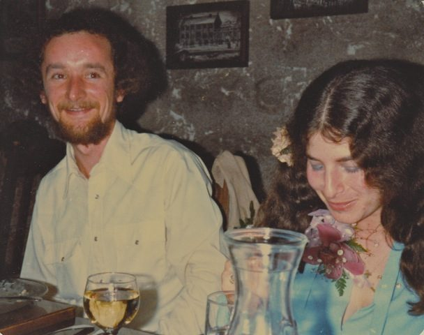 Chandrika and Harvey get married, February 1981
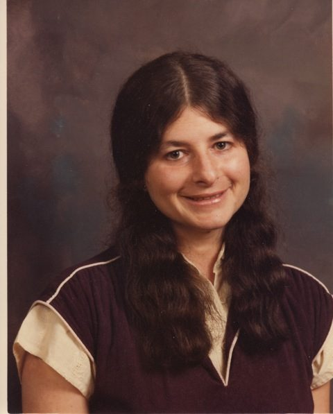 Chandrika at the start of her teaching career, 1985
When AD passed away in August, 1988 we were devastated but on the very first year anniversary of his shradha memorial, our son Jarrad was born, and this eased our grieving. Named after Uncle AD, we turned Jerry into "Jarr", added AD to the end; that is how we came up with that particular spelling of Jarrad’s name. Lisa was almost 3 years old and from day one she adored her brother, and they still are very close and great friends. Lisa, almost 2, had been present to say goodbye to Uncle AD in his hospital room where he died.
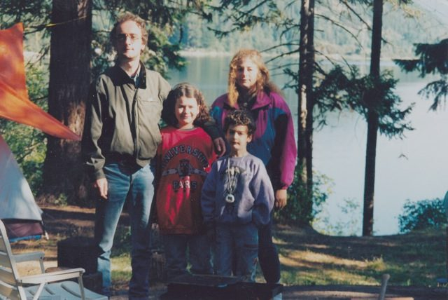 Camping, a Lajeunesse family tradition
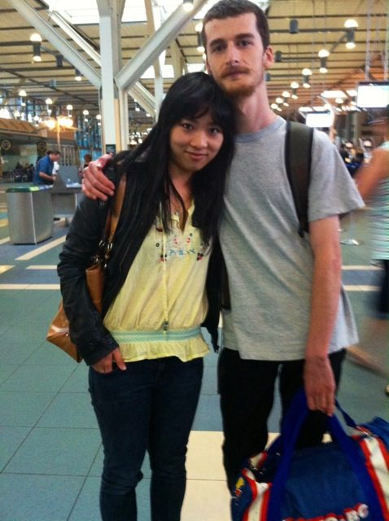 Jarrad with his girlfriend Emily, at the airport on his way to art school
A couple of years later, on AD’s birthday – June 29 - I decided to make some copies of tapes in which AD was discussing the brain and yoga. As a child AD was a great yoyo player. So there I was, very emotional, trying to choose which cassette tapes to buy to make the copies. I was looking all around in London Drugs when I came upon something that blew me away. I had never seen anything like it - a large barrel full of blank cassette tapes from California, arranged in packages of 3 cassettes, each with a yoyo, all wrapped in cellophane together. I looked up towards the sky and said - ok AD, I will buy these cassettes, thanks for the help. When else did they ever sell cassette tapes with yoyos?
Our children Lisa (Sushila) and Jarrad (Raman) were raised going to satsang in Vancouver and attending various events at the SSCY during the year, including the annual yoga retreats. What a wonderful way to raise children! We all feel it is such a privilege and blessing to have been in Babaji's presence so many times over the years, the kids catching candy prasad from him - so special.
Being given the name Chandrika (moonlight) had extra meaning to me because I had taught myself about the moon cycles back in the 70’s sleeping on the beach in Mexico. The waxing moon follows the sun towards the west and the waning moon leads the sun towards the west. I figure the moon rises about 48 minutes later each day (24 hours divided by 30 days = .8 and .8 of an hour = 48 minutes.) Yes?
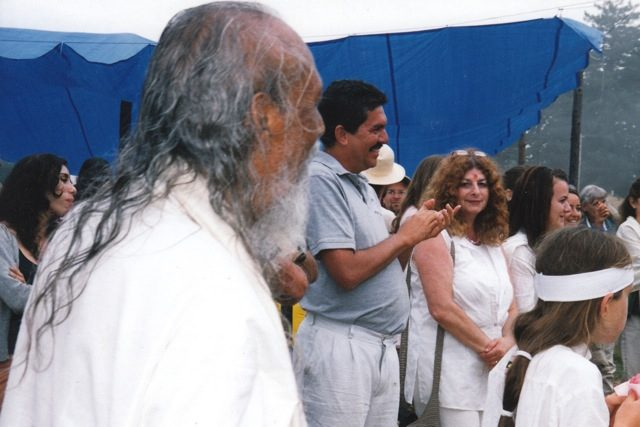 Chandrika and daughter Lisa, Guru Purnima MMC, 2005
Seeing the Centre evolve from the time of purchase in 1981 to its present state is a testament to the teachings, leadership, hard work and profound community spirit. The teachings, the magic of the retreats - talent shows, Hanuman Olympics, asanas, pranayama, meditation, enormous meal circles, fabulous food, reverberating Om’s, chants and music, Ma Renu, all the people, the gardens, the mound, Latté Da, the rock wall construction, Babaji’s omnipresence. I am so very grateful to have experienced all this. Working on the kids’ program at retreats was always great. Sharada used to give me long lists of supplies to get on the mainland. For a couple of years way back, Harvey and I hauled the high jump mat (several feet thick) to the Centre in our truck.
Having led many kirtan chants at Vancouver’s satsang was also so special. Another very important influence in my life is being part of this community in which age was not a factor. I have strong images of people teaching and working hard in this community well into their 70s and 80s. And so at 63 I continue to teach music and French at elementary school in the Coquitlam area. I love doing it - part time now - and haven’t felt the need to “retire” because of the strong image of people of all ages working together at the retreats at both SSCY and Mount Madonna Center. My aunt is 76 and teaches yoga in Montreal to seniors.
Jarrad did his Yoga Teacher Training at the SSCY in 2010. For me on an emotional level this completed a beautiful cycle - for our son - AD’s nephew - to be taught by several people who were AD’s students and friends, and Auntie Kalpana. I am so grateful that Jarrad had this opportunity to learn about his uncle whom he had never met and that everyone made personal connections to Jarrad regarding Uncle AD.
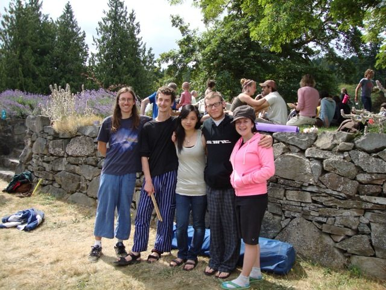 Jarrad and friends (including sister Lisa and her now-husband Eric) at the rock wall
We have great Lajeunesse family parties and yearly camping gatherings with Harvey’s brothers, sisters-in-law and all our young adults and kids. I discovered a number of years ago that my sister-in-law, Gayle, has an aunt whose son lives at Mount Madonna. How incredible - quite the link from my husband’s side to our Babaji side. Madhukar is Gayle’s cousin, and his mother of 90ish years had been AD’s student back in the 70s. And my other Lajeunesse sister-in-law, Marnie, has a brother who lives on SSI and works with Ramanand. Small world!
My mother of 89 lives with us, and we feel it is an honour to care for her at this stage of her life. We all refer to her lovingly as “G-ma”. Still intelligent, loving, with a great sense of humour, she needs assistance because of memory issues. My kids always found it awesome to have a grandma living with us (15 years since my dad passed away). She is the epitome of “be here now” because her short-term memory doesn’t permit her to be anywhere else but in the present moment. We are continually learning from her; we see how she embraces her memory shortfalls with laughter - and that’s a good teaching I hope I can hold onto!
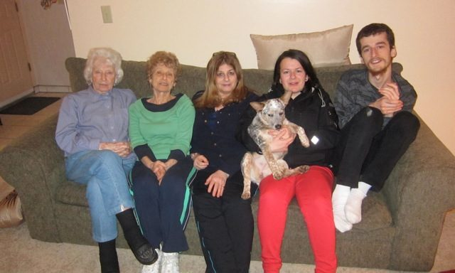 Ad and Chandrika's mom Vivian (89), her sister Ruth, Chandrika and kids Lisa and Jarrad
And speaking of grandparents, we are all so excited for the upcoming birth of Lisa and Eric’s baby boy in July. Naturally we will look for that little bit of Uncle AD again in his “great nephew” to be. Will this child carry on some of those “eccentric behaviours” known to our family?? I’m sure we will spot a few over the years to come.
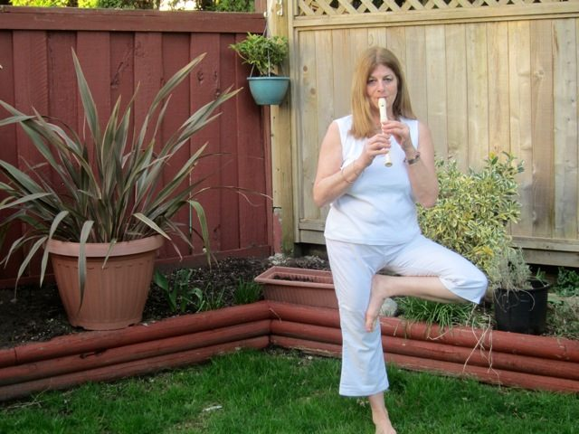 Playing the recorder in the yard
With much love and gratitude
OM
Chandrika
