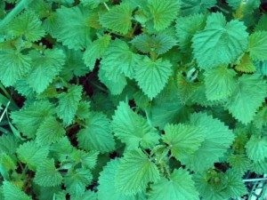
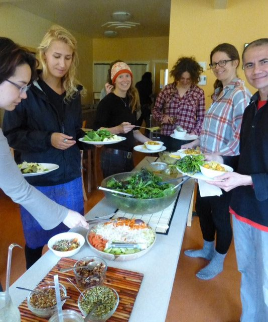
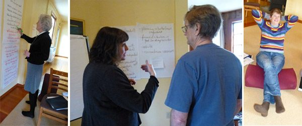
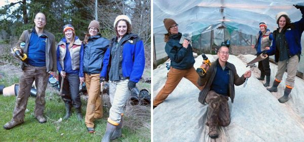
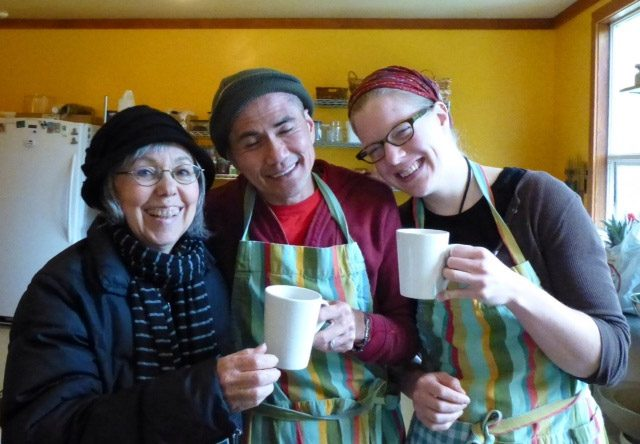

[caption id="attachment\_6751" align="alignright" width="300"] The nettles are here - a sure sign of spring[/caption]
Although it’s been in the air for a while, spring officially arrived a couple of weeks ago. It may not be so on the day this arrives in your inbox, but today the sun is shining and the sky is clear blue with only tiny wisps of clouds.
Our community has grown once again, and we are delighted to welcome our wonderful team of karma yogis - several for the full season, others for the 3-month KYSS program. The meals are amazing, thanks to both the farmers and the cooks. The housekeeping crew has been doing some deep cleaning in the house, while the maintenance and landscape crew continues to beautify the grounds and keep everything working. Meanwhile the office staff is busy with all the work related to programming, registration, scheduling and the many, many daily tasks of keeping the Centre organized.
[caption id="attachment\_6750" align="alignnone" width="481"] Dinner time with Karma Yogis Laura, Sam, Sherri, Lisa, Christine and Van[/caption]
With such a strong team in place, the first Yoga Getaway of the season went off with nary a hitch. It’s always a pleasure to be able to welcome people to the Centre and provide the teachings, the best food on the island (and beyond) and the experience of peace.
A week prior to the Yoga Getaway, the DS Board and Panchayat (group of elders) and the department managers held a strategic planning meeting with the same facilitator who guided us through the process a couple of years ago. It was gratifying to note that so many of the goals we had set at that time have been met, with others in progress.
[caption id="attachment\_6753" align="alignnone" width="600"] Strategic planning with Chandra, Lakshmi, SN and Carol[/caption]
Jack reports that the farm yogis are an enthusiastic group - all women except for him. The salads that are coming from the farm are amazing! The big news of the moment is that all six varieties of potatoes are planted - a lot of potatoes. There are also 29 varieties of tomatoes in the greenhouse. Last week the farm crew spent a day repairing and recovering one of the greenhouses after a big wind ripped the plastic off. In other farm news, the new (to us) farm truck has a name, following the truck-naming competition on our Facebook page. The fifty suggestions were winnowed down by community members’ votes, and the six names with the highest number of votes were posted on FB for the final vote. The envelope please: [Welcome Jai Mazdananda](https://www.facebook.com/photo.php?fbid=10151377725682800&set=pb.94876812799.-2207520000.1364878181&type=3&theater)! - and congratulations to Patrick Hogan for suggesting the winning name. His prize was a copy of ‘The Salt Spring Experience’ and a variety of saved seeds from the farm.
[caption id="attachment\_6754" align="alignnone" width="600"] Jack and the new members of the farm team, Sherri, Christine and Lisa[/caption]
Coming up in the third week of May is a big celebration of Babaji’s 90th birthday at Mount Madonna. Please [follow this link](https://saltspringcentre.com/2013/03/a-special-celebration-babajis-90th-birthday/) to read the invitation. If you would like more information, or if you plan to attend, please contact either Lakshmi - [lakshmi@saltspringcentre.com](mailto:lakshmi@saltspringcentre.com) or Sharada - [sharada@saltspringcentre.com](mailto:sharada@saltspringcentre.com).
Some features to check out this month: The [Founding Member profile](https://saltspringcentre.com/tag/founding-member-feature/) (now renamed Our Satsang Community) this month features [Chandrika Lajeunesse](https://saltspringcentre.com/2013/03/our-satsang-community-chandrika-lajeunesse/). Chandrika has been part of our satsang community since the 70s; her brother, AD (Anand Dass) was Babaji’s first North American student, and the first yoga teacher in the Dharma Sara community. Chandrika began learning yoga from AD before she met Babaji.
The YTT grad article features Kishori Hutchings, one of the Centre’s founding members, who did her yoga teacher training the first year it was offered here, and who continues to teach, along with the many other gifts she shares with the community.
The [Asana of the Month - Child’s Pose](https://saltspringcentre.com/2013/03/asana-of-the-month-balakasana/) - is by Neil Mark, who teaches at the Centre during Yoga Getaways. He graduated from our YTT program in 2003 and describes himself as an extreme athlete turned yogi.
Planning for our Annual Community Yoga Retreat (August 1 - 5) is underway, and we are actively seeking an ACYR Coordinator. This will be a short-term contracted position. If you are interested, please contact Lakshmi: lakshmi@saltspringcentre.com for more information.
[caption id="attachment\_6752" align="alignnone" width="576"] Sharada visits Van and Hannah in the kitchen[/caption]
We welcome you to keep in touch by commenting on the various articles in this newsletter and by reading - and commenting on - postings on our Facebook page. It’s always wonderful to hear from people in our extended family.
With gratitude and love in this season of growth,
Sharada
