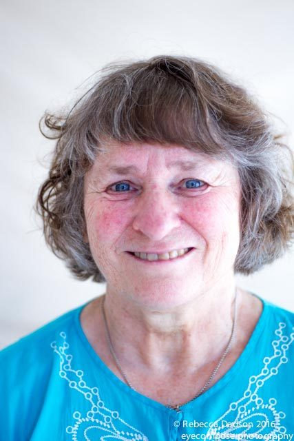

**Where do you live? What do you do in your life apart from yoga? **
I live on Salt Spring and have for over 30 years. Apart from volunteering at the Centre and teaching aspects of yoga, I'm retired, now living about 10 minutes drive from the Centre. I spend a lot of time gardening, walking and swimming - and of course, spending wonderful times with my husband of almost 40 years and playing with my sweetie-pie dog.
**How did yoga come to be a part of your life? What attracted you to the SSCY YTT program?**
I started practicing yoga in 1971 - quite a while before I met Babaji - mostly because of listening to a recording of ‘Be Here Now’ by Ram Dass, after which I bought the book. When I came across the photo of Babaji, I remember thinking - and maybe even saying out loud - “Oh I'd love to meet someone like that!”
In those days, I went to asana classes for a while but never really got it. I met Babaji in 1974 after my husband and I had gotten together, and I was completely smitten. I tried to do the things that Babaji suggested. Although I wasn’t into asana, Babaji gave me his blessing to continue teaching fitness and going to dance classes; he told me it was good for me. I didn't really get into asana until much later when I met a wonderful asana teacher on Salt Spring.
We moved to the Island shortly after the Centre property was purchased in 1981 with our then 3 month old daughter. I did a lot of karma yoga in those days - getting the centre ready for all the programs and trying to clean up and organize the property; it was a mess back then and needed a lot of tlc - and we worked hard at cleaning, painting, and many other things. I had started teaching yoga as well, and then in about 2000 or 2001, my friend Kalpana told me I needed to get certified. I was in the first graduating class of 2002. .
**What aspect of yoga has had the most transformative effect on your life? What surprised you the most about the practice of yoga? How has your understanding of yoga deepened?**
Through the program, which I found very challenging, I learned that I had a lot of strength and that some of the teachings I actually knew quite a lot about, which gave me time to focus on the stuff I had not learned before. I was 50 that year - with sore knees, sore back, injured hips - and I found the sitting very difficult, but I also surprised myself by how well i did in the program and how great it was to graduate.
I think what transformed me the most was learning to relax and not try so hard, not to force the pranayama and meditation, but to relax and go deep into the practices, especially kirtan. I Iearned to open myself and see what was inside.
**Please share some memorable moments from YTT.**
I remember doing my practicum for both asana and pranayama, and feeling great about how well those had gone. There definitely were and still are things that I have to look up sometimes, but that's why we have a primer and a binder packed with information. I remember the laughter and the singing. And I remember so many of my classmates - both young (my daughter's age) and older than me. It was wonderful.
I love teaching at the Centre - pranayama and meditation and restorative yoga classes. Those are my favourite things - plus I love to sing and am involved with the Centre’s satsang committee and am at Satsang most Sundays, singing my heart out. As I age, I'm working on positive qualities - being tactful, being compassionate, being tolerant, being kind and being warm and welcoming to everyone. And as I work on these things, I'm finding happiness and contentment in most aspects of my life. It's really true: you work on yoga and yoga works on you.
**Do you have any favourite quotes?**
I think my favourite quote is "teach to learn" - I have learned so much more by teaching - doing research to make sure my classes are right, learning from the students, working to solve their problems, and in doing so, many of my problems go away. What a wonderful thing!
**What can students expect from the [SSCY Yoga Teacher Training](https://saltspringcentre.com/yoga-teacher-training/)?**
For anyone wanting to enrich their lives, this program is fantastic. It will deepen your own practice even if you decide not to teach.
--
Read more about Kishori's story and her connection with the Centre in her [Founding Member Feature](https://saltspringcentre.com/founding-member-feature-kishori-hutchings/).

### For information about the Salt Spring Centre of Yoga’s YTT program, visit:

[Yoga Teacher Training home](https://saltspringcentre.com/programs-retreats/trainings/yoga-teacher-training/)
