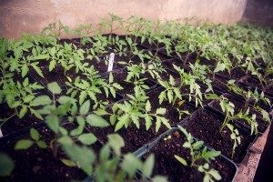

Farm haiku of the day:
**Lovely tomatoes,
Awaiting in the future,
Such sweetness to come!**
Great news! We recently potted-up our tomatoes and they're looking mighty fine. In early May, they'll be transplanted into one of our greenhouses, taking the place of our soon-to-be harvested crop of carrots, and thus creating the "House of Tomatoes" (we will also have the "House of Eggplants and Peppers", not to mention the very fragrant "House of Basil").
Along the same line of summer harvests, we recently seeded the first batch of summer squash (zucchini), winter squash, cucumbers, and melons. Of the varieties we seeded, some of you may remember the remarkably scrumptious--and cute--Lemon cucumbers, and the UFO-like Sunburst summer squash. We also have some you may no know, but may be very interested in trying, such as the Ninja Asian cucumber--likely the winner of the best name category, but also distinct from Western cucumbers in that the skin is very soft of sweet--and also the Dumpling winter squash, a delicious and beautiful acorn squash with tiger-like green striations. For a little fun, we also seeded a few of Dill's Atlantic Giant Pumpkins, which have fruit that can easily get up to 100-200lbs or even 1000lbs!
Our spring crops are ongoing, of course, and you'll find our farm stand stocked every Friday afternoon with a fresh batch of salad mix, spinach, and kale. A new addition this week will be French Breakfast radishes. Try them with just a dab of salt! Be sure to come early in the week, as we do tend to sell out!
May the sun be bright and plentiful!
The Farm Team
