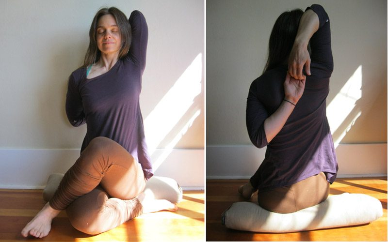
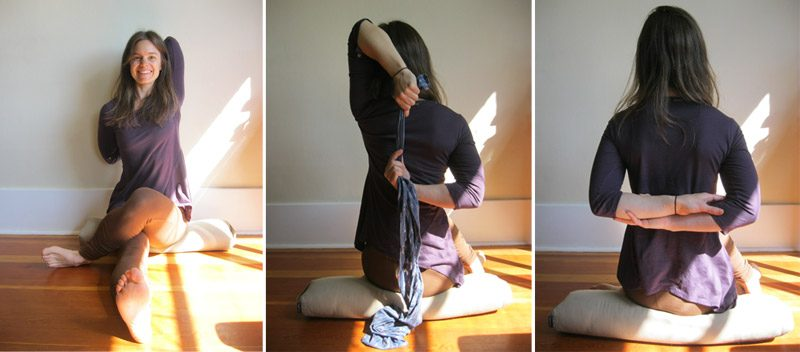

### Gomukhasana (cow’s head pose) (go-moo-KAHS-anna) go = cow (Sanskrit "go" is a distant relative of the English word "cow") mukha = face

 Full Gomukhasana pose (front view and back view)
First off, I must admit that this is my least favourite yoga asana. Up until now, I have mostly managed to avoid practicing it and teaching it, but I often find myself in a yoga class saying things like, ‘Your greatest gift in yoga is finding a pose you can’t stand to be in. This is the pose for you!’ So, when asked to write an Asana of the Month piece for Offerings, Gomukhasana instantly came to mind.
I have short muscular limbs, a long torso, and naturally inwardly rotated thighs. This pose seems to stretch every tight muscle I have, all at once, which apparently includes ankles, hips and thighs, armpits and triceps, and chest. My fullest expression looks nothing like the images I've seen of this pose being demonstrated in books and online.
The traditional version of this pose is seemingly quite straightforward to execute.

1. From Staff pose (dandasana) bend both knees and bring the soles of the feet onto the mat. Bend the right knee, bring the heel towards the left hip, and the thigh towards the center line of the body. Flex the foot to protect the knee. Bring the left knee on top of the right knee, bend it to bring the left heel to the outside of the right hip, and again the foot. Allow both sitting bones to rest evenly on the floor.
2. Lift the left arm to shoulder height at the front of the body and turn the palm up to face the ceiling. Reach the arm overhead and bend the elbow to bring the hand to rest between the shoulder blades. Bring the right arm down by the right side of the body and rotate it clockwise so the palm faces out to the right. Bend at the elbow and reach fingertips toward the left hand. Clasp hands at fingers and pull arms towards center line of body.

**Gomukhasana for the rest of us**
For many of us, this full expression of Gomukhasana is not physically possible at present, or at least for any length of time. Here are some gentler variations of Gomukhasana for the rest of us!
 Gomukhasana modifications

- Elevate the hips on a block or bolster to tilt the pelvis forward and allow for an upright neutral spine.
- Allow the right leg to remain straight, bend the left knee over the right knee, and bring the left heel towards the outside of the right hip.

 **Modification 2**

- After bending the right knee and bringing the heel toward the left hip, bend the left knee but place the sole of the left foot on the floor on the right side of the thigh, and do not stack the knees.
- If the hands do not reach each other, hold a strap in the left hand, and grab onto it with the right. Walk the hands slowly towards each other.

 **Modification 3**

- Bring both arms to your sides, with palms facing behind you, and grab opposite elbows.

**Break the pose up**

- Move into Gomukhasana legs, and rest arms on knees, while holding for as long as is comfortable.
- Release the legs and come into an easy sitting position to move into Gomukhasana arms, and again hold for a while.

Once you've found your appropriate expression of this pose, inhale and lengthen the spine, and open through the heart centre. Exhale, engage the pelvic floor, and the deep belly muscles. In a "yang" style, or more vigorous practice, one minute on each side is a good place to start. If there is obvious tightness on one side, you might start with the tight side and then end with it as well. To deepen the pose, press the arms away from the back, and bring the torso towards the thighs, with the intention of keeping a neutral spine. In a "yin" yoga practice, this pose is called shoelace; after a minute the arms are released, the back rounds forward, and the muscles relax completely to hold for another 2-4 minutes.
Regardless of what your pose looks like on the outside, the true yoga is what is happening on the inside. Close your eyes and allow the breath to be slow and full. In the (cow's) face of strong sensations the mind will tend to wander away; bring it back to the breath. Watch with utmost attention the breadth and width of the sensations. Explore whether there is a temperature, color or emotion attached to them. Observe how the sensations shift and flow with the breath.
**Coming out of the posture**
Release from this pose slowly! First release the arms, roll the shoulders and shake out the arms and hands. Place the hands on the floor behind you and lean into them to slowly release the legs and then give them a shake as well. Bend the knees to 90 degrees, place the soles of the feet on the edges of the mat, and ‘windshield wiper’ the knees - first to the left, and then to the right - as many times as is needed. Come to stillness. Ask the body where it needs to go next. Be intuitive. Breathe.
 YTT grad, Kenzie Patillo
**About the instructor**
Kenzie Pattillo is a householder yogi living in North Vancouver BC. She completed her Yoga Teacher Training at SSCY in 2002 and currently teaches Gentle Hatha and Yin Yoga. (You can find out more about Kenzie by reading our [YTT Grad Feature on her](https://saltspringcentre.com/2013/04/meet-our-ytt-grads-kenzie-pattillo/).)
