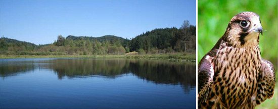
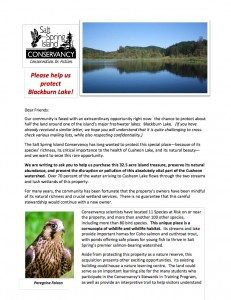

Dear Satsang Friends,
I am writing to you this month to tell you about an exciting development in our neighbourhood. For several years, our next-door neighbour at the Blackburn Golf Course, has been trying to sell his 32.6 acre property that reaches around half of Blackburn Lake. Recent rumours have been confirmed that the Salt Spring Island Conservancy is planning to purchase this property and maintain it as a nature preserve.
 SSI Conservancy letter of appeal
We heartily support this nature reserve project, in particular because of the special wildlife and water values on the property. The Conservancy has identified a dozen ‘Species at Risk’ on or near the property, as well as more than 85 bird species. The property also has a critical relationship to the Cusheon watershed, which supplies many hundreds of nearby residents with water.
As the property directly adjoins the Salt Spring Centre lands, we are delighted that our new neighbours want to protect the watershed and its rich wildlife by managing this property as a nature reserve. We invite you to read the [letter of appeal](https://saltspringcentre.com/wp-content/uploads/2013/04/SSI-Conservancy-Letter.pdf) provided by the SSI Conservancy regarding the purchase of the Blackburn Lake property, and to consider making a pledge to support this acquisition.
In supporting this initiative of the SSI Conservancy, the Centre stays true to its aim of ensuring that this land continues to be a place of peace for all who come here.
In peace,
Paramita,
On behalf of DS Board and SSCY Management
*“...You are in the mountains where there is fresh air and water, where there are trees and plants and streams. Sit with them and enjoy the creation of God. God and creation are not separate. The idea is to attain peace.”* Baba Hari Dass
