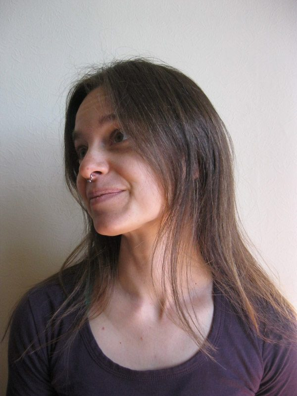

[caption id="attachment\_6898" align="alignright" width="384"] YTT Grad, Kenzie Pattillo[/caption]
**Where do you live? What do you do in your life apart from yoga?**
I have been living in North Vancouver for the last seven years but will always call Nova Scotia my home. I am a full-time mama to two divine little boy beings who are presently 4 and 5. I deeply appreciate attending life drawing classes and hiking into the North Shore Mountains in my spare time.
**What motivated you to begin practicing yoga? How did yoga come to be a part of your life?**
Yoga became a part of my life when I came as a "WWOOFER" to SSCY fifteen years ago, stayed for an entire season and met Babaji. Karma and Bhakti yoga came first - the former because it came easily, and the latter because it melted my heart and filled a deep spiritual need. I went on to complete a spiritual lifestyle training at Kripalu Yoga Centre, studied the teachings of many gurus in a myriad of yoga styles and lineages, and experienced some yogic misadventures along the way. But almost a decade later, I still had a tenuous relationship with asana and pranayama, as I both pursued and resisted a regular yoga sadhana in equal measure. It wasn't until I sprained my sacrum after childbirth six years ago that physical pain required me to maintain a daily "back maintenance" yoga sadhana. Now that my home practice has taken hold it has finally become non-negotiable and self-sustaining.
**What attracted you to the SSCY YTT program?**I had already lived at SSCY one season and was aching to return. In 2002 I had plans to plant trees in the interior of BC in the spring and attend art school in Victoria in the autumn. When I found out SSCY was offering its first YTT that same year the decision made itself. The year before I'd been asked by many friends to teach them yoga, and though I'd been studying it quite vigorously for three years, I knew there were some gaps in my knowledge. I needed a teacher training program that I could trust to help me fill in those gaps, while also allowing me to establish a strong personal sadhana and positive teaching experiences.
**What surprised you the most about the practice of yoga? How has your understanding of yoga deepened?**I think I was first attracted to the more "far out" perceptions of yoga. I thought ‘yoga’ would happen in some supernatural, ethereal plane. I had spent so long trying to get out of my body and out of my ‘mundane reality’ that I was sure yoga had nothing to do with either. But what I eventually came to realize was that true yoga happens on the inside, breath by breath, in the eternal present, and it does not come easily. I was surprised by how much shame and judgment about my body I’d internalized and how unsafe I felt being present within myself. I was surprised by the negative thoughts about myself that played out in my mind when I observed it. But the real surprise about practicing yoga is that through my practice I have come to deeply know that I am whole and filled with peace and love, and I can heal myself. The deeper I get into my body and into the present moment the deeper my true understanding of yoga becomes.
**Please share some memorable moments - or a favourite moment - from YTT.**At one point in our training we were all asked to do our own versions of surya namaskar at our own pace for ten minutes or so. The energy in the room was so captivating. The commitment to practicing together yet the deep honouring of our own unique approach was evident.
I also remember how absolutely terrified I was to do my teaching practicum. I was in torment. The strong sadhana aspect of this YTT can really strip one bare. My witness was observing my insecurity clearly. But once I began teaching, that openness also allowed me to feel the tremendous support and love emanating from my YTT peers. We were all in complete support of each other’s transformation into yoga teachers. I remember looking up at the class I was teaching and feeling such awe that they were doing what I said! I was guiding them in and out of yoga postures and holding the space to allow them their own experience.
**What can students expect from the yoga teacher training at the Centre?**We all come with our own perceptions of what yoga is and what it means to practice it let alone teach it. I think students can expect to be respected for where they are at on the path and for what they bring to their practice. But I think they can also be expected to expand and grow their practice to acknowledge and hopefully embody a wider, fuller vision of what yoga means and can mean to the diverse range of students they may eventually teach. When I am at the Centre, I am deeply connected to my best self, and I see that best self in everyone around me. That in itself is a profound gift that I believe all YTT participants will receive and carry with them back out into the world.
-
Check out Kenzie's Asana of the Month posts:

- [Gomukhasana (Cow’s Head pose)](https://saltspringcentre.com/asana-of-the-month-gomukhasana-for-the-rest-of-us/)
- [Anjaneyasana (Kneeling Lunge pose)](https://saltspringcentre.com/asana-anjaneyasana-or-kneeling-lunge/)
- [Holding Steady (recorded class)](https://saltspringcentre.com/holding-steady/)

### For information about the Salt Spring Centre of Yoga’s YTT program, visit:

[Yoga Teacher Training home](https://saltspringcentre.com/programs-retreats/trainings/yoga-teacher-training/)
