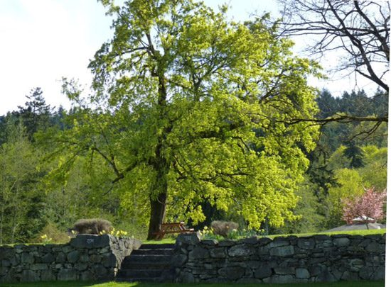
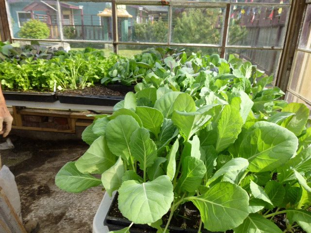
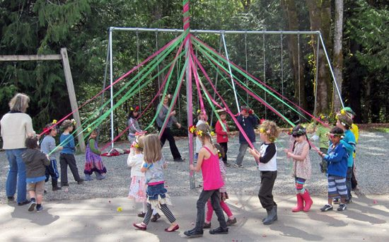
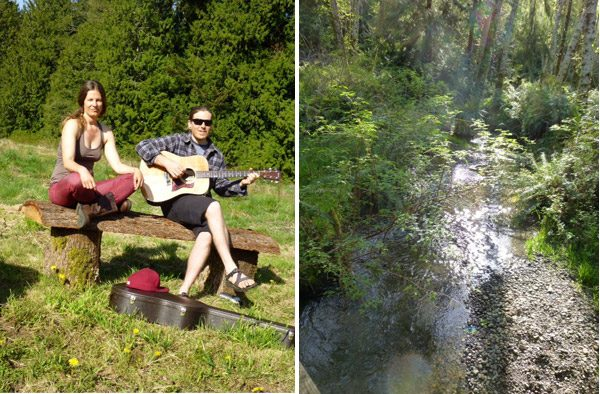

 New leaves on the old maple atop the mound
Hello to everyone from all of us at the Centre. It’s a glorious day today - sunny, warm, the air filled with the sweet fragrance of spring blossoms and freshly mown grass. Life is in full swing here, with programs or rentals scheduled every weekend and some during the week, plus guests who are here on personal retreats. Below is a little update on some of the goings-on at the Centre.
 Seedlings ready to be transplanted
**Farm update**
Jack reports that the farm team is currently planting ten varieties of cucumbers, twenty varieties of melons, six kinds of zucchini, fifteen kinds of winter squash, including some blue pumpkins and some that can get up to 100 - 200 pounds! Meanwhile we continue to enjoy amazing meals, with as much as is available from the farm. No 200 pound squashes yet, but lots of greens - best salads anywhere!
 Kids at the school maypole dancing in celebration of May Day!
**School update**
The school’s garden is also in full swing. The kids did the work of preparing the beds, including the spreading of manure - farmers in the making. They’re now planting the seeds that they gathered and categorized in the fall. Having just completed making homes for mason bees, they’ve now taken them home to their families to attract these pollinators to their gardens. In other school news, rehearsals for “Pinocchio”, this year’s school play, are well underway. Coming up at the beginning of May is the annual May Day celebration, complete with dancing around the maypole, a tradition begun by Usha way back in the earliest years of the school.
**Annual Community Yoga Retreat coordinator announced**
As mentioned last month, planning for the Annual Community Yoga Retreat is going strong, and we are happy to announce that Kathryn Kusyszyn has accepted the position of ACYR Coordinator. She has been attending retreats here for quite a few years and familiar with the program and the community. We are very lucky to have her.
***Offerings* Articles**
I invite you to read this month’s Meet our YTT Grads article, featuring [Kenzie Pattillo](https://saltspringcentre.com/2013/04/meet-our-ytt-grads-kenzie-pattillo/) who graduated from the first YTT offered at the Centre in 2002. Kenzie also contributed the Asana of the Month piece, focusing on [Gomukhasana (cow’s head pose)](https://saltspringcentre.com/2013/04/asana-of-the-month-gomukhasana-for-the-rest-of-us/), with lots of variations for those of you who find this pose difficult. The Our Satsang Family feature will return next month. Included in this newsletter is another teaching from Baba Hari Dass on the subject of [developing positive qualities](https://saltspringcentre.com/2013/05/developing-positive-qualities/), something we can all practice.
 Christine and Ben hanging out In the orchard after a day's work; walking through the trail
**Blackburn Lake to become nature reserve?**
We are delighted to share some local island news with you. Please read [Paramita’s letter](https://saltspringcentre.com/2013/04/help-us-protect-blackburn-lake/) about the property next door - currently an organic golf course and hopefully soon to be a nature reserve. The Centre is in full support of the proposed zoning change that would allow The Salt Spring Conservancy to buy the property for the purpose of protecting the land and the many species of animals and birds that live there (and here). You can click on the link in Paramita’s letter to read the letter from the Salt Spring Conservancy.
**AGM Update**
Also, please take note of the posting about the upcoming [Keeping the Flame Burning](https://saltspringcentre.com/2013/05/keeping-the-flame-burning-agm-2013/) weekend. More information will be posted on our website with details about the weekend, which will include [Dharma Sara](https://saltspringcentre.com/about/dharma-sara-satsang)’s Annual General Meeting along with some fun stuff. This is not to imply the AGM isn’t fun! It’s an opportunity to learn about the many facets of Dharma Sara’s projects, including the many projects at the centre.
*May the longtime sun shine upon you,*
 *All love surround you,*
 *And the pure light within you*
 *Guide your way on.*
In peace,
Sharada
