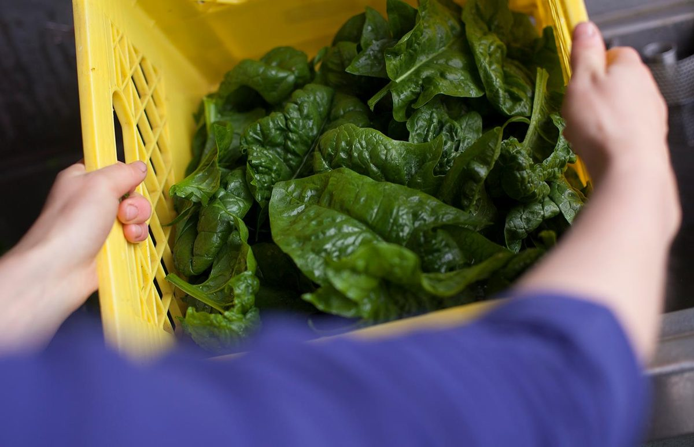

[caption id="attachment\_7010" align="alignright" width="300"] photo by Lisa Small[/caption]**This month our farm blog is from one of our farm yogis, Sheri!**
We are spoiled here on the West Coast with such an early and long-lasting spring. The daffodils are almost finished, making way for irises, bluebells and tulips. Everything is that young brilliant green shooting up to begin a new season. Our snap peas are doing just that, extending their arms leaf by leaf and curl by delicate curl.
This week was all about transplanting! Over 3000 brassica plants received new homes out in the fields, including; nappa, purple and green cabbages, a variety of broccoli and cauliflowers as well as collard greens. As the brassicas moved out, it made room for a second round of squash, melon and corn seeding, filling the propagation house right back up again.
With all this hot weather, watering is demanded by all the seedlings. This means irrigation was a priority, much to our dismay. Untangling piles of 100-foot lines, punching new holes, fixing leaks, tying off ends and untwisting them all are finicky, frustrating tasks. Questions like “when is lunch?” were frequent during these days!
Spring herb tip: Cheerful looking cleavers (Galium aperine) are making an appearance along roadsides and forest trails. Maybe you have noticed them clinging to you after a hike in the woods. These little plants are a fabulous lymphatic remedy. Our lymph system is the body's way of carrying waste products out of tissues. As we are in spring-time, it is a perfect opportunity to stimulate and flush out your lymphatic system and ease swollen glands. You can simply pick a handful or so, chop up and steep as tea or just put them on top of a salad!
Let's all plant the seeds we want to grow for summer!
Sheri and the Farm Team
