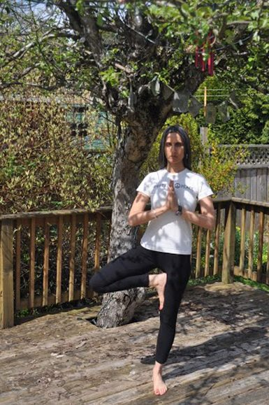
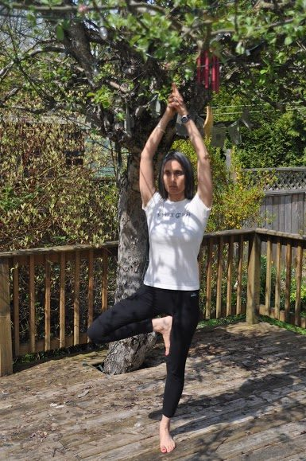

### Vriksasana (Tree Pose)

 Preet in Vriksasana
Vriksa means tree and asana means pose. Vriksasana, tree pose, builds balance and strength and is suitable for all levels.
Practicing Vriksasana helps ground me, especially when I am feeling overly busy and disconnected. The pose reminds me of the importance of finding ‘balance’ in my daily life. Like the tree, connecting to the earth, while also striving and reaching for the sky. I think about the opposing forces of rootedness working with an uplifting quality: a delicate balance between the two.
**Preparation**
Start in Tadasana, mountain pose:

- stand with your feet hip width apart, knees slightly bent, arms at your side
- lengthen up though the spine
- imagine a string, gently drawing the crown of your head toward the sky
- allow your shoulders to relax back and down
- inhale, exhale – bringing awareness to your breath

Bring awareness to your feet:

- While standing in Tadasana, slowly shift your weight from one leg to the other in a small pendulum-like motion, noticing the weight shifting from one foot to the other, from the inside edges of your feet to the outside edges of your feet.
- Then slow down the pendulum movement and find the balance point where you have equal weight in both of your feet, notice the inside and outside edges of your feet.
- You can try this with your eyes closed to really help focus your awareness inside your body.
- Next lift up all your toes as best you can, and while they are lifted, spread your toes apart, creating space between each of your toes. Then, leaving them fanned apart, bring your toes down to the meet the mat.
- Do this a few times to create an awareness of the sensation of your body connecting with the ground, awakening the sensation on the bottom of your feet.
- Then stand in mountain pose, feet firmly grounded.

**The Pose**

- With your knees slightly bent, slowly shift the weight into your left foot
- gently lift the right foot off the ground and press the sole of the right foot into the inside part of your left thigh
- *make sure you are not pressing your foot into your knee*
- As you press your foot into your thigh, you will also want to press the thigh into the foot, cultivating an awareness of the mid-line of the body running through the centre of the torso and between the legs to the ground.
- Then slowly bring your hands together at your heart centre in prayer.
- As you press your hands together, press your thigh and foot together again. Feel the connection into the centreline of your body.
- Root down through your feet, lift up through your chest and crown of your head, feel the sweetness of these opposing forces.
- To help with balance, try focusing on something that doesn’t move. If your gaze is down, then find a spot on the ground slightly ahead of you to focus on, or you can gaze at something straight ahead.
- Imagine your feet connecting with the ground, like tree roots into the earth. Feel the strength in your core, like the stable trunk of the tree. Lengthen your spine and reach the crown of your head to the sky, like the long branches of a tree.
- Remember to breathe here, long and steady breaths, keeping your awareness in your body. Stay in this pose for as long as you feel comfortable.

**Coming Out of the Pose**

- slowly bring your arms down along the sides of your body
- lower your bent leg back to the ground
- stand in mountain pose, where you started
- take a moment and close your eyes and feel the effects of the pose. Notice any differences from one side of your body to the other. Notice the sensation of your feet connecting with the ground.
- When you feel complete, begin again, this time lifting the opposite foot from the ground.

 Vriksasana, arms extended
**Modifications**
1. If you are a beginner, you can consider the following:

- Balance-stand near a wall to help with balance
- Position of the raised foot-instead of bringing your lifted foot into the thigh, you can bring the sole of your foot into the ankle area, keep the toe of the lifted foot touching the ground. Or you can bring the lifted foot into the inside of the calf area

2. You can add more challenge to the pose:

- Extend your arms overhead- lengthen through the arms, while drawing your shoulder blades down your back, clasp your hands together.
- Position of the raised foot-bring your raised leg into half lotus position
- Close your eyes – notice how this challenges your balance even more

**About the Instructor**
 Preet Heer
Preet Heer works as an Urban Planner for the City of Surrey, and also teaches yoga part time from her home studio in White Rock. She did her yoga teacher training at the Salt Spring Centre, and has taught at some of the Yoga Getaway Weekends.
She finds yoga a perfect complement to her busy life. Preet focuses her teaching on the aspect of bringing present moment awareness into each asana, integrating mindfulness with the physical practice. Yoga has been part of her life since she was 9 years old.
*“Trees are poems that the earth writes upon the sky.”* –Kahlil Gibran
