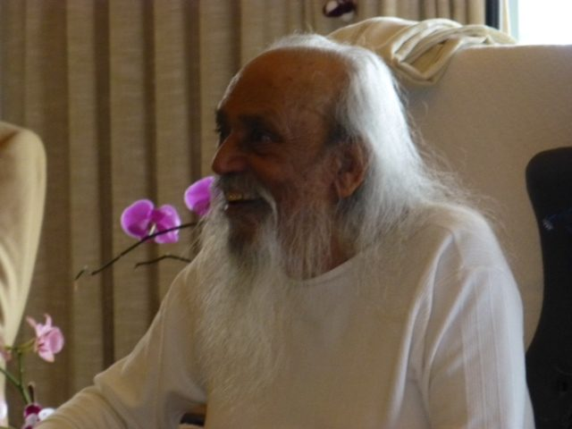

[caption id="attachment\_7344" align="alignnone" width="493"] Babaji at 90[/caption]
Having just returned from Mount Madonna Center - the Salt Spring Centre’s big sister centre - to celebrate Babaji’s 90th birthday and to connect with many, many brothers and sisters in our satsang family, I am struck by the precious gift of having met a master yogi and been taught, inspired and supported by Baba Hari Dass.
I know that not all readers of this newsletter have met Babaji, and may not understand the idea of devotion to a guru. When asked about it, Babaji wrote:
> The aim of life is to live in peace. A guru or spiritual teacher teaches how to attain that peace. The teacher and student relationship is based on faith and trust. A guru who is not trusted by the student is not his or her guru in reality. A guru doesn’t teach much except how to live in the world with truthfulness, with nonviolence, and with selfless service to others. The guru either presents these teachings in words of through the way they live their life.
> A teacher is not much of a guide except to show the right path for attaining peace, and to point out that another path goes in the wrong direction. In both cases you have to walk by yourself. The teacher’s duty is finished after simply pointing out the right path.

Babaji has been a guide to many of us, and his teachings continue to guide the unfolding of the Salt Spring Centre of Yoga and all the other projects inspired by him. Many people did a lot of work, but the light that has guided us is grace.
At the retreat there were presentations every day - complete with slide shows and songs - about the many projects that have evolved since the 1970s:

- Mount Madonna Center and the Hanuman Fellowship
- Pacific Cultural Center (the town center in Santa Cruz, usually referred to as PCC)
- Mount Madonna School, with a slide show of the Ramayana productions from the early years to the present
- Sankat Mochan Hanuman Temple at MMC, to which hundreds of visitors come every week
- Sri Ram Ashram in India (sometimes referred to as an orphanage, although it is actually a home and a family), founded upon Babaji’s dream of providing a home for orphaned and destitute children. This presentation was also a tribute to Ma Renu, who initially sponsored Babaji to come to North America, and worked diligently to support Sri Ram Ashram.
- the Ashtanga Yoga Fellowship in Toronto
- Dharma Sara Satsang Society and the Salt Spring Centre of Yoga.

When the retreat began, people began pouring in from all over Canada and the US, everyone instantly feeling a sense of connection. We are all one family; no matter where we are on the path, we all hold the aim of living in peace. We spent the days in Babaji’s presence, swimming in a sea of gratitude and love.
Babaji’s role has shifted with age, but he still serves as a shining example by being present and accepting whatever happens, with grace. He may not remember people’s names, but he still connects with everyone, radiating love and compassion. He remains playful and twinkly, especially with children. At this retreat even some of the adults received candy!
Our job is to continue to show up, and stand up every time we fall.

*Work honestly,
Meditate every day,
Meet people without fear
And play.*

*Keep the lamp lit, walk on step by step. You can’t go astray but will merge in the light.*

contributed by Sharada
