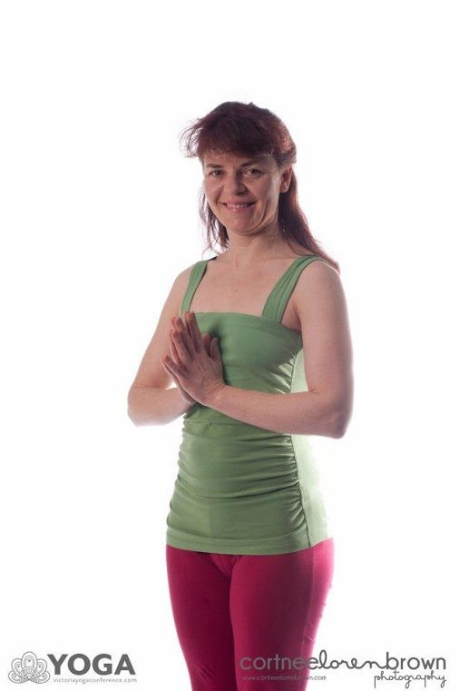

**When did you meet Babaji?**
Originally from Toronto, in 2001 I completed a 250 hour yoga teacher training in the Ashtanga Vinyasa and Flow traditions. One of my respected teachers gave me a flyer for the Ontario Retreat and spoke highly of Babaji. A genuine Indian guru!
I decided to go and be a karma yogi in the kitchen. I became truly captivated by this unassuming man, the story of Sri Ram Ashram, Lakshmi’s asana class and the gigantic outdoor fire for the Yajna ceremony. Waking to pad-kirtan for the first time, I thought angels were singing to me.
There was casual time to be with Babaji and I got brave enough to ask him a question.
“What is our purpose?”
“To find the True Self”, he wrote.
Someone else came along before I could ask him how. Later I learned the answer he would most likely have written: Regular Sadhana, or RS for short.
**How did you come to the Salt Spring Centre of Yoga?**
In 2003 I completed a Diploma in Holistic Nutrition. One of the criteria for graduating was to find a co-op placement working with food. I came across an SSCY posting for Head Cook for the summer season. Hmm, I thought to myself; there’s the ocean, mountains, yoga, healthy food, intentional community…the decision was easy.
I told my family I was only going for the summer, however, I knew that I would be looking around BC for a more permanent home. Unfortunately my mother was ill and my trip was delayed so I missed most of the season and arrived on Labour Day weekend 2003. It was a hot, sunny day, filled with promises of new beginnings. As soon as I stepped onto the property, I felt I was home. Savita greeted me, showed me my room under the kitchen (now the Daisy Room) and said “You can get the orientation later. Go down to the orchard and meet the other karma yogis.” So I did. Jana (Gitanjali), Auguste, Shanti, Nirmal and Pearl were all harvesting pears and reveling in the glory of the abundant season. someone suggested a swim so we all went off to Roberts Lake. A very promising start indeed.
Things got even better after that and it seemed the stars were aligned to make this part of BC my home. My best friend, Michelle, moved to Salt Spring with her daughter, Bronwyn, who later attend the Salt Spring Centre School.
Living, working and teaching in community taught (and continues to teach) me a lot about myself and how to be in the world. My learning of yoga philosophy deepened, and I established a regular meditation practice. A deep respect for the path of karma yoga developed. The elders I met provided examples of what can result from a lifelong dedication to yoga practices. They also supported me with work and in numerous other ways.
My dad (not really knowing anything about yoga) came to visit and observed “it’s very peaceful here” after participating in one of Sharada’s drawing classes.
Living on Salt Spring had its advantages and disadvantages. The weather and culture differences from Toronto are drastic. That first drizzly grey winter was very challenging. In 2004 I relocated to the South End with my partner and later to Vancouver Island. The pull of Salt Spring is strong and I continued to participate in the Annual Retreat as a karma yogi. Some years I felt outgoing and met lots of people and other years I felt like hiding after a hot day of work.
I’ve worked in the kitchen, dishes, housekeeping, landscaping, garden, teaching asanas and the Children’s Program. What I most enjoy about the karma yoga experience is working with new people from different places. And I’ve learned to be unattached when the sinks I’ve just cleaned are immediately used by an apologetic guest. Being in housekeeping in the camping area is great because when it’s hot I just pour cold water over my head from the hose. One year I woke up with a complete poem about Babaji in my head which I read at Latte Da open stage.
Prenatal YTT, Yoga Getaway and an AGM weekend are other events I’ve attended, at each one meeting fabulous people and deepening my practice in various ways. The friendships I’ve made with fellow karma yogis are a deep and shared experience that is quite unique. I continually learn how different and yet how similar we are to each other.
Most recently I was blessed to attend the New Year’s Retreat at Mount Madonna Center and to see Babaji again. Meeting lots of ‘originals’ from the “Mother Ship” was very illuminating, as was the celebration. If you have yet to go there, I highly recommend it! Be warned, you may not want to leave.
When I was contacted for the position of Retreat Coordinator [for this year's [Annual Community Yoga Retreat](https://saltspringcentre.com/retreats-programs/family-retreat/)], I laughed. They think I can do this? I was flattered and humbled. After ten years of being associated with the Centre, maybe I’m starting to understand what is going on here. Maybe. My intention is to create a fun and nourishing event. It is truly an honour and a privilege to be a part of this satsang. With the wonderful team support and years of tradition to stand on, I am confident we will all enjoy our peak summertime community celebration together.
**[Register early](https://saltspringcentre.com/retreats-programs/family-retreat/family-retreat-registration/) for the best rates and if you’re a Salt Spring Islander, this includes the half-day islander special. Avoid disappointment by planning ahead. I’m looking forward to seeing you at the retreat. I’ll be the one with the hose.**
