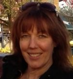

**Where do you live? What do you do in your life apart from yoga?**
I live on Burke Mountain with my daughter and 2 cats, and am employed as a customer service representative for H.Y. Louie. I love the outdoors - preferably when it's sunny - walking or biking in the many trails near my home.
**What motivated you to begin practicing yoga? How did yoga come to be a part of your life?**
I began practicing yoga when my daughter was born. I had a lot of back problems from a couple of car accidents in my early 20s, and my daughter was very collicky when she was a baby, so yoga helped me to ease both the pain in my back and my frayed nerves. May practice was sporadic until January of 2002. I quit smoking then, and filled the void of my bad habit with the more life affirming practice of yoga. I was hooked.
**What attracted you to the SSCY YTT program?**
In 2011 I decided to take my practice deeper and enroll in a teacher training program. I looked at many programs in the Vancouver area but the SSCY program attracted me because I was able to leave my life behind for a short while and focus solely on my studies. They also had what I considered the most skilled and knowledgeable faculty. And Salt Spring Island is very special to me as my grandparents moved there when I was a young child, so I have many precious memories of spending time with them on the island.
**What aspect of yoga has had the most transformative effect on your life?**
I think, like most people, I started doing yoga mostly as a physical exercise and then started to notice the mental and emotional benefits. As I added more practices like pranayama and meditation, it reinforced and expanded my feelings of ease and peace on all levels. Studying the philosophy and ancient texts has given me the tools to challenge my limiting beliefs and expand my views on life. Now every aspect of my practice feels very sacred to me.
**What can students expect from the yoga teacher training at the Centre?**
Students coming to the SSCY for YTT can expect to come away with an expanded mind and well-rounded education. The staff has a wealth of gifts and information to share. And the food!!!! I am a total foodie, and I have to say some of the best meals I have had have been at the Centre. Must be all the love that the karma yogis add when they are cooking the meals! Also the friendships and bonds I formed with the other students and staff has been a blessing in my life. Scattered amidst all the hard work and studies, expect to find lots of fun and laughter. I went to SSCY to get a certificate to teach yoga and I came home with so much more - an expanded mind, a healthy body and heart full of love.
**Do you have any favourite quotes?**
As Babaji puts it so simply, ***"Work honestly, meditate every day, meet people without fear, and play."*** I love this quote because it shows we need to have balance in our lives and that play is as important as work.

### For information about the Salt Spring Centre of Yoga’s YTT program, visit:

[Yoga Teacher Training home](https://saltspringcentre.com/programs-retreats/trainings/yoga-teacher-training/)
