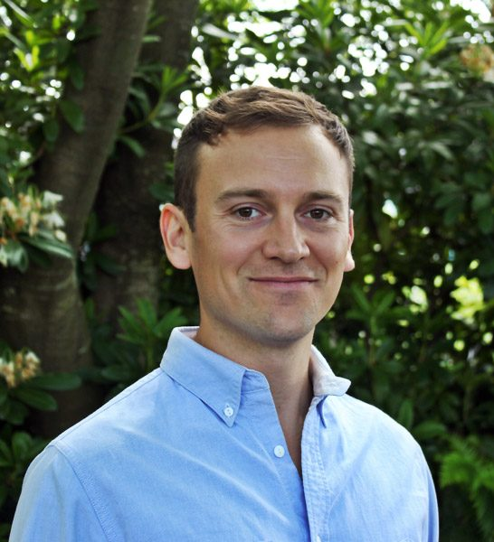
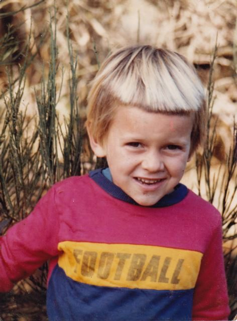
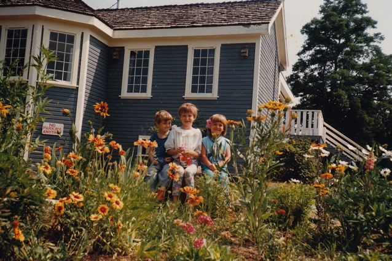
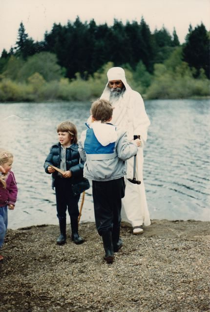
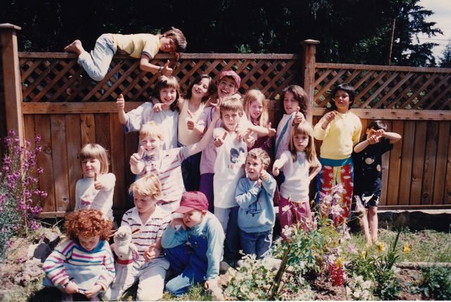
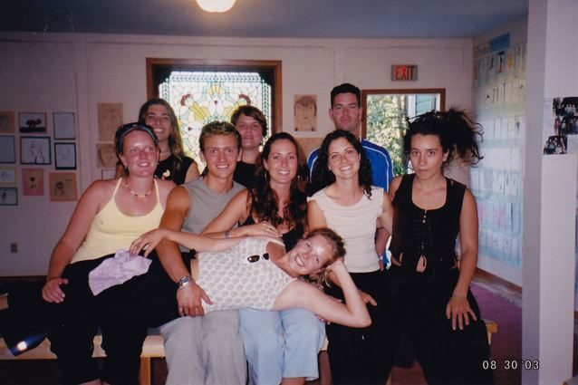
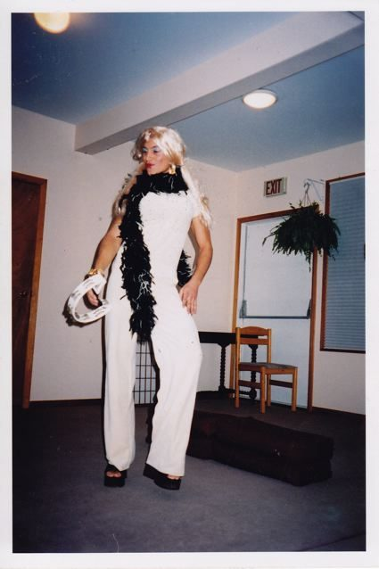
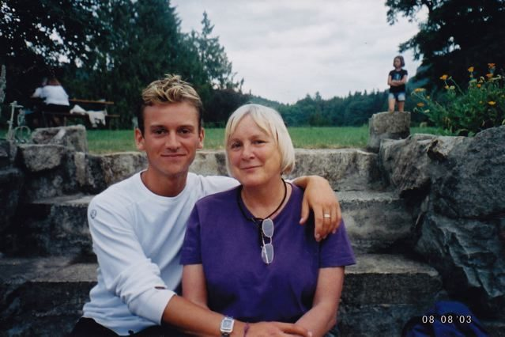
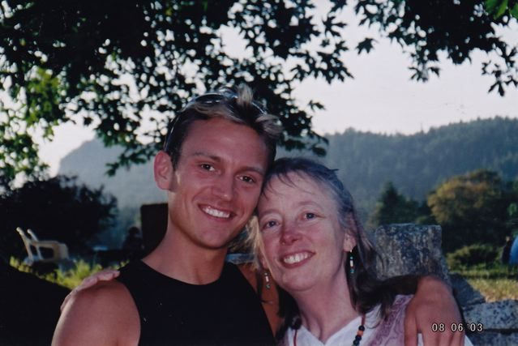
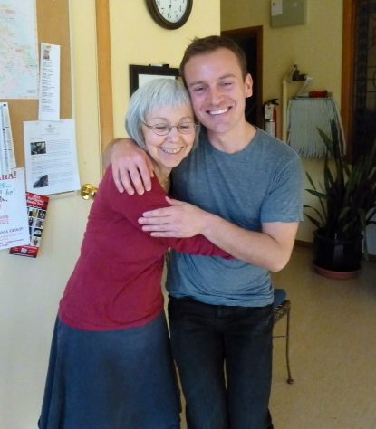

 Jeramiah, part of the Centre family
I was born in Florida in 1979 into a family of three sisters and my Canadian mother, Jeanine Paquet (Mamata). We left Florida when I was still a baby, to move to coastal British Columbia. My mother and I, along with her two sisters and their children all lived in a big house in Cloverdale.
 the famous haircut, 1983
In 1982 my mother saw a posting on a community board in the local health food store about a retreat with Baba Hari Dass on Salt Spring Island. This was the first she’d heard of Babaji, the Salt Spring Centre, and the island … and it was the beginning of my long experience with the Centre.
As long as I can remember the Centre has always felt like my home. After attending that retreat in 1982 my mother decided to move us to the Centre, and we became the first family to live on the property. Shortly after, Sid and Sharada moved into their home along with Nayana and Daya. Mangala came later with Ariel and Caleb, and Maya and Piet lived there for a time with their dad, Marc. My mother and I lived in the main house in various rooms upstairs over the years.
Nayana and I were the best of friends in those early years, and we had the run of the whole land all to ourselves. I would frequently wake up at the crack of dawn before everyone else, run down to Nayana’s house, and steal her clogs (they were made of blue transparent plastic). Well, they were attractive and I liked wearing them! Each time I did this my mother insisted I return them before receiving breakfast. When I was two or three Nayana and I decided to get married, and she wore a twist-tie wedding ring to show it.  I believe we later divorced.
 Caleb, Ariel, Jeramiah, 1985 or 86.
Growing up at the Centre was like having a very large family, which was a gift to me as most of my family lived across the country and were not a part of my life.
In 1984 I began my first year of school at the Centre School, where I continued on for at least half of my primary education. Back then, there were a dozen or so of us downstairs in a large room, which has now been divided up into KY quarters.
My mother and I moved off the centre property, only to return a few years later for another stint when I was 7 years old. Whether we were living at the centre or elsewhere on the island, the Centre continued to play a major role in my life. I attended school and we participated in weekly satsang and regular retreats.
 With Babaji at Blackburn Lake (when we had access to the lake from the Centre), 1986
Of course, as a child, satsang and retreats just meant really awesome extended play time and visits from Babaji! He was like a grandfather to us as children. I remember getting so excited to receive the daily Prasad candy. One time I stood at the foot of the stairs outside of the kitchen - I couldn’t have been older than 3 or 4 - with Anuradha and Babaji at the top of the stairs looking down. I insisted that I hadn’t received my daily candy yet (which I believed to be true). I was devastated when they both agreed that I had already had my candy for the day and denied me any more! I was sure they were mistaken, but Sharada says Babaji always kept track and was surely correct.
I remember there always being so much going on in those early days of the community. I remember epic Halloween parties (there are photos in the library to prove it), retreats, countless festivals, and of course who can forget the original Hanuman Olympics?! Sack races, tug of war, obstacle courses … it was undoubtedly one of the highlights of every year for all of us.
In my later years at the Centre school our classroom was upstairs in the Satsang room and the library (which we called the piano room back then). There were no permanent fixtures in the classroom, only bookshelves on wheels that got turned around for weekend programs. Usha, being the teacher that she is, didn’t need any extra gimmicks!
 School photo at Usha's house, 1987
There were about 14 of us as I recall. Usha was an innovative and passionate teacher who brought us an education unlike what most kids would experience in public schools. In particular I remember being taught peaceful resolution to conflict. Each day we would sit in a large circle and Usha would dip into our ‘feedback box’ and pull out any slips that had been deposited by us kids. She would read the slip aloud, and the parties involved were coached on how to communicate their feelings and resolve the conflict with each other.
At lunchtime we would all run around the property with great excitement and complete freedom. We created forts, which soon turned into a full blown village called ‘The Bunny Homes’, complete with real estate agents, shopkeepers, police officers, restaurants and our own currency. Apparently the Bunny Homes still exist today, although the form and location has changed. We would also run down to the creek when it flowed in cooler months. Inevitably at least one of us would fall in each day, and would spend the afternoon wrapped in a towel in class while our clothes dried in the dryer.
When the school bell broke (it was a handheld old style metal bell) Usha would come outside at the end of lunchtime and sing, in her beautiful Usha style, ‘Ding-aling-aling time’. We would all protest and beg for ‘5 more minutes’! Occasionally, but not often, our request was granted.
In 1990 I left the Centre School to attend French Immersion at Salt Spring Elementary. I can recall feeling a little out of place in such a traditional setting, and it took some time for me to adapt to the normal schoolyard bullying and games that simply didn’t exist in our Centre School.
In 1992 we left the island to move to Kaslo in the Kootenays where my mother had purchased land and a home. This began a long gap in time where I didn’t see much of the Centre. I kept in touch with some friends, and occasionally would come back for visits, but we didn’t attend retreats for many years.
It was in 2002 that I re-established a strong connection to the Centre that has endured until today. I had been living in Vancouver attending college and working, and then living in Florida for a year. I moved back to BC at age 22 with a broken heart after ending my first relationship. Being in a state of pain and loss, I began to explore my own spirituality for the first time as an adult.
That year I attended the retreat as a participant and Karma Yogi for the first time. I attended my first asana class with Lila, an elder who taught well into her eighties. I will always remember her words in class, spoken in her gentle German accent, ‘Your body loves to be loved. Give your body love. There are no real excuses. Why wouldn’t you practice asana and give your body the love it wants to receive?’ This was the beginning of what would become a deep and disciplined yoga practice.
During the retreats of 2002 and onwards I reconnected with many childhood friends. In those years Babaji was still attending the retreats, and I did KY on rock crew on all of its many construction projects. I also worked in childcare and dish crew.
 School reunion,2003
In 2003 I attended the Yoga Teacher Training program at the Salt Spring Centre thanks to a very generous scholarship from a longtime satsang member. This was an incredible education into all aspects of ashtanga yoga as taught by Babaji, and it shaped my yoga practice and my life thereafter. Later that year I traveled to Mount Madonna Centre in California to attend a two-month Karma Yoga program.
 Yoga Queen by Babba. YTT talent show, 2003
Getting to know Babaji and his teachings took on a whole new form in that period of my life. As a young adult I was eager to learn all that I could from him. It is perhaps the greatest gift of my life to have known him from such a young age: to have sat beside him at mealtime, to have heard his teachings in Gita class, and to have worked with him on rock crew and other projects. Because of this, yoga has always been an integral part of my life and I don’t remember a time that it wasn’t, in some shape or form.
In 2003 I also began a career at lululemon athletica which would span nearly 10 years. When I began it was a small startup company based in Kitsilano with 5 stores in Canada selling yoga apparel.
I began as a salesperson on the retail floor, and I expected to remain for only a month or two! I later became a valued member of the senior leadership team based in the Vancouver head office and traveling across North America. In the early years of the company we created a company culture based on many aspects of yoga, including ego awareness, communication, asana practice and more. My yoga practice and knowledge that I had learned from Babaji’s teachings was a great asset and influenced my leadership at lululemon. Without it, I’m not sure I would have progressed as far as I did with the organization.
By 2010 I was beginning to see that my time at lululemon was coming to a close. I yearned for a life more like the way I had grown up and also more consistent with Babaji’s teachings of living simply. It was a great spiritual yearning that became stronger and stronger, and soon could not be ignored.
 With his mom, 2003
 With Usha, 2003
That same year I met a beautiful yogi. Michael grew up in North Saanich and spent years living overseas and traveling in India before we met. The next year, in 2011, Michael and I were together living in an apartment in Vancouver.
We shared a yearning for a simpler life, and in February of 2012 we moved to Salt Spring Island. Later in the year, I bought a 50-acre organic farm on Starks Road which is our home today.
As we were pulling blackberry brambles and reclaiming parts of our pasture this spring, I was struck with great respect for all of the work that has gone into the Salt Spring Centre over the years by so many people. In the 30 years I have known it, it has truly transformed and evolved in such a beautiful way.
My mother once told me that a guru’s energy can be felt long after his departure from his centre or ashram. I know this to be true at our Centre because I feel it always when I am there. It continues to be a place of peace and restoration for me.
I have great gratitude for Babaji and for the many satsang members who helped raise me. We are family! Thanks most of all to my mother for having the wisdom to take us to this special place.
Love,
Rajesh
 Sharada & Jeramiah, 2013. (Jeramiah crouching to be closer to Sharada's height.)
