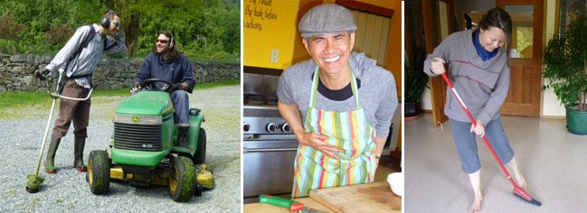
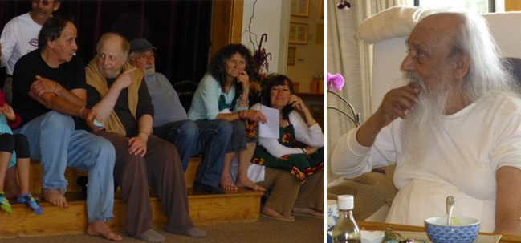

Happy summer, everyone. Soon it will be sunny and hot - maybe not today, depending on where you live - but it’s coming. The expansiveness of summer means the Centre is in its busy season, and about to get busier. Following are a few of the events that are about to unfold.
This week we welcome a new group of karma yogis into our Karma Yoga Service and Study program. They will be joining the kitchen, housekeeping and maintenance crews, with one person added to the farm team for the summer. It is always inspiring to meet people who choose to live a life of community and service.
[caption id="attachment\_7384" align="alignnone" width="584"] l-r: Landscaping consultation, Ryan and Stacey; Van prepping for lunch; Tana sweeping the lobby[/caption]
While the Centre gears up, the [Salt Spring Centre School](https://saltspringcentre.com/about/centre-school) year winds up the school year. This year’s play - Pinocchio - was a big success; this annual event includes every child in the school. This month the school holds its [5th Annual Art Lottery](https://www.facebook.com/events/433655193398043/) on June 16, the school’s biggest fundraiser, with great opportunities to come away with a beautiful piece of art donated by one of the many artists on Salt Spring Island.
Coming up on June 14 is the ‘[Keeping the Flame Burning](https://saltspringcentre.com/retreats-programs/agm/)’ weekend, which includes our AGM. You can read more about it under the Retreats and Programs on our website, at the top of the home page. The following month we will be celebrating Guru Purnima at the Centre on Monday, July 22 at 8 am. Please read about Guru Purnima under Upcoming Events, with more details coming later in June.
[caption id="attachment\_7192" align="alignright" width="142"] Jeramiah's famous haircut, 1983[/caption]
There are several articles in this edition that I hope you will enjoy. The Our Satsang Family article this month features [Jeramiah Rajesh Morris](https://saltspringcentre.com/2013/06/our-satsang-family-jeramiah-rajesh-morris/), who has been part of this family since he was two, living here with his mom. It is full of great stories - hope you enjoy it. Meet our YTT Grads introduces [Karen Cabral](https://saltspringcentre.com/2013/06/meet-our-ytt-grads-karen-cabral/), who graduated from the Centre’s YTT program a couple of years ago. Preet Heer, who often teaches at Yoga Getaways, offers us [Tree Pose](https://saltspringcentre.com/2013/06/asana-of-the-month-vriksasana-tree-pose/) in Asana of the Month. These articles give you a fuller picture of people’s experiences at the Centre.
This year’s [Yoga Teacher Training](https://saltspringcentre.com/yoga-teacher-training/) (YTT) begins on July 3. It is a 200 hour yoga teacher training, with an in-depth curriculum and a faculty of very experienced teachers. There is still some space left in the upcoming YTT, so if you or someone you know has been thinking about enrolling, now’s the time to do it.
Immediately following the first session of YTT is our [39th Annual Community Yoga Retreat](https://saltspringcentre.com/retreats-programs/family-retreat/), a special program full of learning, connecting and fun, offering a great variety of classes - plus a program for children, enabling families with children to come. Please read the details under Retreats and Programs on the homepage of our website. If you want to come, I encourage you to [register online](https://saltspringcentre.com/retreats-programs/family-retreat/family-retreat-registration/) early for the best value. This newsletter features an interview with [Kathryn Kusyszyn](https://saltspringcentre.com/2013/06/meet-kathryn-this-years-annual-community-yoga-retreat-coordinator/), this year’s ACYR Coordinator, telling about her connection with Babaji and the Centre.
[caption id="attachment\_7385" align="alignnone" width="584"] Sanatan, Divakar, Sudarsan, Rajani, Lakshmi - some of the Canadians at the May retreat with Babaji; Babaji at the celebration[/caption]
Several people from our community went to Mount Madonna Center recently for the celebration of Babaji’s 90th birthday. I welcome you to read some reflections arising from that special satsang family reunion, in the article called [Inspiration and Gratitude](https://saltspringcentre.com/2013/06/inspiration-and-gratitude/). For the moment, here are a few comments from some of our satsang family:
*“There was so much love in the room. There was a pouring out of love from Babaji - and people were so gracious, softened. I was almost drunk with love.”* - Kishori
*“It was like a river flowing with love and gratitude from several hundred people flowing directly to Babaji.”* - Rajani
*“I think everyone came with love and it went through us like electricity.”* - Sudhir from MMC
From Babaji: *Love is a universal religion.*
Love,
Sharada
