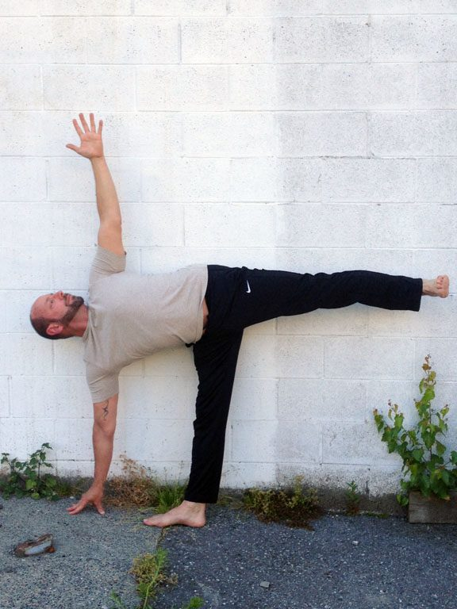

### Ardha Chandrasana (are-dah chan-DRAHS-anna) - Half Moon Pose Ardha = half; Chandra = shining (translated as "moon")

[caption id="attachment\_7561" align="alignnone" width="576"] Ashok in Ardha Chandrasana against a wall[/caption]
I like to add this pose in the middle of a sun salutation or on its own followed by downward dog (adho mukha svanasana) and cobra pose (bhujangasana). Include this standing pose in a morning practice as a reminder of life's abundance and ones own physical reawakening from winter season.
**Benefits include**
Balance, core, leg and buttock strength, stretches the spine, chest groin and hamstrings. Improves digestion.
**Getting into the pose**
Place a hard block at the front-left side of your mat. Start in tadasana (mountain pose) at the front of your sticky mat, with your feet together and arm resting next to the torso. Exhale and step the right foot back approximately 3 to 3.5 feet and turn the foot out to the edge of the mat, with the left foot pointing forward, heels lined up. The left leg is straight and both arms are held horizontally over the legs, keeping the shoulders relaxed with shoulder blades soft, moving down the back. Hip points and chest are facing the side of the mat. At this point, find the legs strong, balance coming up from the inner arches while pressing down through the earth with the outer right heel.
Take the right hand down to the waist as you begin to exhale and extend over the left leg, bringing the trunk over the thigh with equal extension on both sides of the spine. Bending the left knee, take the left hand to the floor (or block) 8-10 inches in front of the little toe and pressing evenly down through all fingers, simultaneously lifting the right leg up, keeping the foot flexed and the leg parallel to the floor or slightly higher so that it creates a straight line from the side body.
Let the standing leg begin to straighten with the kneecap lifting and the quadricep contracted. The right hip should stack over left. Your head is neutral, neck is aligned with the spine and looking to the side. Regulate your balance with the body's weight more onto the standing leg but the balance controlled from the core, through the limbs. Repeat on the opposite side, take a break in child's pose or continue through a sun salutation.
**Variations on the pose**
To deepen the pose, the right arm can extend above the shoulder with the palm facing the right. Turn your gaze up to the hand while lengthening through the torso from the top of the head to the tail bone.
**Modifications**
**Using a Block:** Use the block on the side that provides the most support and balance. A block provides 3 sides (or heights) to help reach for the floor. Keep your hand flat to the block with a firm hold.
**Using a Chair:** Beginners can practice using a chair to understand the pose and the alignment of the pelvis, while balancing on the hand and leg. Place the hand of the standing side on the seat of a chair.
**Using the Wall:** Position yourself against a wall with the feet 2 inches away from it, then follow through as above instruction. Using the wall eliminates the balance component and helps to develop the alignment of the pose
**About the instructor**Peter Ashok Baragon graduated from SSCY’s Yoga Teacher Training ten years ago  and has been teaching in Vancouver and West Vancouver ever since.  He enjoys teaching at community based centres for the variety of participants and the opportunity to offer different styles throughout the week. Rooted in classical ashtanga yoga and hatha yoga, he also teaches yin, restorative, chair-yoga for seniors and power flow vinyasa. Teaching for him flows from a place of love, compassion and gratitude.
Read more about [Peter's experience as a student of the Salt Spring Centre's Yoga Teacher Training program](https://saltspringcentre.com/2013/06/meet-our-ytt-grads-peter-ashok-barago/).
**Other postures taught by Peter**

- [Viparita Karani (legs-up-the-wall pose)](https://saltspringcentre.com/2013/01/asana-of-the-month-viparita-karani/)
