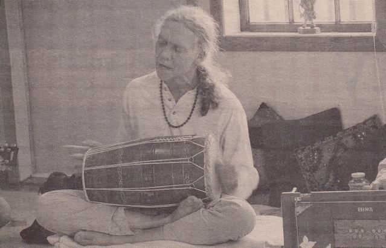
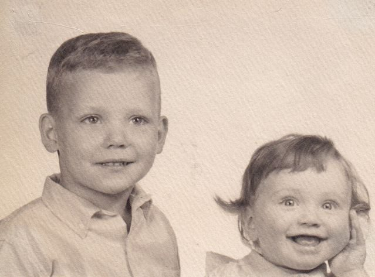
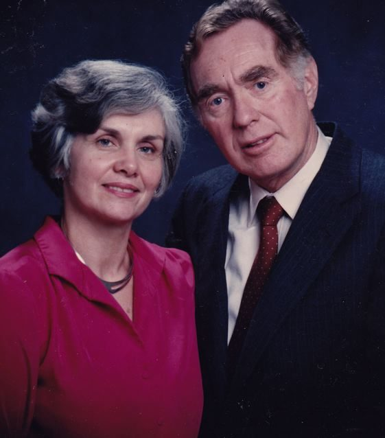
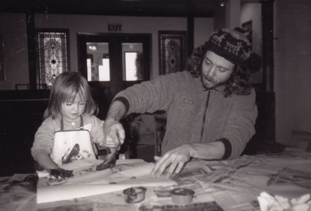
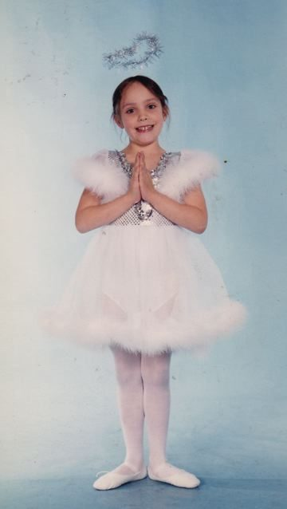
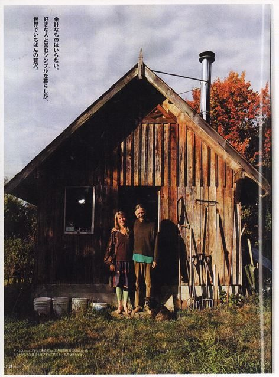
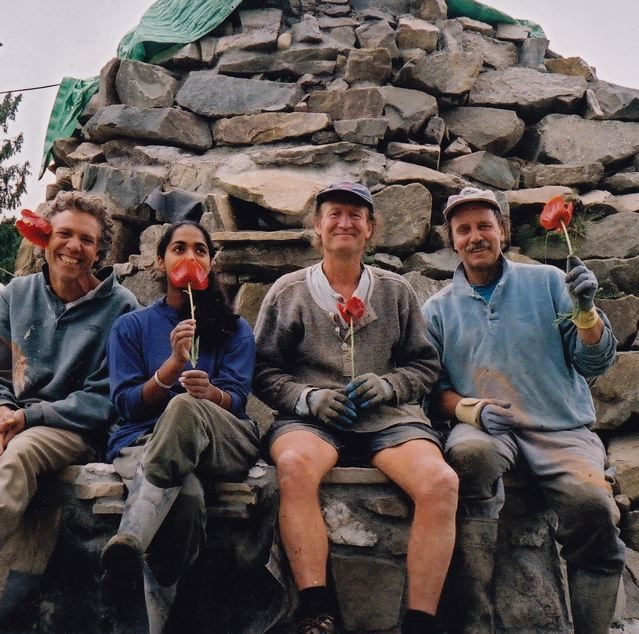
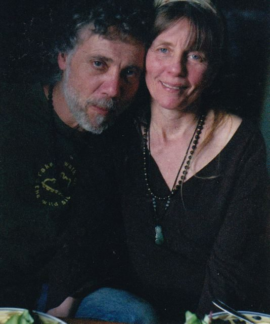

 Kirtan at the Centre a few years ago (photo from the Driftwood - local newspaper)
I grew up near Boston, Mass. with one brother and one sister. My parents are Episcopalians (similar to Anglicans). During my confirmation process at the church, I was not able to get satisfying answers to my questions.
 Vikash (then Mark), age 6, with his sister
As a young man, my first inkling of spiritual life came to me in high school, ever since I started to think for myself as a young teen. My interest in spiritual life grew, getting more focussed in my senior year of high school, largely through reading Thoreau. I started to see spirit in nature, seeing nature as sacred, and I rejected the modern, industrial world as a misdirected human endeavour. That was me in a nutshell at the age of eighteen. I took long walks in nature - for three, four, sometimes five hours.
I went to to University in Massachusetts, wanting at first to be a medical doctor; two of my relatives were doctors. After two years I changed to wildlife biology. While at university I met the Hare Krishna devotees. I loved the chanting and the food - and they were able to answer all my questions.
I made the choice after two years of university to live on a Hare Krishna farm in West Virginia. My parents were not happy about my choice, but they respected my freedom to choose. It wasn’t easy for them. Regardless of how difficult it was for them, especially my mom, they still visited me there a couple of times. On the Krishna farm we lived a very disciplined and austere lifestyle. What kept me there for two and a half years was the fact that I felt a genuine spirit of devotion. Eventually, however, the dogmatic nature of the teaching, along with the rigors of the lifestyle, prompted me to leave in 1979.
 Vikash's parents
A year before I became a Krishna, I got my draft card. I was fortunate enough to narrowly miss the mandatory draft by about six months, so I didn’t have to go to Vietnam. Instead, the Krishna farm was a spiritual boot camp for me.
After I left the Krishna farm, I went on a two month, 600 mile hike on the Appalachian Trail, from central Mass. to northern Maine through four states: Massachusetts, Vermont, New Hampshire, then Maine. This was primarily to reorient myself; I was so inculcated in the Krishna farm that I wanted some time to reorient, to see what my life would be now.
I made a decision to study Comparative Religion at UC Santa Barbara, and do what was needed to establish residency in California. My old roommate from U. Mass. had moved to Santa Cruz, so I landed there and got a job at Staff of Life. After about a year of living there, I saw that there was so much living spirituality around me - Zen buddhists, Tibetan buddhists, master yogis, Native American teachers - I realized that this living spirituality was richer than sitting in a classroom, so I never enrolled in UC Santa Barbara. I did, however, become more interested in Baba Hari Dass. This was in 1983. It took time because I was disillusioned with Hindu gurus; the strong link was the beautiful kirtan.
At first I came to only the kirtan hour of satsang in Santa Cruz, but slowly I began listening to what Babaji had to teach. I found his view far more universal than that of the Krishna doctrine, so around 1986 I started going regularly to the whole satsang.
During my stay in Santa Cruz, I took a year off to travel around the world and spent time in India. I found India to be deeply spiritual, emanating from the land itself, though I was uncomfortable with the chaos and pandemonium of the modern culture of India. I visited with my parents upon my return, and then went back to Santa Cruz.
It was not obvious at first, but I found out that Babaji had a centre in Canada. Also, a friend was hosting a gathering on Salt Spring Island. In 1987 I travelled with a friend from India to Salt Spring where I attended the Celebration of Life at the Salt Spring Centre. I was enchanted by the beautiful grounds and the easy-going vibe of the people at the Centre, and decided I would like to move there. Meanwhile, I returned to Santa Cruz, moved to Mount Madonna Center in the fall of 1987, lived there for the winter and worked in the garden. On the spring equinox of 1988 I moved to Canada to live at the Salt Spring Centre, where I resided for two and a half years, living in the Phoenix Cabin (before it burnt down and got resurrected.). I must say I loved my time living in the Centre community very much, and enjoyed managing the garden.
 1988 at the Centre - Vikash fingerpainting with Soma
In the fall of 1990 I was invited to live in a community in Maui. Because I didn’t have legal status in Canada - and because it was Maui - I decided to accept the offer and move there. I got work gardening on Maui and I built a rustic cabin, thinking I would live there for many years. However, towards the end of my stay in Maui, my daughter was born. Since things didn’t work out with her mom, I moved back to California; my daughter and her mom moved to the northeastern US to get support from my parents.
 Vikash's daughter, Mahina (probably around age 6 or 7)
I lived for two years in a remote, isolated commune in northern California called River Spirit, where I learned how to turn deer hides into clothing and make fire by rubbing two sticks together.
There were 11 adults and 11 children living there, and eventually I found the small number of adults to be socially claustrophobic. After getting a letter from Sanatan, I thought of Salt Spring and how I had enjoyed my life there. In June of 1998 I moved back. Sanatan found me a small room in Fulford village - a small, cement, basement room in the house Satya was renting. After several more moves, one of which was in Sanatan’s bus, I eventually landed at the "goat shed" on Weston Lake, with a beautiful yard and great landlady, where I lived for over ten years.
 Claire and Vikash in front of the goat shed (where they lived)
 Vikash, Kamalesh, Henri, Sanatan, 2003
During these years I learned how to make beads out of rose petals. It came about as a need for livelihood in the winter season as my gardening work was largely over by the fall. After a false start making rose beads, a friend told me about a recipe for them, which I tracked down. I had success with that recipe, and rose bead making has now been my main livelihood for about 13 years. The beads are quite unique, and carry the fragrance of the rose for an amazingly long time. In fact, the term ‘rosary’ comes from the time the Catholics got the beads from the Muslims in the 1500s. The beads originated in India before Christ. I still sell the beads at the Saturday market, and I’m just setting up a website: [www.rosepetalbead.com](http://www.rosepetalbead.com).
On August 22, 2012, I married Claire Ryder and we bought a house together in the south end of the island. My daughter, Mahina, has become very close with Claire’s daughters, Rose and Dorah. Claire and I go to satsang regularly and support the music with voice, me on drums, Claire on harmonium. We also host a Wednesday evening kirtan circle at the Centre.
 Vikash and Claire a few years ago (before they were married)
Babaji’s teachings and presence over the years have enriched my spiritual life. I receive teachings from other spiritual teachers as well, and find the core message the same - the non-dual path of awakening, which is closest to my heart. I find myself a pretty grateful guy as to how my life has turned out: a great partner and family, a close-knit spiritual community and an extra beautiful environment. I have been a seeker for much of my life, and now I’m a finder! OM SHANTI
