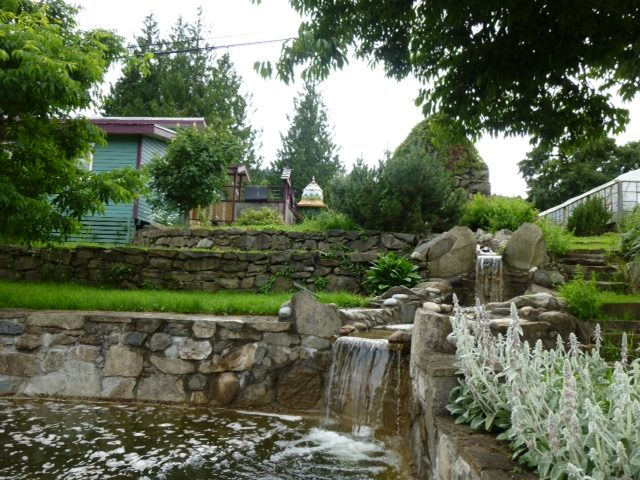
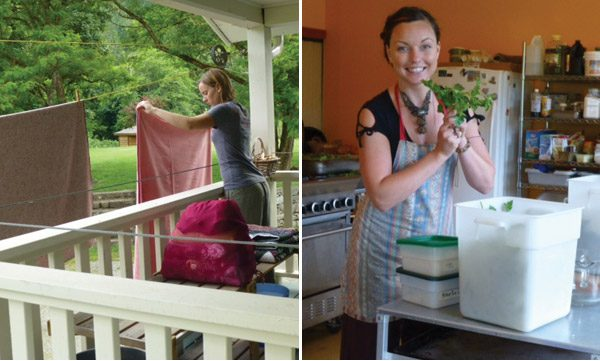

Hello everyone,
Happy Canada Day - and Fourth of July if you’re American - and happy summer, everyone. The sun is shining (on some days), the grass is still green and the sky is light into the late evening. We hear the song of the frogs at night and the birds early in the morning.
[caption id="attachment\_7585" align="alignnone" width="576"] The pond at the back of the mountain-fountain[/caption]
Added to the ongoing daily tasks that keep the Centre running - and asana classes, yoga theory study and kirtan - this is a time for swims in one of Salt Spring’s many lakes and naps in the hammock. As always, we are blessed to have an awesome group of karma yogis here to keep everything on track.
[caption id="attachment\_7589" align="alignnone" width="600"] Laundry sadhana; Lucille with a bouquet of parsley[/caption]
Yoga Teacher Training is coming up this week, always an exciting time, followed by our [Annual Community Yoga Reteat](https://saltspringcentre.com/retreats-programs/family-retreat/) - [our 39th consecutive yoga retreat!](https://saltspringcentre.com/2011/07/37-years-of-yoga-retreats/) - at the beginning of August. If you plan on joining us please read the information online and [register](https://saltspringcentre.com/family-retreat-registration). The retreat is filling up quickly. The early bird registration date has now passed, and late registration closes July 15; to ensure that there’s a space for you, register now! The retreat is always a wonderful time for strengthening our learning, deepening our practice, and connecting with family and friends. You can see some beautiful photos of past retreats [here](http://www.flickr.com/photos/saltspringcentreofyoga/sets/72157624791487190/) and [here](http://www.flickr.com/photos/saltspringcentreofyoga/sets/72157627242011735/).
Self-development is supported by practice, whether we’re talking about learning to play a musical instrument, become a skilled athlete or make progress on our spiritual path. This month’s teaching from Babaji, called “[Regular Sadhana](https://saltspringcentre.com/2013/07/regular-sadhana-spiritual-practice/)” is a reminder of the importance of regular practice.
“Our Centre Community” this month features [Markus Vikash Knox](https://saltspringcentre.com/2013/06/our-centre-community-vikash-markus-knox/), whom many of you know from Sunday satsangs and Wednesday kirtan evenings; you may also know him as the maker of the rose petal beads. I’m sure you’ll enjoy reading his full story.
July’s “Asana of the Month” is [Half Moon pose](https://saltspringcentre.com/2013/06/asana-of-the-month-ardha-chandrasana/) - Ardha Chandrasana - contributed by Peter Ashok Baragon, an early graduate of the Centre’s Yoga Teacher Training program, who teaches at both Yoga Getaways and YTT. He has also contributed this month’s [YTT Grad feature](https://saltspringcentre.com/2013/06/meet-our-ytt-grads-peter-ashok-barago/). He is one of several people who have graduated from the Centre’s Yoga Teacher Training program who are now teaching at the Centre, either at Yoga Getaways or YTT (or both).
On July 22 of this month, we will be celebrating [Guru Purnima, an ancient Vedic ceremony (Yajna)](https://saltspringcentre.com/2011/06/guru-purnima-full-moon-yajna/), to honour Babaji and all spiritual teachers. Please follow [this link](https://saltspringcentre.com/2013/06/guru-purnima-2013/) for more information on this year's event. We welcome you to join us at 8:00 am on the 22nd for this auspicious ritual in honour of Babaji and all spiritual teachers who have inspired and supported us in treading the spiritual path. If you are interested in offering at the Yajna, or would like more information, please contact Rajani at 250-537-9537 or [rajanirock@me.com](mailto:rajanirock@me.com).
I wish you all a sunny summer, filled with light, joy and peace.
Love,
Sharada
