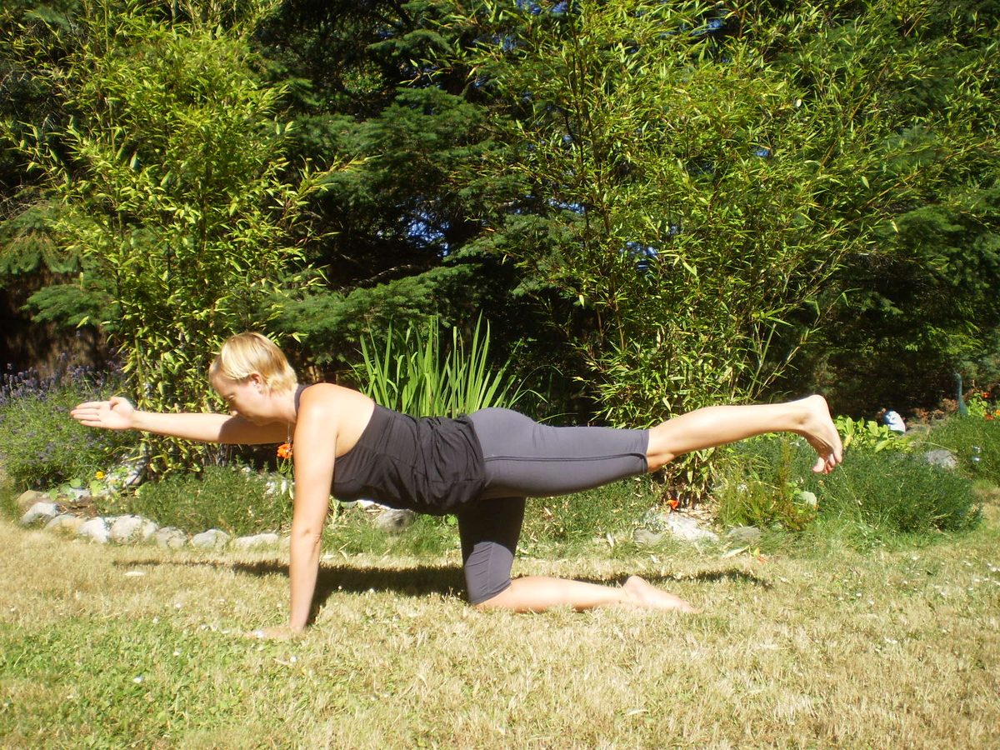
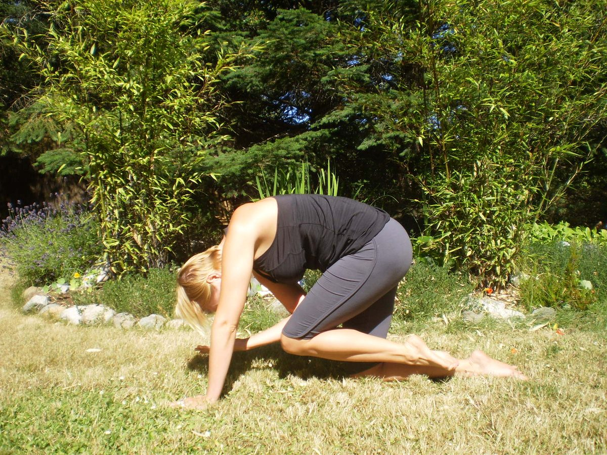
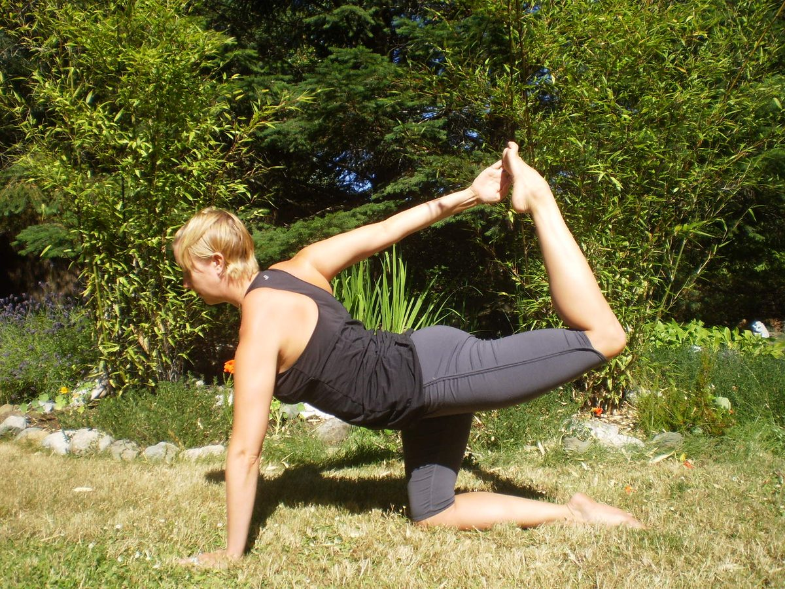

I absolutely love this pose! I offer it to my students in almost every hatha and flow class I teach. Sunbird is a great pose for beginners as it builds core strength and helps improve balance and co-ordination. For intermediate students this pose offers many variations to make it more challenging and can be used as prep for another asanas.
**Benefits include**
Strengthens core, arms, chest, legs and glutes, stabilizes pelvis and stretches the spine, massages kidneys and abdominal organs.
[caption id="attachment\_7749" align="alignnone" width="518"] Sunbird pose[/caption]
**Getting into the pose**
From hands and knees, stack your shoulders over your wrists and draw them down your back away from your ears. Make sure that your hips are stacked over knees, and legs are hip-width apart. Bring your awareness to your core by drawing your navel towards the spine and feel your hips, pelvis and lower back square. Extend your right leg straight behind you, parallel to the floor. Imagine pressing your lifted leg into a wall behind you as you flex the foot and make sure that your knee and toes are pointing in the direction of the floor. Reach your left arm forward (opposite arm to leg). As you reach the left arm forward make sure that your left shoulder is still in line with your right. Continue to breathe as you find a steady gaze. Feel one long line of energy from your left fingertips all the way to your right foot. To protect your lower back, continue to use your abdominals and draw your navel towards the spine. Stay for 5-10 breaths. Repeat other side.
**Variations on the pose**
For a variation add movement to this pose to further challenge your balance. Keep the leg extended behind you and the arm reaching forward as you inhale and on the exhale bring your knee towards your chest, your elbow towards your knee and round your back. Next inhale breath extend your leg back and arm forward and again exhale bring your elbow and knee in as you round your back. Repeat 3 more times. Do this movement slowly and mindfully, emphasizing fluidity and the movement of your spine.
[caption id="attachment\_7750" align="alignnone" width="540"] Sunbird variation[/caption]
Once you feel confident with the first variation, try the second (super-duper challenging) backbending variation. Start with the back leg extended and the opposite arm reaching forward. Bend your lifted leg so that the sole of your foot faces the ceiling. Keep the leg there as you internally rotate your lifted arm so your thumb points to the floor. As you exhale, sweep the arm out to the side and behind to you. Without straining or losing your balance see if you can touch your lifted foot (if not, don’t worry about it!) On an inhale kick your leg back and reach your arm forward and as you exhale, round your back and bring your knee toward your elbow, hugging navel to spine. Repeat 4 more times.
[caption id="attachment\_7751" align="alignnone" width="553"] Sunbird backbend variation[/caption]
**Modifications**
There are many modifications for Sunbird Pose. If lifting your leg off the floor is challenging, try keeping your toes on the floor. Another modification is to separate the arm and leg movements. Start by just lifting your leg, and then lower your leg and lift the opposite arm. A third option is to keep both hands on the floor and lift just the leg. With this variation you may add the knee to chest movement on an exhale while you round the back. For wrist problems use fists, instead of flat palms.
After Sunbird pose I usually move into Child's Pose for a few breaths to gently stretch the lower back and release the hips.
This pose is great for all levels and it fits nicely into most hatha, flow and power classes. In a hatha class, it is a great foundational pose as it helps to build shoulder, core, leg and glute strength as well as improving balance and co-ordination. For flow and power classes, it is a great way to warm up (especially the super-duper challenging variation) and gets students really connected to their breath. The back-bending variation is also a great prep pose for other backbends such as Cobra, Upward Facing Dog, King Pigeon, Upward Facing Bow (Wheel) and Dancers Pose.
**About the Instructor**
With her encouraging and positive personality, Sarah Crawford Russell, E-RYT 200, inspires others on their journey, both on and off the mat. Sarah reminds her students to take their yoga practice one breath at a time, to let go of judgements and expectations, and to find more compassion towards themselves. In 2008 Sarah completed her 200 hour Hatha Yoga Teacher Training program at the Salt Spring Centre of Yoga. For Sarah, this experience ‘changed her life’ as she began to see yoga not just as a physical practice but as a philosophical way of life. That same year she also finished her degree in Contemporary Dance from Simon Fraser University. In 2011 Sarah finished a 200 hour Yoga Teacher Apprenticeship with Michael Gannon, studying Ashtanga Vinyasa Yoga in Playa Del Carmen, Mexico. While dramatically deepening her personal practice, this apprenticeship also provided Sarah with a greater sense of confidence in her ability to teach Vinyasa Yoga to all levels, intelligently and safely. Sarah’s passion for helping others find more comfort and ease in their bodies lead her to study Restorative Yoga with Judith Hanson Lasater in the fall of 2012. As a certified Relax and Renew Restorative Yoga teacher Sarah intends to give her students the support and space that they need to breathe, explore, observe, release and truly listen to their bodies. In 2012 Sarah was honoured to join the teaching faculty at the Salt Spring Centre of Yoga’s Teacher Training program.
[Read more about Sarah's experience in our Yoga Teacher Training program.](https://saltspringcentre.com/2013/07/meet-our-ytt-grads-sarah-crawford-russell/)
