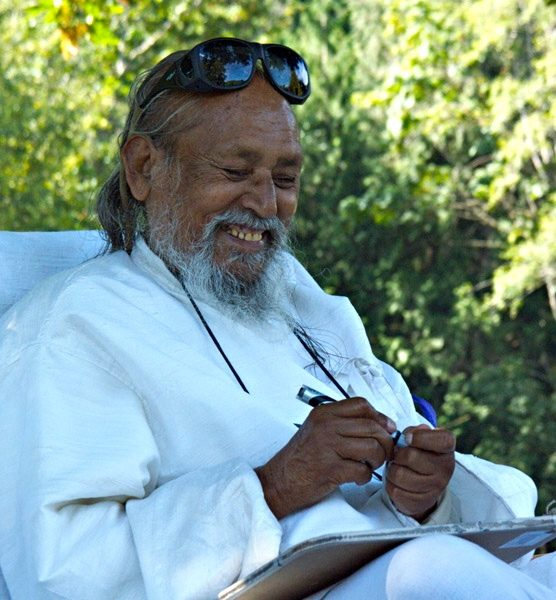

[caption id="attachment\_7580" align="alignright" width="356"] Babaji[/caption]
Babaji has written, “Accepting the present is happiness.” Although we may understand this on some level, some of the time, very often we want things to be different from how they are right now. If it’s unpleasant, we want it to stop or go away; if it’s pleasant, we want more of it or we hold on tight for fear of losing it.
Recently I came across a wonderful story shared by Tara Brach, an American Buddhist teacher and author of the book, “Radical Acceptance”, that illustrates beautifully how we create difficulties for ourselves by not accepting situations as they are.
This story took place a number of decades ago when the English had colonized India and decided to build a golf course in Calcutta. Apart from the fact that the English didn’t belong in India to begin with, the golf course was not a particularly good idea. The biggest challenge was that the area was populated by monkeys.
The monkeys, it turns out, liked playing golf, too - except their way of playing was to go onto the golf course, pick up the balls that the golfers had hit and toss them around in all directions. Of course, the golfers didn’t like this at all, so they tried to control the monkeys. First they built high fences around the golf course - and they went to a lot of trouble to do this! Now, monkeys climb...so of course that solution didn’t work at all.
The next thing they tried was to lure the monkeys away from the course - maybe by waving bananas or something - but for every monkey that would go for the bananas, many others would come onto the golf course to join in the fun. In desperation they tried trapping and relocating the monkeys, but that didn’t work either. The monkeys just had too many relatives that liked to play golf!
Finally, they established a novel rule for this particular golf course: The golfers in Calcutta had to play the ball wherever the monkey dropped it. Those golfers were onto something!
Tara Brach goes on to say: We all want life to be a certain way. We want the conditions to be just so, and life doesn’t always cooperate. Maybe it does for a while, which makes us want to hold on tight to how things are, but then things change. So sometimes it’s like the monkeys are dropping the balls where we don’t want them.
We have our habitual ways of dealing with these kinds of situations - blaming others, blaming ourselves. We may become aggressive, or see ourselves as victims and then resign. Or sometimes we soothe ourselves with extra food or drink. But clearly, none of those reactions is helpful.
If we are to find any peace, if we are to find freedom, we need to learn to pause and say, “Okay, this is where the monkeys dropped the ball. I’ll play it from here as well as I’m able.” Whatever the situation, whether in a relationship with another person, a work situation or any one of the many things that come up in our day-to-day lives, what would it mean to play the ball from here?
It doesn’t matter what is happening. What matters is how we respond. How we respond is what determines our happiness and peace of mind.
From Babaji:

*Your mind is the creator of everything. You create heaven and you create hell. Both are in the mind.*

*You are in bondage by your own consciousness and you can be free by your own consciousness. It’s only a matter of turning the angle of the mind.*

*The world is not a burden; we make it a burden by our desires. When the desires are removed, the world is as light as a feather on an elephant’s back.*

Contributed by Sharada
