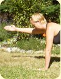

With her encouraging and positive personality, Sarah Crawford Russell, E-RYT 200, inspires others on their journey, both on and off the mat. Sarah reminds her students to take their yoga practice one breath at a time, to let go of judgements and expectations, and to find more compassion towards themselves. In 2008 Sarah completed her 200 hour Hatha Yoga Teacher Training program at the Salt Spring Centre of Yoga. For Sarah, this experience ‘changed her life’ as she began to see yoga not just as a physical practice but as a philosophical way of life. That same year she also finished her degree in Contemporary Dance from Simon Fraser University. In 2011 Sarah finished a 200 hour Yoga Teacher Apprenticeship with Michael Gannon, studying Ashtanga Vinyasa Yoga in Playa Del Carmen, Mexico. While dramatically deepening her personal practice, this apprenticeship also provided Sarah with a greater sense of confidence in her ability to teach Vinyasa Yoga to all levels, intelligently and safely. Sarah’s passion for helping others find more comfort and ease in their bodies led her to study Restorative Yoga with Judith Hanson Lasater in the fall of 2012. As a certified Relax and Renew Restorative Yoga teacher Sarah intends to give her students the support and space that they need to breathe, explore, observe, release and truly listen to their bodies. In 2012 Sarah was honoured to join the teaching faculty at the Salt Spring Centre of Yoga’s Teacher Training program.
**Where do you live? What do you do in your life apart from yoga?**
I live in Vancouver and teach full-time in Vancouver, Burnaby and Richmond. When I’m not in a Yoga studio, I’m at school studying Counseling Psychology. When I’m not at school I’m either hanging out with family and friends, dancing to reggae music or at a performance. When I’m not doing any of that I enjoy watching a good movie and eating a huge bowl of popcorn!
**What motivated you to begin practicing yoga? How did yoga come to be a part of your life?**
When I was 18 years old I started practicing yoga to complement my dance training. At the time, yoga was a physical practice for me, a way to gain strength and stamina for dancing. It wasn’t until I became a Karma Yogi at the SSCY at the age of 20 that I started to see yoga as a “philosophical” way of life.
**What attracted you to the SSCY YTT program?**
I fell in love with the SSCY over the two summers that I worked as a Karma Yogi. It was the first time in my life that I experienced a real sense of community, a community of resect, compassion and selfless service. I felt at home at the SSCY and I just knew that I would do my Yoga Teacher Training there.
**What aspect of yoga has had the most transformative effect on your life?**
For me, the aspects of yoga that have been the most inspiring are the Yamas and Niyamas. I believe that the ancient teachings of Yoga can nourish and inspire us in today’s contemporary world. I draw daily inspiration from these teachings, particularly Ahimsa (non-harming), Santosha (contentment), and Isvara Pranidhana (surrender to a higher source). In Patanjali’s Yoga Sutras, we learn that the ethical practices of Yoga must come before Asana (yoga postures). As Babaji says, “when one says, ‘I want to become a better person’, that is the start of Yoga.” Yoga begins with leading an ethical life.
**What surprised you the most about the practice of yoga? How has your understanding of yoga deepened?**
I love that Yoga is multidimensional. There are numerous types and styles of yoga and there is literally something for everyone. The more studying I do the more I realize that the practice of yoga grows and extends well beyond the mat, cushion or yoga studio. Yoga is everywhere in life. Yoga is treating others with kindness and compassion. Yoga is self-acceptance and self-respect. Yoga is standing up for what you believe in. Yoga is honoring the trees, the oceans and the equality of all beings. Yoga is working honestly towards a common good for all.
**Please share some memorable moments - or a favourite moment - from YTT.**
YTT was a very special time for me because my sister, Heather, and I did the program together. It was so lovely to be able to share this life-altering experience with her, and we grew much closer because of it.
**What can students expect from the yoga teacher training at the Centre?**
From my experience of both taking YTT and teaching on the faculty, I can say with certainty that the YTT program at the SSCY will change your life. This program is unlike any other training available. It is a comprehensive program that provides students with a solid foundation in the teachings of Classical Ashtanga and Hatha yoga. Students also study the teachings of the Yoga Sutras and Philosophy as well as Ayurveda, Physiology and Anatomy. Students will complete the program feeling inspired, full of knowledge, personal strength and an eagerness to ‘teach to learn’.
**How has your practice evolved since completing the YTT program? Are you sharing yoga in your community? If so, what inspires you to share the practice?**
I completed another 200 hour YTT in 2011 studying Ashtanga Vinyasa yoga with Michael Gannon in Playa Del Carmen, Mexico. While dramatically deepening my personal practice, this apprenticeship also gave me a greater sense of confidence in my ability to teach Vinyasa Yoga to all levels, intelligently and safely. In 2012 I studied with Judith Hanson Lasater, gaining my qualifications to teach Restorative Yoga. Currently, I am studying Counselling Psychology and training to be a Yoga Therapist with Phoenix Rising Yoga Therapy. I am fascinated by body somatics, psychology, and the mind-body connection.
These days, my yoga practice is a combination of different techniques and methodologies that I have been influenced by. Some days my practice is powerful and fast-paced, whereas other times I just roll around on my living room floor using massage balls and foam rollers. However, most days I practice what I refer to as the ‘mandatory’ legs up the wall pose! I love that my practice can reflect my needs, moods and requirements for each day.
I am inspired when I hear that yoga has changed someone’s life. That is huge!
**Do you have any favourite quotes?**
Yup! It’s incredibly profound and amazingly simple: “Peace of Mind = Peace on Earth”
--
Practice [Sunbird Pose](https://saltspringcentre.com/asana-of-the-month-sunbird-pose/) with Sarah in our August instalment of Asana of the Month.

### For information about the Salt Spring Centre of Yoga’s YTT program, visit:

[Yoga Teacher Training home](https://saltspringcentre.com/programs-retreats/trainings/yoga-teacher-training/)
