[caption id="attachment\_7757" align="alignnone" width="518"][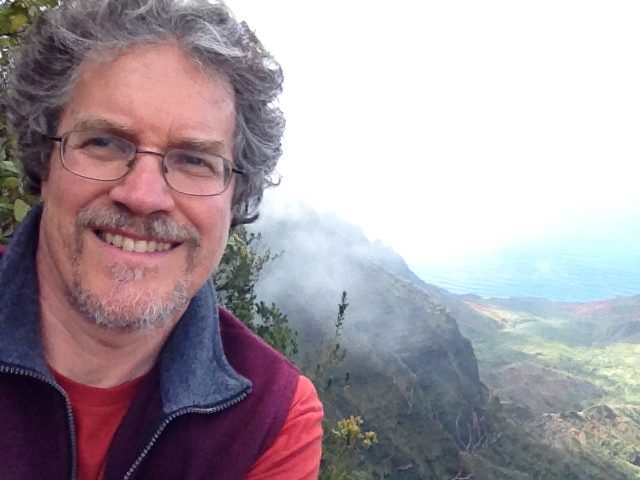](images/81ed3841_OmPK-current.jpg) Om Prakash, part of our Centre community[/caption]
The first time I saw Babaji, I was seventeen years old. I was in high school, eating from the Hare Krsna Cookbook, doing hatha yoga using Richard Hittleman’s books, and reading Autobiography of a Yogi and Be Here Now. I was an annoyance to my family with my dietary demands, sleeping on a mat on the floor in an empty bedroom. One day I was walking past Flying Monkey Store in Toronto and saw a magazine on a rack out front: Dharma Sara #1. I thought it was free, so I took one. On the cover was the image of a man who represented my ideal of the Himalayan yogi, beautific in features with an ascetic bearing. After reading the magazine from cover to cover, I put it aside.
[caption id="attachment\_7713" align="alignnone" width="465"][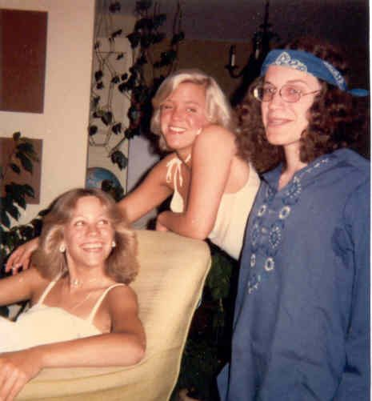](images/81ed3841_OmPK1.jpg) OmPK (age 19) with sisters Wendy and Carelyn[/caption]
I was a student of Yogananda at the time and often visited Song of the Morning Ranch in Northern Michigan which was run by Yogacharya Oliver Black, Yogananda’s oldest disciple. On moving to Calgary a few years later, I began working in Ambrosia Restaurant where we were deeply interested in Findhorn, akashic records and Alice Bailey. I also became good friends with Terry Willard, who taught me about tipi living and Native American herbs. I heard a rumour about Salt Spring Island and loaded my tipi poles to visit.
[caption id="attachment\_7714" align="alignnone" width="600"][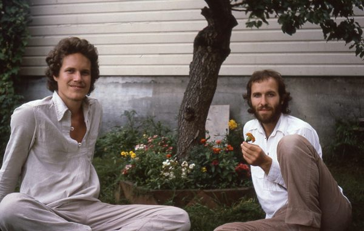](images/81ed3841_OmPK2.jpg) OmPK at Shyamspace Ashram 1979 with Ravichandra[/caption]
I remember arriving in Vancouver and hearing that Babaji was in town before the Oyama retreat. I went to an address in Point Grey and knocked on Ravindra’s door late in the evening. I asked if I could see Babaji, but they said he was asleep (I was not a socially astute individual). After a short stay on Salt Spring at Tassaday Farm, and then on Gabriola Island I began living at the Shyamspace ashram in Vancouver. Mayana lived next door and she introduced me to the Dharma Sara Satsang. At my first satsang I heard Anuradha sing and that was it. I signed up! We were looking for land all over BC, when finally Sudarshan found the property on Salt Spring and we all chipped in for the down payment. That summer I finally met Babaji at the Camp Elphinstone retreat.
[caption id="attachment\_7715" align="alignnone" width="578"][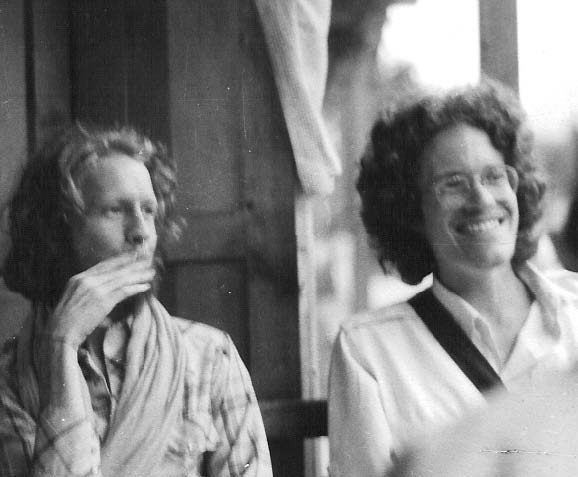](images/81ed3841_OmPK3.jpg) At a chai shop in Kulu with Govind Shyam[/caption]
Pitambar and Sumitra started farming at the Centre and I moved onto the land soon after, staying for about six months. At one point Anuradha, Vidyasagar and I decided to make a tape in the Centre library of all the kirtan in the Wings of Breath book (which had recently been published) using two mikes and a cassette deck. We sold those tapes for decades. In the fall I fulfilled a dream and travelled to India, visiting places like Ladakh, Kulu, Rishikesh, Badrinath and Almora. I crawled into Hariakhan Baba’s cave in Pandukoli, met Lahiri Mahasaya’s grandson in Varanasi, and meditated in Yoganada’s attic in Calcutta.
[caption id="attachment\_7716" align="alignnone" width="433"][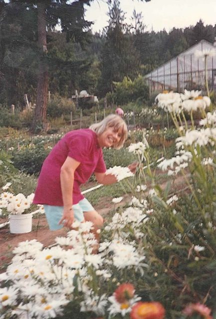](images/81ed3841_OmPK4.jpg) My mother Savitri in the SSC garden[/caption]
My sisters and niece came to retreats over the years and my mother, Savitri, stayed on the West Coast for several years. She helped me buy a VW van and I decided to teach her how to drive. We were on Blackburn Road, trying to turn around when she hit the accelerator instead of the brake and we smashed into the big fir tree by the driveway entrance!
[caption id="attachment\_7717" align="alignnone" width="540"][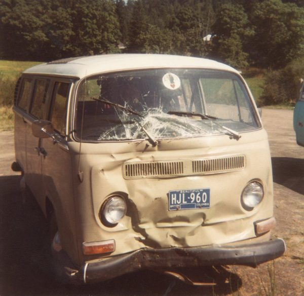](images/81ed3841_OmPK5.jpg) Oops![/caption]
In 1985 I moved to Santa Cruz for a year, visiting Mount Madonna each week, learning to play beach volleyball, African drumming with Arthur Hull and building houses with Govind and his crew. I fell in with the artists down there and started taking drawing classes at Cabrillo College, finally returning to UBC to get my Fine Arts degree.
[caption id="attachment\_7718" align="alignnone" width="540"][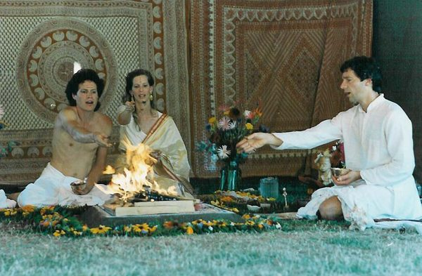](images/81ed3841_OmPK6.jpg) Vedic wedding with Sanjivani (Rameshwar pujari)[/caption]
It was up at the Whistler retreat in 1988 that I met my wife, Sanjivani. We moved to Salt Spring and had our first child, Sierra, in a portable yurt on Rameshwar’s property. Sanjivani was the administrator for the Centre School and one year they needed a teaching assistant, so I applied. I liked the work so much that I got my teaching certificate and taught the older kids at the school for the next six years. Usha was my teaching mentor and influenced the foundation of my educational philosophy.
[caption id="attachment\_7719" align="alignnone" width="540"][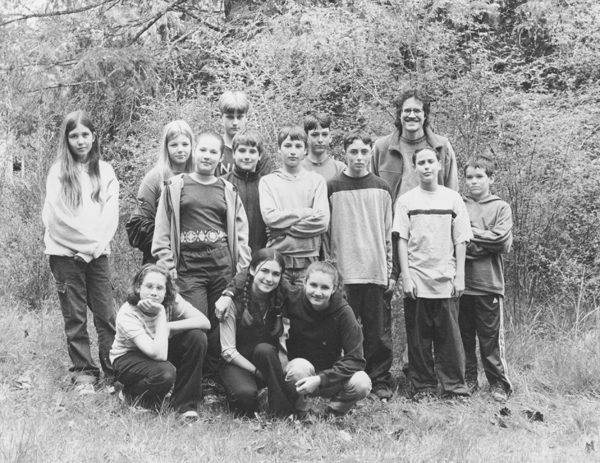](images/81ed3841_OmPK7.jpg) Teaching at the Centre School (stepdaughter Mamata front row right)[/caption]
During that time, our family had a second daughter, Ashé, and bought property on Sky Valley Road while working daily at the Centre: I designed several of the buildings (the school, garden house and isolation cabin), did lots of plumbing and electrical, and served on the executive for a few years. I recall one year we had a big debate about dishwashing. I tended to avoid dish duty and researched the purchase of a commercial dishwasher, but suddenly there was a big resistance to this idea because dishwashing by hand was recognized as a social event.
Several satsang members were in a marimba band that played around the island and at Saturday Market.
[caption id="attachment\_7720" align="alignnone" width="540"][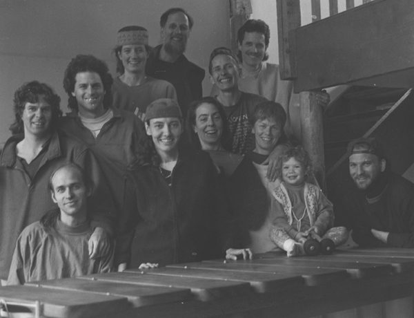](images/81ed3841_OmPK8.jpg) Shungu Marimba with Bhavani (2nd from left in front) and OmPK (back right)[/caption]
My marriage took a sad turn and my ex-wife and children moved to Nelson. I went back to school to get my Masters degree and became a principal, initially in First Nations communities in Klemtu and Kincolith and then in Harrison Hot Springs. That’s where I have been working for the last seven years. I have been blessed with Rajani’s companionship for the last 16 years and we like to travel the world, tend the garden on a small property on Mount Belcher and spend time in the wilderness on our little boat. I stay involved with the Centre as a sound technician, facilitating events, and telling tales at the Latte Da Stage.
[caption id="attachment\_7721" align="alignnone" width="540"][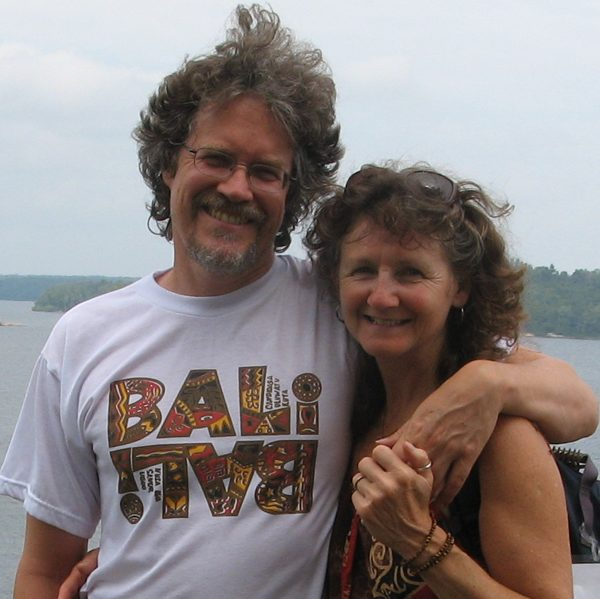](images/81ed3841_OmPK9.jpg) OmPK and Rajani, 2009[/caption]
Although I was often on the fringes, I feel like the Centre has always been my root and my home community. I felt that Babaji’s teachings were simple, clear and concise. In the early years, I thought it was my duty to be “official questioner” during Question & Answer, but with time my mind settled down and I could abandon that compulsion. With the assistance of my Centre friends and the buffeting of life’s events, I feel that I have softened the arrogance of my youth and feel comfortable slowly becoming an elder.
[caption id="attachment\_7722" align="alignnone" width="540"][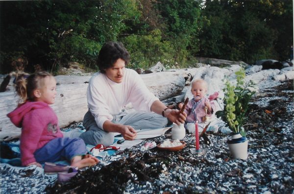](images/81ed3841_OmPK10.jpg) Shraddha ceremony for niece Saxon 1994, daughters Sierra (left) and Ashé[/caption]
[caption id="attachment\_7723" align="alignnone" width="540"][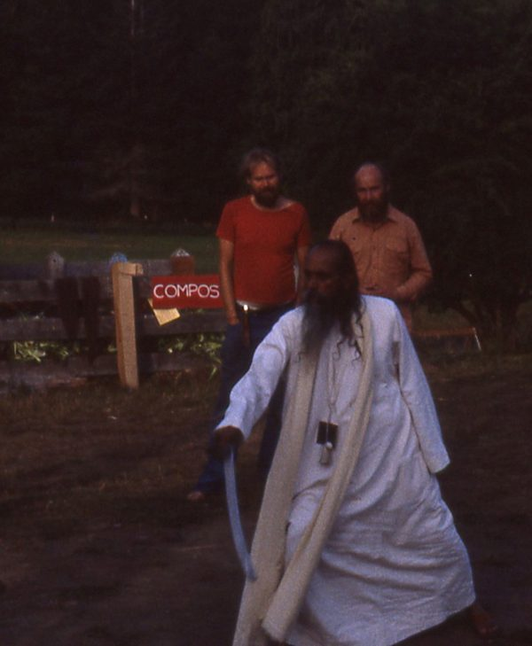](images/81ed3841_OmPK11.jpg) Babaji demonstrates sword technique at SSC Retreat 1982, SN and Mahesh behind[/caption]
