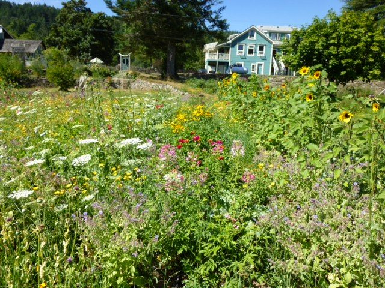
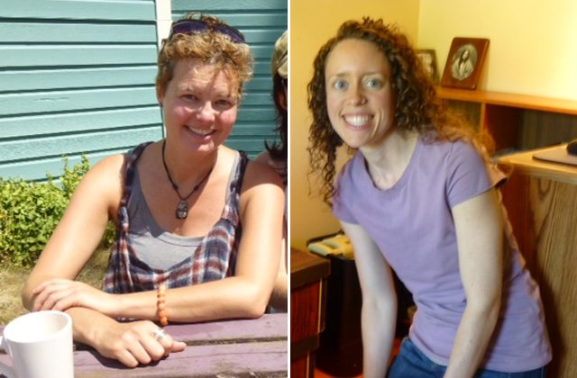
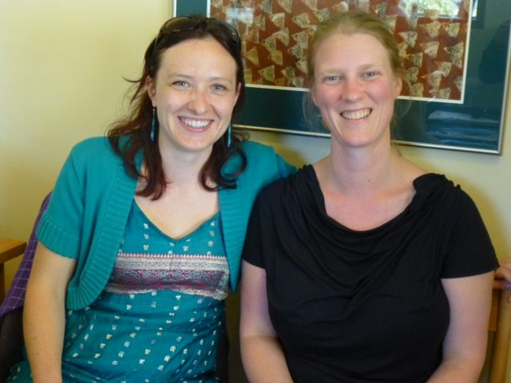
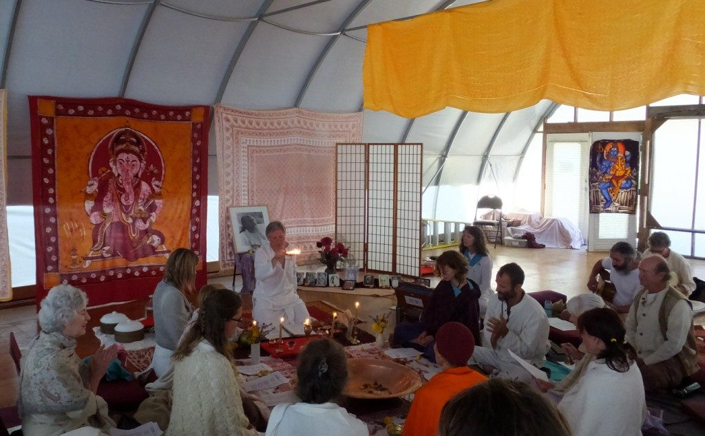

Hello everyone,
I hope you’re enjoying summer wherever you are. We are in the midst of our annual hot, dry summer on Salt Spring Island. We wait all year for the sun and heat, and then suddenly, it arrives. The sun is shining, the sky is clear blue almost every day and the lakes are very inviting. The farm is producing an abundance of fresh produce, and the cooks are serving huge salads and other delicious dishes from farm harvests.
[caption id="attachment\_7734" align="alignnone" width="512"] Summer gardens[/caption]
All the karma yogis continue to work hard to keep the Centre going - weeding and harvesting, cooking and cleaning, answering phones, keeping everything running smoothly - truly a wonderful team!
[caption id="attachment\_7746" align="alignnone" width="495"][![[clockwise from top left] Uddhava and Joe sitting in one of the chairs they just painted; Paramita hard at work; Lisa battling the morning glory; Kali in the kitchen office](images/81ed3841_KYs-at-work.jpg)](images/81ed3841_KYs-at-work.jpg) [clockwise from top left] Uddhava and Joe sitting in one of the chairs they just painted; Paramita hard at work; Lisa battling the morning glory; Kali in the kitchen office[/caption]Within the continuity of life at the Centre, life, as it does, brings changes; at this moment some of those changes are in the office. Julie, our wonderful Karma Yoga Coordinator, is going back to school for a masters program at Naropa University in Colorado. The program is a perfect fit for her, and we’re getting used to the fact that she’s leaving at the beginning of August. We wish her well. Jack will remain till October, then join her in Colorado. Fortunately a new Karma Yoga Coordinator was selected, and arrived here mid-July to learn the ropes from Julie and get to know the community. I’m happy to report she’s a great fit, and I’m sure she’ll do an excellent job. Welcome Georgia.
[caption id="attachment\_7735" align="alignnone" width="512"] Thanks to both Georgia and Julie[/caption]
One more of our office team is leaving shortly as well. Monique, the Centre’s Office Manager and Rentals Coordinator, is also going back to school, to study acupuncture in Victoria. I’m delighted to report that Claire Barratt, a current participant in our KYSS program, has been hired. She is already familiar with the Centre, and will now bring her considerable skills and experience to the office. Everyone in the office is delighted she will be joining them. The Centre is also looking for a new Farm Manager; ads are posted and applications are coming in.
[caption id="attachment\_7767" align="alignnone" width="576"] Thanks to both Monique and Claire[/caption]
We recently celebrated Guru Purnima in the pond dome, as the program house was in use by a Zen meditation group for the full week. Guru Purnima is a special time to honour Babaji and all spiritual teachers. As always, it was a beautiful and moving event. Jai Gurudev!
[caption id="attachment\_7745" align="alignnone" width="553"] Guru Purnima celebration at the Centre, 2013[/caption]
On the first day of August we begin our 39th Annual Community Yoga Retreat. We held [our first retreat in 1975](https://saltspringcentre.com/2011/07/37-years-of-yoga-retreats/), at a camp in White Rock, BC. In subsequent years we rented a children’s camp in Oyama, in the interior of BC. The retreats back then were much longer than they are now, and larger - 300- 400 people. It’s undoubtedly a good thing we didn’t know what we were getting into; we probably wouldn’t have done it. But Babaji kept us going, and after a while, encouraged us to buy land and start a yoga centre. For many years now, our annual retreat has been held here at the Salt Spring Centre of Yoga.
Following the retreat, we will welcome this year’s group of YTT students and teachers back to the Centre for the second half of YTT. Meanwhile, regular classes for the karma yogis and others from the island community continue. Satsang remains strong every Sunday afternoon, held in the pond dome when the program house is full. Wednesday evening kirtan also draws many people. It differs from satsang in that everyone sits in a circle, and a peacock feather gets passed around. Upon the arrival of the feather, each person is invited to lead a song. Not everyone does, but everyone has the chance to lead; it’s a perfect opportunity for anyone wanting to try a new song or sing in front of others for the first time. It’s a very supportive group.
I invite you to read the articles in this edition of Offerings. “[Our Satsang Community](https://saltspringcentre.com/2013/07/our-centre-community-mark-om-prakash-classen/)” features Mark Classen, known to us as Om PK (Om Prakash). He’s been part of this community for many, many years, in varying roles, several of them teaching in the Salt Spring Centre School. The [YTT Grad article](https://saltspringcentre.com/2013/07/meet-our-ytt-grads-sarah-crawford-russell/), as well as the [Asana of the Month](https://saltspringcentre.com/2013/07/asana-of-the-month-sunbird-pose/), are by Sarah Russell, a graduate of our YTT who is now on the YTT faculty. I encourage you also to read “[It’s not what’s happening, it’s how you respond](https://saltspringcentre.com/2013/07/its-not-whats-happening-its-how-you-respond/)”. It is for and about all of us, an amusing story to remind us that life can be a lot lighter than we often think it is.
May we be filled with loving kindness.
May we be well.
May we we peaceful and at ease.
May we be happy.
Love,
Sharada
