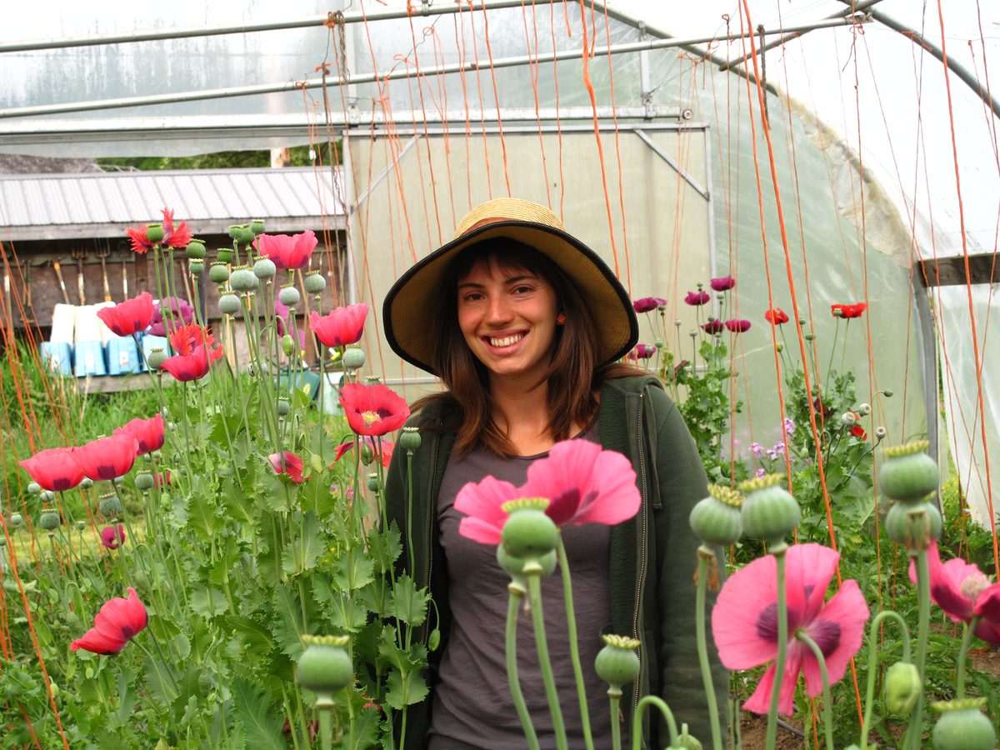

[caption id="attachment\_7775" align="alignright" width="300"] photo by Uddhava Tomei[/caption] **This month our farm blog is from our newest farm yogi, Leah!**
As the newest karma yogi on the farm, I've been lucky enough to dive headfirst into the abundance of summer. I arrived at the centre in the first week of June, eager to learn and ready to get my hands dirty. The last six weeks have been thoroughly educational, and recently we've really been seeing (and eating!) the fruits of our labour.
My daily routine consists of a 6:00 wake up every morning. Like the other summer-season karma yogis (KY’s for short), I sleep in a tent in the forest. I love to see the dappled morning light as I crawl out of bed and pull on my boots to start a new day. I cook an early breakfast in the community kitchen with the other farm yogis. Then it’s to the propagation greenhouse (the prop house, as we call it) for our morning meet-up to plan the day’s activities. Our tasks are varied and there’s always something new to learn.
Since my arrival, I've suckered and trellised tomatoes, collected dried mustard seed, hilled potatoes, and mulched strawberries. I've thinned lettuce, seeded carrots and flipped compost. I've also learned to use various farm tools and now feel quite comfortable with a hoe in my hands. I’m getting better at keeping my furrows straight and even for seeding. The day Jack taught us to scythe was a memorable one. It is incredibly satisfying to slice through shoulder-high thistles with one swoop after spending days pulling the roots by hand. I’m slowly building up my farm muscles, and I daresay I am even developing some farm callouses on my hands!
Fridays are often my favourite day of the week, because Friday is harvest day. Lately we've had such bountiful harvests that we've even added a second harvest day, which means twice the fun. We've been picking, washing and bunching heaps of kale, chard, lettuce and collards. More recently we've gotten our first summer squash and tasty bucketfuls of blueberries, raspberries and strawberries. The snap and snow peas are in high production, and this morning we picked an impressive 92 pound of beans! It is so wonderful to sit down to dinner and see all the delicious farm veggies on my plate. I’m certainly living the good life as a farm KY, and the food is even tastier because I know exactly where it came from!
