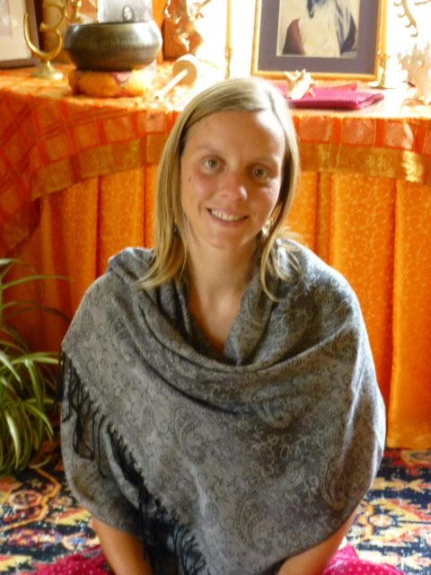

[caption id="attachment\_7940" align="alignright" width="302"] Karma Yogi Crystal, Summer 2013[/caption]
I had just returned from an adventure in California, teaching yoga and soaking up the sun. In September I started driving up the coast to Canada to visit family, not knowing what I was going to do next. When I was visiting my family in Missouri, I got an email from a friend in Vancouver who wanted me to come back to Canada; she kept sending me links to job opportunities in Canada. The Centre’s KYSS program was one of them. I immediately knew this was more than a job posting, so I did a lot of research which solidified what my heart was telling me. I didn’t care what department I’d be in; I just wanted to be here.
When I first arrived in June I had some trouble finding a place in the community - an experience that was new to me. Once I realized it didn’t have to happen immediately, that it would happen in its own good time (or not), I surrendered and let the universe be in charge, and I felt right at home.
One sentence by Rumi sums up my experience: “I lost everything and I found myself.” This place has a way of mirroring your truth to you, whether you want to see it or not, and I chose to be awake.
I’m so grateful that I’m staying for the fall season. Putting the pieces of the puzzle may be a lifetime’s work, but I sense that I’m starting from a better place, learning to trust. I want to live my life from love rather than fear.
