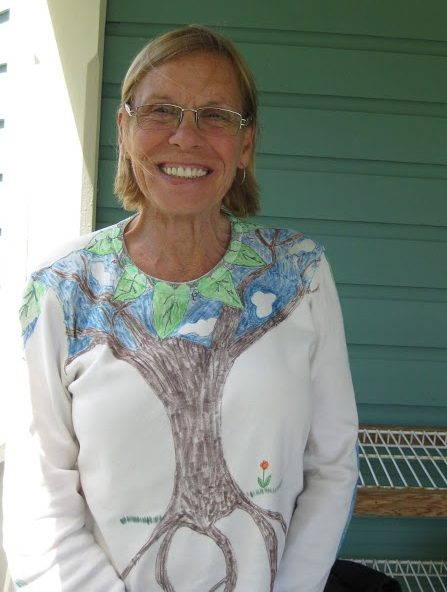

[caption id="attachment\_7995" align="alignright" width="313"] Karma Yogi Geraldine, Summer 2013[/caption]
I’m sixty-six years old, officially retired last year. I decided that I wanted to travel extensively while I’m still able to do it. I felt I was stagnating while living in Vancouver, following my routine but not meeting new new people. I’ve found that the best part of travelling is meeting new people. Everybody is interesting and has stories to tell. Seeing the sights is a bonus.
Due to my arthritis, I like to practice yoga to maintain flexibility and range of motion. I applied to come to the Centre shortly before leaving Canada for Europe. I gave up my apartment because I’m living on a fixed income and couldn’t afford to both travel and pay rent, and my priority was to travel.
In applying to come to the Centre, I wanted to be part of the community, to work, contribute to the community and meet new people. I’ve done volunteer work in the past, and have alway found I get more out of it than I put into it. The experience has always been positive.
In my time here at the Centre, I’ve gained an appreciation for the spirit of cooperation, and above all, the friendships I’ve made here - all the love I feel to and from others. Dealing with everyone’s personalities has been a struggle for me; I’ve learned that I have to develop more patience. I think I was closed when I first came here, and I’ve opened up. How can you relate to people in an honest way when you have a wall up? It feels so much better to be open with people. I was much more prickly when I came here, but my edges are beginning to wear away.
