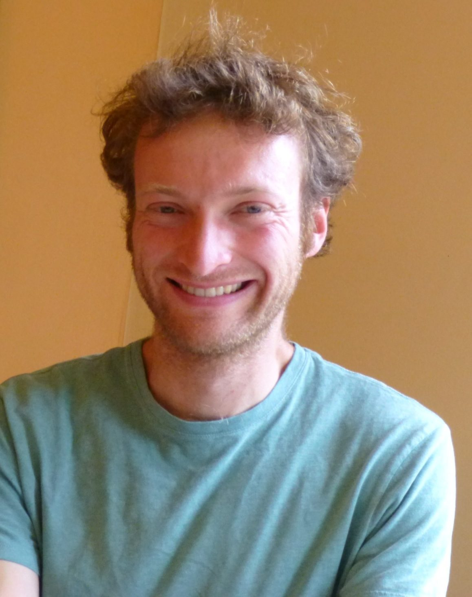

 Karma Yogi Jeff, Summer 2013
I was looking for an experience in which I would have an opportunity to live and work in the same place with people who were also interested in living and working together. Before I came here, I was working in an office doing tech. work for an internet company. The hours were flexible and the work was part time, but nevertheless my work was disconnected from my life. I came here seeking integration between my work and my life, and I can say at this point that I have found that. My work days and my days off don’t feel very different. I don’t spin my wheels here in the way I often did in the city, where I’d be looking for something and not finding it.
I truly appreciate that spiritual practice is a priority for the people who live here. In my previous life it was a struggle to carve out time for myself - many distractions and competing priorities. Also key is that we live together in community, sharing our meals, sharing our work, sharing in our play time; this has been a great source of support for me.
This is the first community I’ve lived in, and it’s been both a challenge and a gift. All the interactions with people in the community have exposed me to myself. My tendency in the past has been to seek solitude, to take time to recover from the world and prepare for the world. Here I’m starting to learn how to be at ease in the world.
