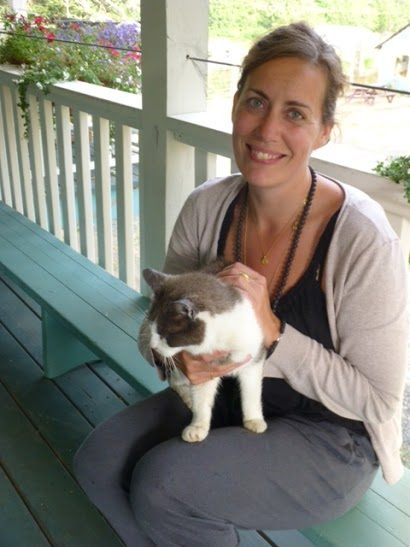

[caption id="attachment\_7945" align="alignright" width="287"] Jutta and Scooch, Summer 2013[/caption]
I woke up one morning; it was cold and snowing outside and I just knew that it was time.
I wanted to change something, wanted to find something. It wasn't because I didn't like my job or the way I was living. I just knew there was more to explore. I wanted to deepen my yoga practice, and I wanted karma yoga to help me find home, to find my Self.
I thought of going to Bali - or Nepal, Thailand, South America, India or the US. I had thought of going to Canada before, but not in a serious way. That changed during a conversation with a friend. Then I simply googled karma yoga and Canada. The Salt Spring Centre of Yoga came up right away. I was enchanted. I didn't have any past experience living in a community and I didn't have any expectations.
I had practiced many styles of yoga over the years. Then in 2012, I went to India to deepen my practice - and came home as a certified hatha yoga teacher with a huge passion for teaching yoga. I discovered that yoga is so much more than asanas and breathing techniques. I wanted to go deeper and this was the perfect time.
Living at the Salt Spring Centre of Yoga has taught me so much more than I ever believed possible - a new world, energised by love and compassion. Everybody in the community makes space for each other so that everyone can grow and develop their spiritual path at their own pace, with one common interest - to make a home in a community where karma yoga is the essence of the spiritual growth. I found my way home, with help from mother nature and all the beautiful souls in this community. I found support, understanding and so much love, and I'm so grateful. I found it inside myself and I recognized it in everybody else, both inside and outside the community.
The hard thing about leaving this community is that I probably will be living too far away to come visit my "new" family for Sunday satsangs - but the beauty is that I'm able to tune into my heart and from that place in my heart, connect with everyone, wherever I am.
Suddenly Copenhagen doesn't feel so far away!
