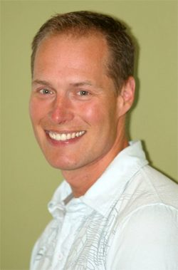

[caption id="attachment\_7919" align="alignright" width="250"] YTT Grad, Bryan Hill[/caption]
**What motivated you to begin practicing yoga? How did yoga come to be a part of your life?**
I was supporting someone I loved to find a way to heal. He didn't care to return to the class but I just kept coming back. I think I really liked the way the class asked me to slow down, to let go of the hurry that I thought city life demanded.
**What attracted you to the SSCY YTT program?**
The condensed nature of it. I keep saying I'm never going to do another crash course but they are much easier to schedule for me than a number of weekends over a period of months.
**What aspect of yoga has had the most transformative effect on your life? What surprised you the most about the practice of yoga? How has your understanding of yoga deepened?** 
The most transformative effect from my yoga practice has been the conscious connection I've developed with the divine. This is something that I was unaware prior to my training at the Salt Spring Centre. I had an idea that there was something greater but I actually got to experience the divine first hand through my yoga practice. This spiritual experience came as a complete surprise. Many of my fellow students said something about emotional release but that just doesn't sum up the reality of this transformation. I have a visual arts background and I can verbally describe the imagery I experienced, but the mental, emotional and spiritual oneness I lived is beyond words.
**Please share some memorable moments - or a favourite moment - from YTT.** 
I remember the opening circle when Divakar said to take in what you take in and not to worry about the rest; that it will come when you are ready. I remember how I took that to heart and felt free to enjoy the experience of YTT without expectations. I remember the energy of the final night when we danced under the full moon in the heat of a summer night - the glowing faces filled with love and optimism, the hearts filled with gratitude.
**What can students expect from the yoga teacher training at the Centre?**
I think that students can expect a change in their life. I don't expect any two people have the same experience at the centre. I expect that each student will get exactly what they need for the evolution of their consciousness in that moment. That may be a huge life-altering flash or something a lot more subtle and enduring.
**How has your practice evolved since completing the YTT program? Are you sharing yoga in your community? If so, what inspires you to share the practice?**
My practice has become a lot more flexible. It shifts between asana, pranayama, meditation, shat karma and back again. It adapts to what is present in my life, bringing me more or less physical demand to balance the demands of my life. I've also learned to bring the power of the yamas (part of the ethical foudation of yoga) into my relationships more often. I share the teachings from the Salt Spring Centre in the Comox Valley through a number of public and private classes. My inspiration for teaching rests in many aspects of this practice: the memories of how much asana has done for me physically, the memory of my divine nature, the hope to touch that again, the knowledge that I can create a space for people to gain wisdom through body, breath and mind.
**Do you have any favourite quotes?** 
I don't really have a favorite quote to share but I offer one of my own thoughts instead, "Yoga students talk with their feet." Your students may leave class without saying a word because they are at peace in their hearts at that moment and no words are necessary. When they come back to class I know they are speaking with their feet; they came back to reconnect with that centre, the one that the teacher made a space for so they could find it on their own.
**Where do you live? What do you do in your life apart from yoga?**
I live in Royston, a small town in the Comox Valley on Vancouver Island. I work as a massage therapist and lead fitness classes for people in the early stages of Alzheimer's disease. I like to make art; usually I paint with acrylics on canvas but I am thinking of branching out into wood carving and other 3D art. I pursue a number of physical activities including weight training, hiking, snowshoeing, running and swimming. I try to keep up with a few friends via facebook and social media games. I love to eat gourmet food and I enjoy cooking a fine meal, but I prefer eating.
**Bio
Bryan Eknath Hill**
Bryan has been practicing yoga since 2000. He completed his teacher training at the Saltspring Centre of Yoga in 2008. He leads a number of public and corporate yoga classes in the Comox Valley on Vancouver Island. Some of his efforts in karma yoga bring him back to the centre to teach at retreats and assist with the yoga teacher training program. Bryan is a registered massage therapist and has a long history of teaching physical skills. He brings his knowledge of anatomy to the mat in order to help students understand their body. He emphasizes alignment of the body as well as thoughts, words and deeds. Bryan's life has allowed him to live in Australia for 2.5 years, hike in the Bavarian Alps, be a firefighter for 4 years, climb numerous mountains and study fine art at a post secondary level.
Om, shanti.
**Read Bryan’s contributions to our Asana of the Month series, [utkatasana](https://saltspringcentre.com/asana-of-the-month-utkatasana/) (chair or powerful pose).**

### For information about the Salt Spring Centre of Yoga's YTT program, visit:

[Yoga Teacher Training home](https://saltspringcentre.com/programs-retreats/trainings/yoga-teacher-training/)
