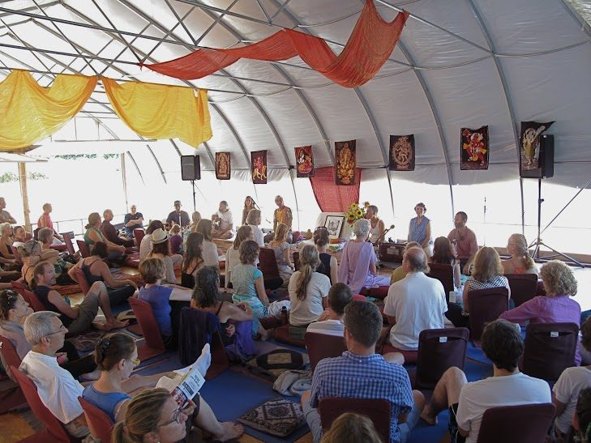
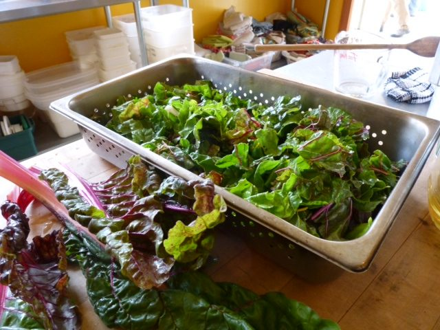
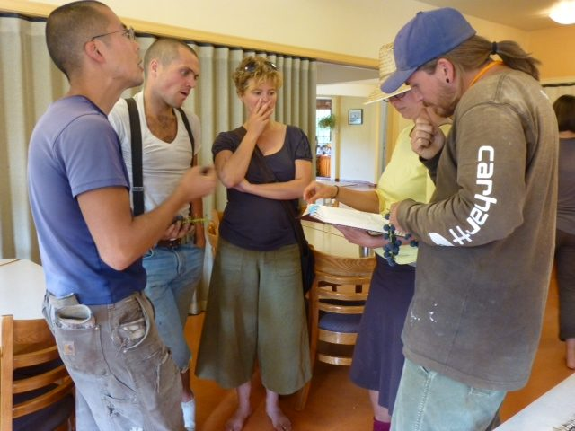
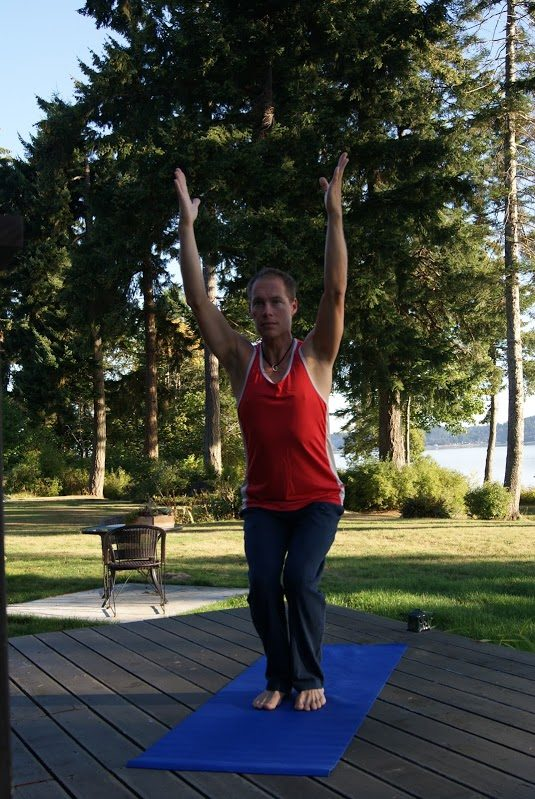

Hello everyone,
Summer has sped by as it seems to do every year, and we’re now moving into the fall season. The Annual Community Yoga Retreat in early August was a wonderful, sweet gathering. Later in August twenty-eight YTT eager students graduated from our YTT program, and are now certified yoga teachers, trained in classical Ashtanga Yoga and Hatha Yoga.
 Satsang in the pond dome during the retreat, Summer 2013
We still have several [Yoga Getaways](https://saltspringcentre.com/retreats-programs/yogagetaways/) coming up, so if you’re looking for a nourishing, relaxing weekend, do check our upcoming programs. You may also want to consider booking time for a [personal retreat](https://saltspringcentre.com/retreats-programs/personal-yoga-retreats/). Details are on the Centre’s website.
Centre residents and guests are being treated to meals that are freshly harvested and prepared. We’ve been enjoying just-picked tomatoes, zucchini, beans, corn and salad greens, chard, plus strawberries and blackberries.
 Chard, fresh from the garden
A big thank you to the farm team and to all the fabulous cooks, as well as the rest of the karma yogis in housekeeping, maintenance, landscaping and office who support the functioning of the centre in a spirit of service.
 Karma Yogis Jack, David, Georgia, Christine and Ben discussing an upcoming project
Some of our karma yogis from the summer term of KYSS have moved on to the next adventures in their lives and others have just arrived to join our community. The Karma Yoga Service and Study program continues to contribute to transformation in people’s lives. In this month’s edition of Offerings we invite you to meet some of them and read about their experiences in the series of posts called [Meet Our Karma Yogis](https://saltspringcentre.com/tag/meet-our-karma-yogis/).
Georgia, our new Karma Yoga Coordinator, has initiated ongoing discussions on the topic of community building. I’ve been delighted to note that the karma yogis who come here continue to feel inspired by the ideals and practice karma yoga. This month’s article on [Living in Community](https://saltspringcentre.com/2013/08/living-in-community/) continues the theme, with guidance from Babaji.
 Utkatasana, chair pose
Other articles you may enjoy reading include this month’s Asana of the Month - [Utkatasana (chair pose)](https://saltspringcentre.com/2013/08/asana-of-the-month-utkatasana-chair-or-powerful-pose/), contributed by Bryan Hill. It is a simple pose that works the whole body. Bryan has also contributed this month’s [Meet our YTT Grads article](https://saltspringcentre.com/2013/08/meet-our-ytt-grads-bryan-eknath-hill/). For anyone living in the Comox area on Vancouver Island, I recommend checking out his classes.
We are delighted to introduce a new feature this month - an article on health, following the principles of Ayurveda, shared with us by Pratibha, our satsang sister from the Mount Madonna community. This article, [A Seasonal Cleanse](https://saltspringcentre.com/2013/08/a-seasonal-cleanse/), focuses on preparations for the changing season. Pratibha, a long-term member of Hanuman Fellowship and Mount Madonna Centre, is a yoga instructor and Ayurvedic practitioner. She has been attending our summer yoga retreats since 1976, and is an important part of our family. We all wish she could be here more often.
As the Centre slows down somewhat in this season, life at the [Centre School](https://saltspringcentre.com/about/centre-school) picks up. During the summer, the Salt Spring Centre School is used by the Centre, all the school’s furnishings and materials having been packed into one classroom (an annual event - probably the only school in BC that goes through the annual pack-up ritual). At the end of August, the school gets set up again in preparation for the new school year. Teachers and parents work together to transform the building back into a school. This follows an old tradition: In the early years, before the school building was here, programs and school co-existed in the satsang room; on Friday afternoons the school moved to the yurt for story-writing while the satsang room was transformed into a program space. On Sunday evenings it was turned back into a school.
A reminder from Babaji: *Life is for learning and the world is our school. Doing your homework every day brings liberation. Wish you all happy and in peace.*
Love,
Sharada
