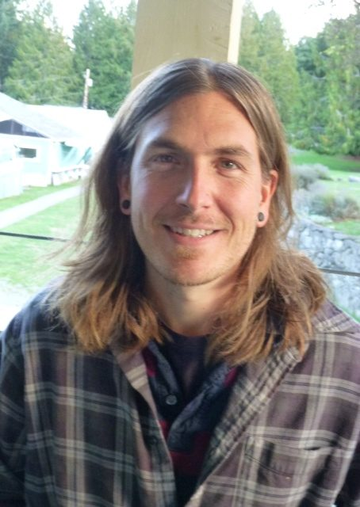

[caption id="attachment\_8207" align="alignright" width="363"] Karma Yogi Ben, Fall 2013[/caption]
Physical sports injuries drew me to yoga because I had heard it could help with past injuries. In the fall of 2009 I started practicing with a teacher in Whistler, BC, who played the harmonium and opened her classes with a prayer and shared a spiritual reading. Earlier, I had explored various spiritual paths, but not for years. Once I started to feel the depth of the classes I was now taking, devotion arose; it was touching something deep inside me.
In the winter of 2010 I started thinking I needed to learn how to grow my own food, so I went online and found the Salt Spring Centre of Yoga’s posting for a farm yogi. I wasn’t accepted because I lacked experience, but I was still really drawn to the Centre, so I looked through the website again to see if there was another way I could be here. There was a posting for a skilled carpenter, and I was accepted for a month long period. After a couple of weeks, one of the farm yogis cancelled and I was asked if I’d like to work on the farm. Unfortunately I had already committed to work for the summer. After my one month stay, I was asked if I could stay on as a carpenter, so I stayed for the next two weeks till it was time to go to work elsewhere. I kept coming back and in 2011 ended up staying till the end of October.
In the winter of 2013 I came to the Centre as a KYSS participant for the first time, working in the kitchen. As it happened, I’ve been able to stay, working in the kitchen and maintenance, and now I have the good fortune to be able to stay till the end of the season, November 15. During the first KYSS term I felt an opening in my heart that I hadn’t felt for a long time; that’s why I had kept coming back. During the time I was away, a yearning started to develop for depth of devotion, practice and service to others.
Last winter, having worked hard to earn money, I was able to commit to my life as a snowboarder; that was the focus of my devotion. As soon as I quit drinking and doing drugs when I was 28. I started devoting myself to a mountain lifestyle and to take my snowboarding more seriously. Seven years of that didn’t fulfill me. Last winter, I was in the best physical shape I’d ever been in and I had the financial resources to pursue snowboarding, but somehow that wasn’t enough. Continually pursuing desires just led to more desires.
I had a little personal check-in with myself and I realized that I wanted the openness of heart I had experienced here, and that’s when I applied to come back one more time. I wanted to serve in whatever capacity was needed; my focus was to be of service. Out of that arose devotion. Bhakti has blossomed in my heart. Having a daily practice is changing patterns I never thought could change - but something is changing. There are moments of relaxation and peace when everything flows easily.
