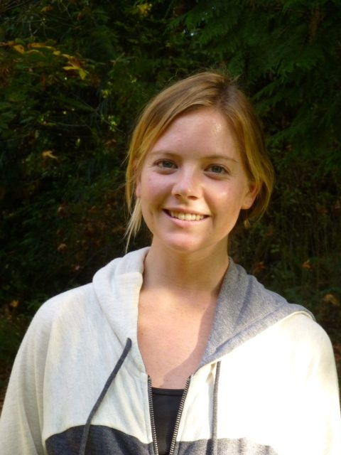

 Karma Yogi Sue Ann, Fall 2013
Before I came to the Centre I was living in San Francisco, getting my Masters degree in Public Health, having previously gotten a teaching degree and spent time teaching kindergarten and fourth grade. I was working at a yoga studio, doing a bit of work exchange for classes. That was my first real experience of yoga. The studio’s focus included spiritual, physical and community experiences.
My first experience of community came earlier, from the age of 5 when I began spending 10 weeks every summer living on a ranch, which I did till the age of 20. On the ranch we all lived and worked together to keep the ranch running and keep the animals healthy. I ended up teaching horse riding and vaulting (like circus riding). Because of that experience, I came to know I wanted to live with other people in community - and it worked out perfectly that this opportunity became available just when I was ready to leave my city life.
The first part of my stay here was more challenging than I had anticipated; I wasn’t expecting the impact that changing everything in my life all at once would have - leaving the city, living in a tent, going from university to housekeeping. Also, I’ve spent so many years with my best friends, many of whom I’ve known since kindergarten, and this was the first time I’d gone somewhere where I had to find my place without them close by. I came here with Jeff, my partner, but I didn’t know anyone else. Having to listen to myself and find my comfort in myself has been the biggest growth. It took longer than I expected, but I’m learning to trust my own wisdom.
Life at the Centre has opened my eyes to what’s possible. Now I really want to do a Yoga Teacher Training, and I’ve been introduced to meditation, which I had never done before. I’m also learning I don’t have to be perfect at everything and can relax into myself. Jeff and I have been here since June, and I’m thankful we are able to stay till the end of the season in November.
