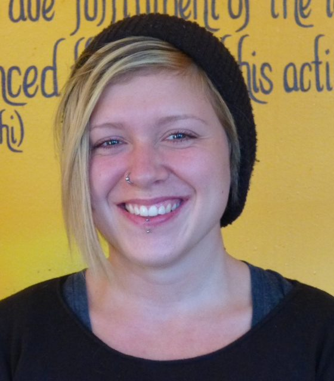

[caption id="attachment\_8209" align="alignright" width="336"] Karma Yogi Zoe, Fall 2013[/caption]
Prior to coming to the centre I lived in Victoria where I received my Diploma in Indigenous Studies from Camosun College. This is the second time I've participated in the Karma Yoga Service & Study Program. One of the reasons I feel I'm so drawn to the Centre stems from my deep appreciation for yoga philosophy, which coincides with much of the knowledge I gained in my studies at Camosun, such as our inherent interconnectedness with others, the importance of respecting the land and its resources, practicing non-violence, and so much more.
It is difficult to pinpoint the most meaningful experience I've had at the Centre because so many moments are enriched with joy, creativity and contentment. There have been many pivotal realizations I've come to, thanks to inspiring discussions on spiritual philosophy; those moments when everything just seems to make sense leave my soul feeling deeply fulfilled and at ease. I have had the privilege of meeting and working with some of the most open-hearted people I've ever known, and with whom I’ve shared many beautiful moments.
I have learnt many lessons by living in community, especially about interacting harmoniously with people from all walks of life. By practicing yoga I’ve come to feel more in touch with my higher self; I've cultivated a stronger sense of self-worth, and each day that I practice I feel more in tune and at ease with the world around me. I am grateful to have had the opportunity to have given me a richly holistic understanding of yoga that I trust will positively influence my practice for many years to come.
