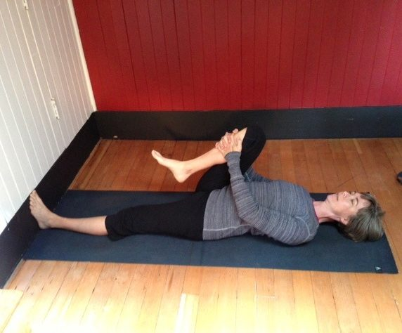
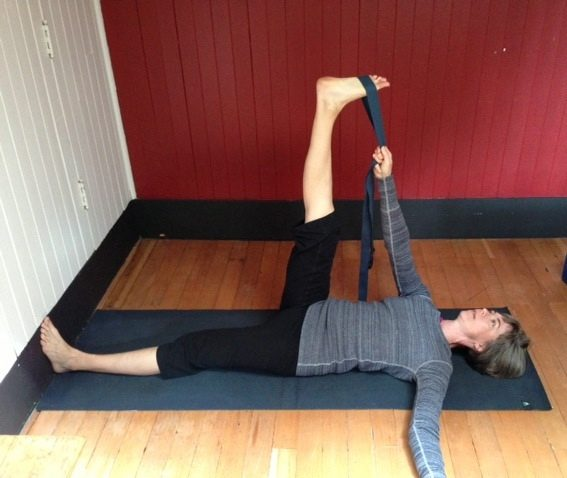
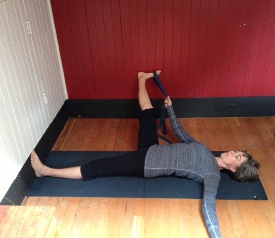

### Supta Padangusthasana or Reclining Big Toe Hold

When introducing your students to a challenging balancing pose, try taking it in a reclining, or supta position first. This allows a student to build familiarity with the actions of the pose before adding balancing to the equation. This posture builds the actions for both ardha chandrasana and padangusthasana.
**Benefits**
Supta pandangusthasana stretches the hips, thighs, groins, hamstrings and calves. It can help with sciatic and lower back pain.

**Coming into the pose**

- Begin by aligning the short edge of your mat with a wall and have a strap ready.
- Lie on your back on the mat, with the soles of your feet pressing evenly and firmly into the wall.
- Bend your right knee and hug the thigh in towards the chest.
- Bring the strap around the ball of the right foot and hold the strap with the right hand as you straighten your leg, moving the sole of the foot towards the ceiling.
- Extend the left arm out along the floor at shoulder height.

- Extend firmly out through the soles of the right and left foot, keeping both legs energized.
- Holding the strap in the right hand, allow the right leg to lower out towards the right side.
- Focus on keeping the left hip and thigh pressing down towards the mat.
- If the left hip lifts, support the right leg on a block, chair or adjacent wall until the left hip settles down towards the mat.
- Continue to press out actively through the soles of both feet.

- To come out of the posture, lift the right leg back up towards the ceiling, then bend the knee, release the strap and hug the thigh towards the chest.
- Come back to your starting position, with both feet pressing evenly and firmly into the wall before taking the left side.

**Modifications**
Use a chair, block or adjacent wall to help support the leg opening out to the side.
**About the Instructor**Julie Higginson has been practicing yoga since 2001 and completed her teacher training in 2008 at the SaltSpring Centre of Yoga. She teaches classes at the Royal Roads Rec Centre in Victoria and assists with yoga getaways and YTT at the Centre. She currently serves on the Dharma Sara Satsang Society Board as treasurer.
