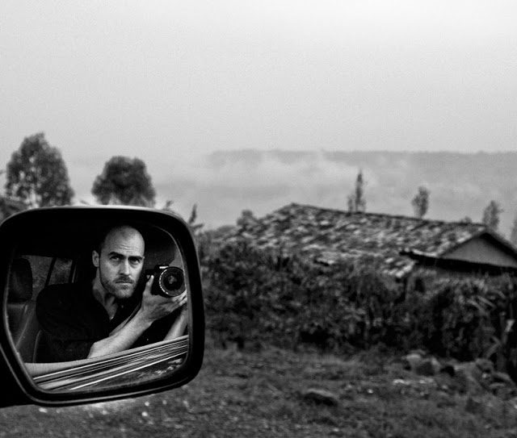
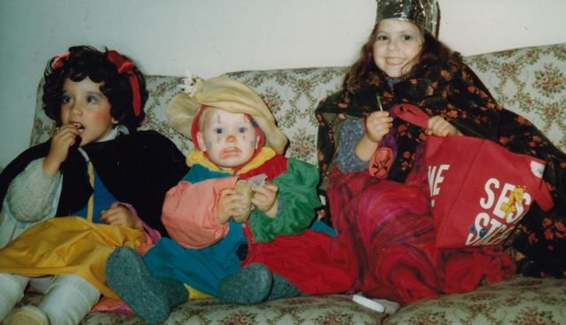
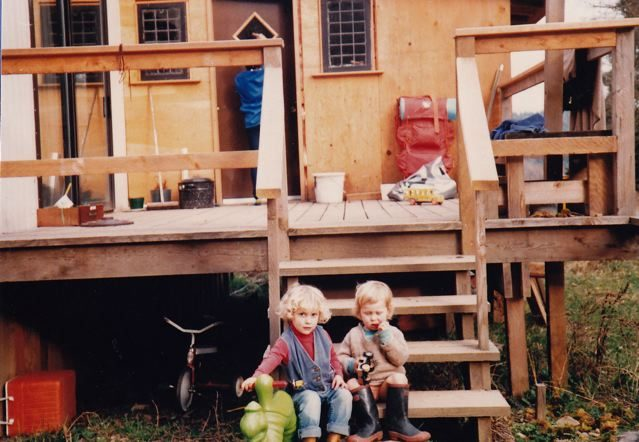
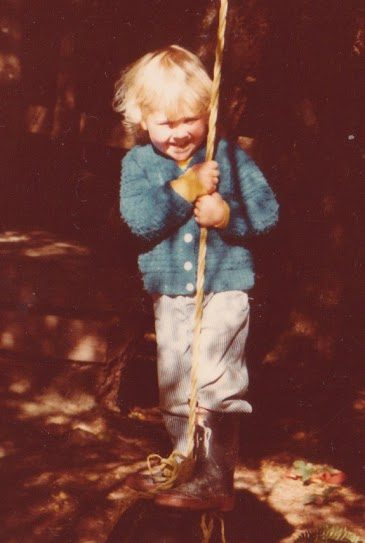
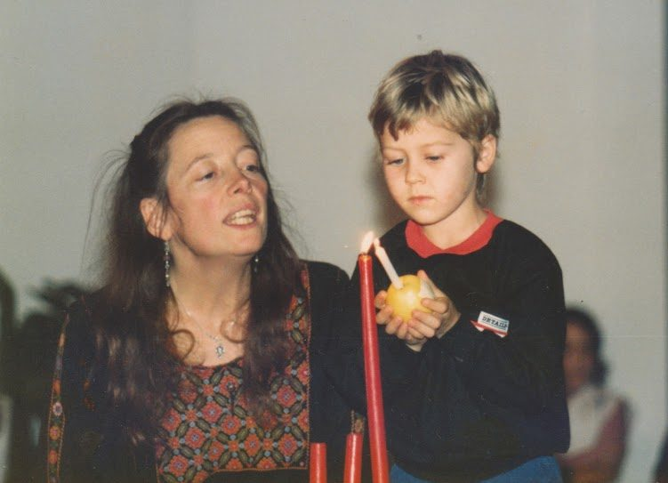
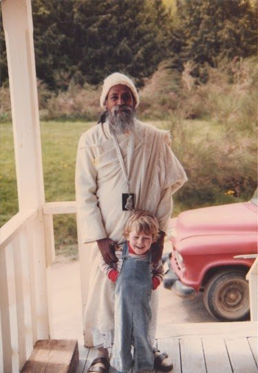
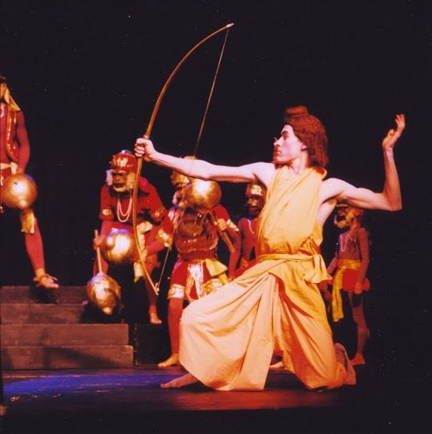
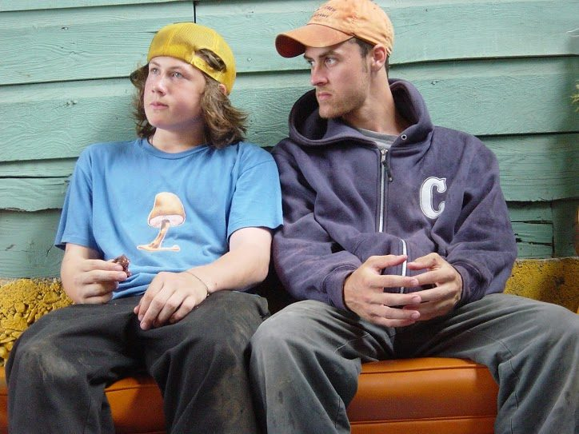

 Piet Suess, part of our centre community
Dear Salt Spring Centre of Yoga,
I am truly blessed to have you in my life - to have known you growing up and to call you home when I am there.
Some time in 1981 the property was purchased and the Salt Spring Centre of Yoga was born. A few months later I decided to be born nearby.
After being born onto the island, my next task was to find some good people and friends and adventure. This I did thanks to my mom commuting to work in Victoria and my dad moving to the yoga centre. My sister and I followed. However it had taken me much longer than I had originally intended, and I was now the ripe old age of two. Looking back, perhaps having developed better motor skills and body control was a necessary step in being able to appreciate what the yoga centre had to offer.
 Nayana, Piet, Maya. Halloween 1982.
Having found the appropriate location for my adventures, I gathered together some like minded individuals whom I could enlist in the games and projects that were soon to begin. Caleb Corkum was a frequent visitor at the centre, and my most constant collaborator. We had met in our earlier development, at half a year old. Now at the yoga centre we undertook many treacherous missions together and eagerly sought out darshan with our guru, Babaji, whenever he visited. We also quite enjoyed the candy with which he saw fit to train our hand eye coordination. Two other key individuals that accompanied us on our journeys were Mallika Hutchings and Naomi Jason, whom we found to be enlivened with the same adventurous spirit which drove Caleb and me.
 Caleb & Piet (note the boots) on the steps at Sharada's house, 1984
On the land there used to be an old hot water tank on its side that had an opening just large enough for small nimble beings to crawl into. The inside had bars running across, perfect for sitting on and pondering the deep questions of life, in near darkness with a contemporary.
According to Usha, Caleb and I would be playing in the sandbox near the big tree and swing, (which is now a garden and a baby tree) and we would get called in to her class to demonstrate for the older children what exemplary listening and attention looked like. We well understood that this was a simple task when our minds were set to it. Of course we did our best to help out the taller kids. Besides, with Usha leading class, there was little cause to get distracted. I was an eager student and participant in the Salt Spring Centre school's naissance as a near-naissance myself.
 Piet on the rope swing, circa 1984
 Piet with Usha, Advent ceremony, circa 1985
Most of my time was spent self-determining around the land, playing in the forest or labouring on self-assigned work projects; like painting a fence or pushing a box of carrots off the deck. Fortunately my father had more distracting things to worry his mind than what it was that my sister or I were doing. During this time of naissance for the yoga centre there was occasionally much heaviness on the minds of the parents and builders of the land. I am told that in the mornings when I came downstairs on my father's shoulders and found everyone in the kitchen, clearly needing some lifting of their spirits, I would try to help out. I was oh so blonde at that age and tiny and round in the face, and I would spread my arms and say 'Good morning everyone!' as boisterously as I felt would make a difference. This period of time was one that has left an indelible mark on me and I always feel oh so blonde and fortunate to have been blessed with such rich guidance, freedom and adventure.
 Piet on the back deck with Babaji, circa 1984
At some point things changed, as they do, and I no longer lived at the yoga centre, though I visited often. Eventually my family moved to Vancouver where I began to forget how wonderful a day could be, and started to learn the many complications that people create for themselves. I visited the centre less and less. With the confusion of public school, city life and the social complexities of elementary, and then high school, I stopped attending the summer retreats. Fortunately Babaji's teachings had been firmly planted in the earth of my being, and my desire to be there, and the memory of those days were close to the surface.
Having attended very few retreats throughout my teenage years, I was now graduating from high school, having done a lot of theatre. My sister Maya was on the phone with Sharada discussing the upcoming Ramayana. I thought to myself that it would be fun to maybe play Hanuman at some point eventually, and with that I was promptly handed the telephone:
"Hi Sharada."
"Hi Piet, do you want to come to Saltspring and play Rama?"
"I do!"
And I did. In 1999 Caleb and I returned for the summer and we had fun living once more on the land and rehearsing, then performing the Ramayana. It was an incredible return for me, I was welcomed with open arms, and it made me feel at home again. I turned 18 at the Centre that summer, and for the following years I attended the retreats faithfully, eagerly participating in the rock crew projects and taking photographs. I always made sure to bring anyone that was close to me, to share in the experience. Since 1999 I don't think I've missed one (maybe one) summer community retreat. I moved from dish-pig to dish-manager and then beyond. Many have said that the dish crews under my gentle reign were the most fun and desired shifts during the retreat. Or at least I just said that just now. The Ramayana in 1999 was the last year in which that play was done on Salt Spring; as well it was the last year that the Hanuman Olympics was done.
 Piet as Rama, Ramayana dress rehearsal (so no makeup), 1999
In 2010 I was casually asked if I'd like to be involved in organizing the Hanuman Olympics and help bring them back. I said yes. A while later, I happened to Google my name as I do every few hours, and found a newsletter for the ACYR which proclaimed that the Olympics were back headed by Piet Suess and his band of Karma Yogis. I was surprised, but happy to have a work project that I could spearhead on the land once more. Of course I enlisted Caleb for the task, and also my brother Max who had become just about as regular at the summer retreats as I, since his first visit as a two year old. This was also-also when my reign as dish Übermeister ended and the board saw fit to create a new dish-room in my honour to signify my departure. Or so I like to interpret it.
Almost immediately after the Ramayana of 1999 I went to the Vancouver Film School to study New Media (digital arts) and after that packed a suitcase for New York City. There I began my career in film. Outside my career on the land, I have built a career in film that has taken me to many wondrous and treacherous parts of the world. I have adventured and done projects with like minded individuals and seen many cultures and hot water tanks. After a two and a half year stint in LA I recently made my way up to stint in Victoria, via a two month stint at Mount Madonna Centre.
 Max and Piet
Through all of my work, the teachings and values that were absorbed in my early years have guided and informed me. The self-determination afforded me at the Saltspring Centre, and the unwavering moral compass of the teachings of Babaji, have been the fertile soil from which my accomplishments have blossomed. I continue to create media with socially conscious relevance, carefully choose what I involve myself in, and try to uplift everyone's spirits.
Coming back to the Salt Spring Centre of Yoga truly is like coming home.
