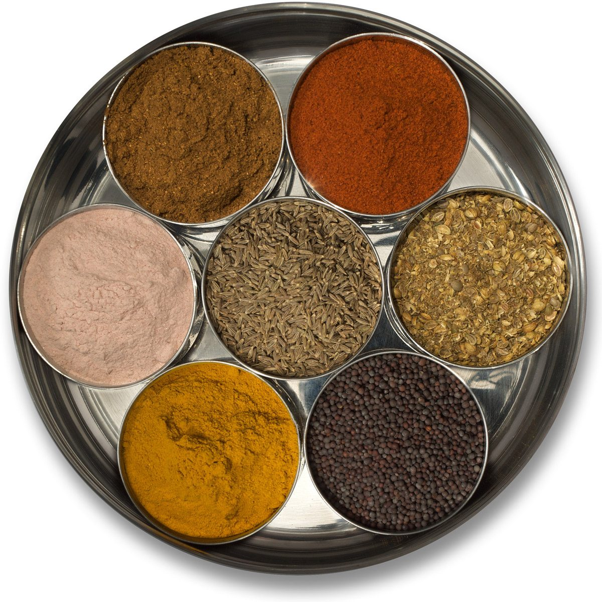

As the summer sun recedes and the autumn winds bring chilly rain, consider your digestive fire. During the warm summer months, our bodies need less fuel to warm us, and our digestive juices can take a bit of a holiday. As the weather cools, our bodies call for more warming foods and we may need to bring some heating digestive spices into our diet.
Ayurveda places great emphasis on agni, the fire principle, which manifests in the body in overall warmth and in the power of digestion (physical, mental and emotional), as well as in our vision, in our blood and skin. When our digestive agni is strong and balanced, we feel energized and clear, light and centered.
To kindle your digestive agni, here are a few common heating spices that are already available in many of our kitchens:

- **Ginger** can be used fresh or powdered. This pungent herb is stimulating and counteracts intestinal gas and bloating. Ginger makes food lighter and easier to digest. Grated fresh ginger with a little salt and lime juice can be eaten to boost our agni. A tea of powdered ginger mixed with hot water may be taken with honey to alleviate colds and congestion.
- **Black pepper** is another pungent heating spice that kindles agni. It increases the secretion of digestive juices and stimulates the appetite. Pepper is especially effective in helping to digest high protein foods such as cheese, meat and eggs. It is said to contain five of the six tastes: pungent, sweet, salty, bitter and astringent. Use in cooking or at the table.
- **Cinnamon** is an aromatic stimulant that is both pungent and astringent. Cinnamon also stimulates the digestive fire and has a natural cleansing action. It’s perfect to mix in with your morning cereal. It is also helpful to stimulate sweating and relieves cough, congestion and colds.
- **Cayenne** pepper is very heating, so use with caution. Cayenne helps to reduce the heaviness of food and makes it light, palatable and easily absorbable. Especially helpful when cooking dry peas and beans, cayenne strengthens digestion and causes sweating.
- **Cumin** seeds are aromatic, with a pungent and bitter taste. Roasted in ghee for a few minutes, the seeds add flavor to kitcheri (rice and beans cooked together) as well as to your favorite vegetable dish. Cumin aids the secretion of digestive juices and improves the taste of food.

A few other tips for improving digestion include:

1. eat only when hungry
2. eat fresh foods, freshly prepared
3. sit quietly and offer a prayer before eating
4. minimize raw foods (especially in cool weather), and
5. walk 100 paces after each meal

All this talk about food is making me hungry! Must be time for breakfast. Bon appétit!
- Pratibha
 Pratibha at her 70th birthday celebration
**Pratibha Queen** is a yoga instructor and Ayurvedic practitioner, who attends Salt Spring Center of Yoga retreats on a regular basis. Feel free to email with any questions that arise as you engage in health practices to support your yoga practice: pratibha.que@gmail.com.
