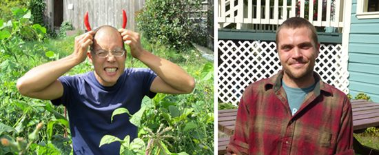
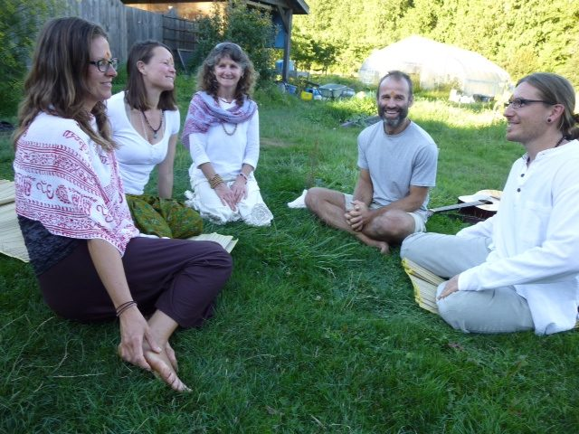
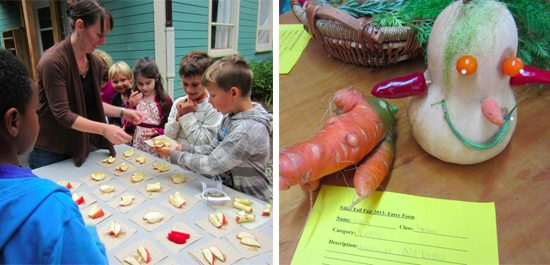

Hello everyone,
October is here - the month of Thanksgiving (in Canada), the celebration of bountiful harvests shared with family and friends, and also Halloween, an opportunity to don costumes and roam the streets with young witches, fairies, superheroes and monsters.
Jack will have left to join Julie in Colorado by the time you read this. We will miss him here, but we can’t compete with Julie. David Stewart, one of last year’s farm yogis, has taken the role of farm manager for the next season. He arrived in time to work with Jack and learn the ropes of managing the farm. Jack feels very confident in David’s ability to take on this role. When asked for comments, Jack described David as a ‘pirate clown farm yogi.” Those who know David will understand. Although it’s a loss having Jack leave, we’re delighted to have David back on board.
 Jack and David
The Hanuman and Ganesh temples have become the focus of revitalizing energy in recent months. Candles have been lit and prayers said each morning at these temples since Babaji installed them - as they have at  all the other altars in the garden area - but recently a great interest in devotional rituals has developed among a few of the karma yogis. Under Rajani’s guidance, they have been learning and practicing arati at both the Hanuman and Ganesh temples, and the spirit of devotion is in the air.
 After arati at the temple: Christine, Tana, Rajani, Raven, Ben
The Centre’s residential community, although smaller than it was in the summer, continues to work, practice and play together, as Babaji told us long ago: Work honestly, meditate every day, meet people without fear and play. A series of discussions on community living on Tuesday evenings has been followed by an 8 week Non-Violent Communication series. The many other class offerings continue: Living Yoga, kirtan, satsang, meditation and asana. We’re hopeful that Bhagavad Gita classes will resume after Shankar recovers from minimally invasive back surgery at the end of September. On Thanksgiving the Centre will host its annual community gratitude circle and potluck - the best vegetarian potluck on the island. We have so much to be grateful for!
 Nayana, Piet, Maya. Halloween 1982
I invite you to to read [Piet Suess’ story](https://saltspringcentre.com/2013/09/our-centre-community-piet-suess/) in Our Centre Community. Piet, of Hanuman Olympics fame, has been part of this community since he was two years old and already stepping into a leadership role. We’re also featuring more of our karma yogis this month in the article called “[Meet our Karma Yogis](https://saltspringcentre.com/tag/meet-our-karma-yogis/).” This month you get to meet [Sue Ann](https://saltspringcentre.com/2013/09/meet-our-karma-yogis-sue-ann-leavy/), [Ben](https://saltspringcentre.com/2013/09/meet-our-karma-yogis-ben-poulton/), [Leah](https://saltspringcentre.com/2013/09/meet-our-karmayogis-leah-hughes/) and [Zoe](https://saltspringcentre.com/2013/09/meet-our-karma-yogis-zoe-lee/). It is a delight to spend time with these inspiring people.
This month’s Asana of the Month - [Supta Padangusthasana or reclining big toe hold](https://saltspringcentre.com/2013/09/asana-of-the-month-supta-padangusthasana/) - was contributed by Julie Higginson, known to many of us as Jules. She is on the Centre’s YTT staff, serves as treasurer on the Dharma Sara Board, and manages to entertain us with her wit even when discussing ‘matters of consequence’ .
We introduce you also to a very recent YTT Grad, [Tana Dalman](https://saltspringcentre.com/2013/09/meet-our-ytt-grads-tana-dalman/), a karma yogi at the Centre, who completed her YTT training here in August and has begun to teach here. Tana also happens to be a dedicated karma yogi who, among other things, undertook to head up the dish crew at ACYR this summer, a daunting job that she did with joy, singing throughout.
You will enjoy this month’s Ayurveda article, [Stoking the Fire](https://saltspringcentre.com/2013/09/stoking-the-fire-spice-up-your-autumn-meals/), by Pratibha, our satsang sister from MMC, this one with recipes for helping us deal with the cooler weather, practical tips for all of us. I invite you also read [Letting Go](https://saltspringcentre.com/2013/09/letting-go/), about the struggle to let go, to surrender to God in the midst of our daily lives.
 Apples and honey for Rosh Hashanah; Fall Fair entry
It’s wonderful to hear the sound of children playing outside the The Centre School again. School has been back in session for a month, and it has been a busy month indeed. I had the honour of celebrating Rosh Hashanah (Jewish new year) with the children again during the first week of school. The kids, some as young as 4 (almost 5) shared their thoughts about the many things they’re thankful for, and reverently - in silence - placed offerings of special objects from nature on the altar we created. We ended the celebration in the traditional way, sharing apples and honey - for a sweet year. The next big event was a school family potluck. Following Salt Spring’s big Fall Fair, the school celebrated, as it does every year, its own Fall Fair, with the kids bringing animals,vegetables from their gardens, baking, and various collections - just like the real fall fair, but smaller (and no rides or candy floss).
A very happy Thanksgiving to you; may you have much to be thankful for.
With wishes for a sweet year to all of you,
Love,
Sharada
