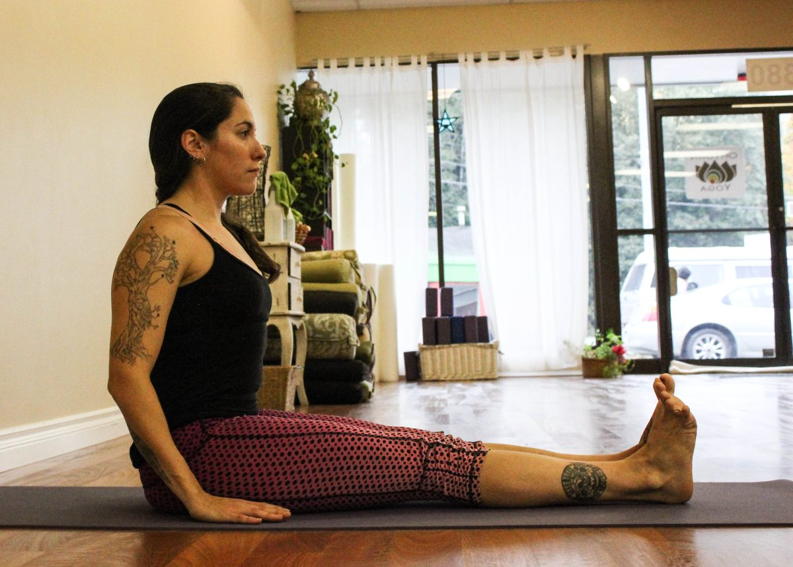
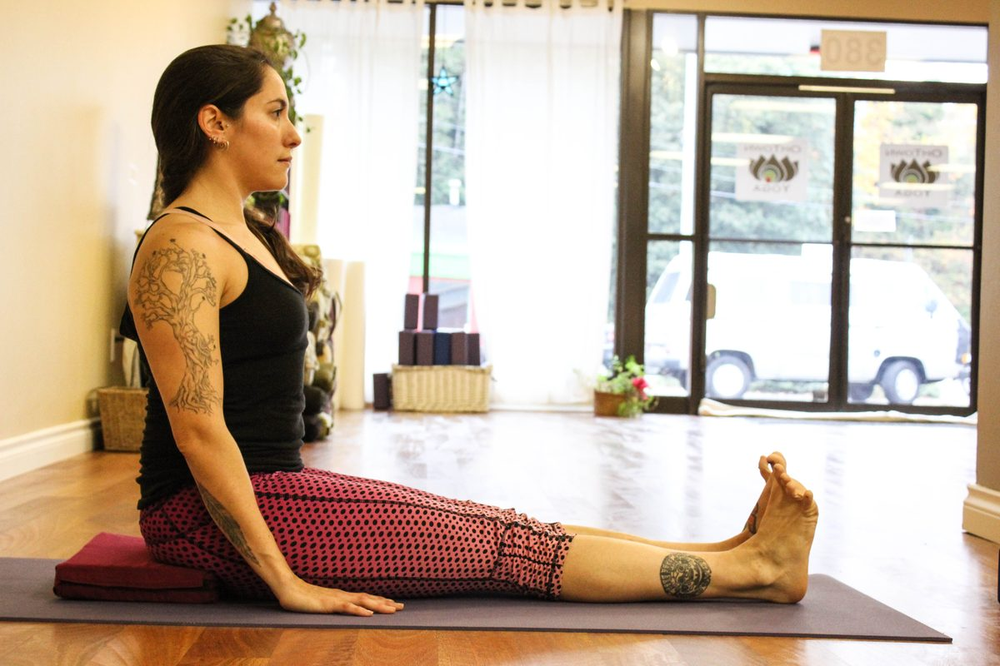
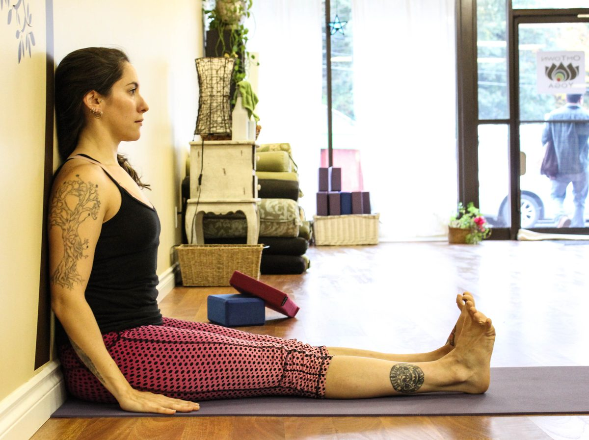
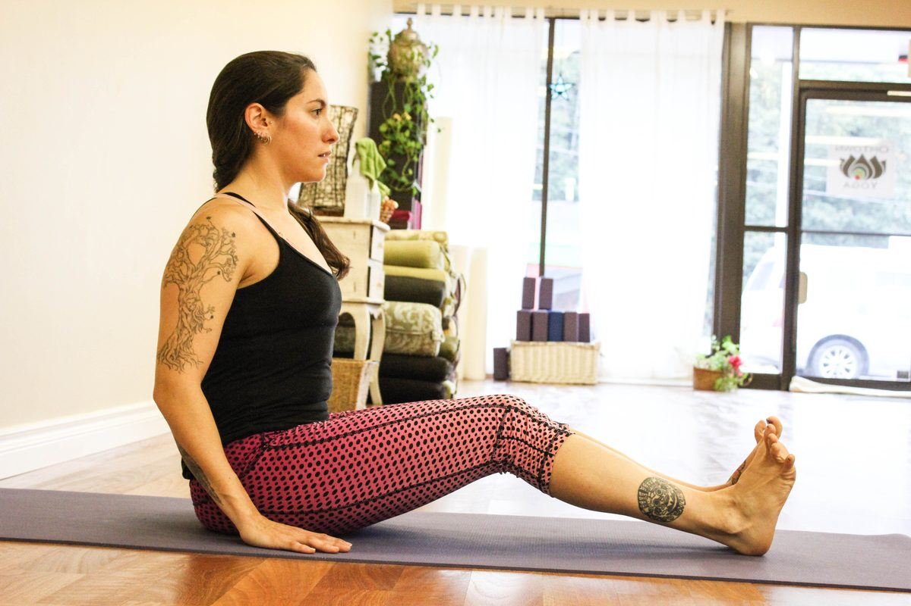
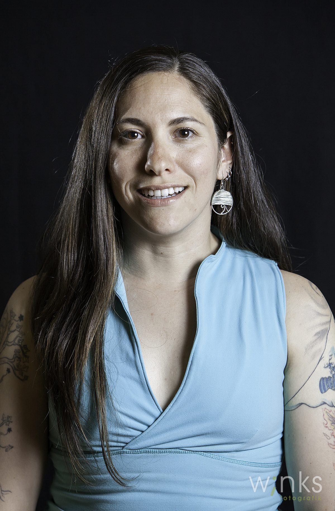

### Dandasana (Staff or Seated Mountain Pose)

This is a pose I use in every class. I like to use it at the beginning of a series of seated postures to help establish a start point, a centre of awareness of the core in the seated form. It also challenges students. When we move from standing asanas to seated asanas, it’s easy to lose connection with the breath and let the monkey brain take over with remnants of our day, the future, plans, “what’s that on my toe?”, et cetera. Start becoming aware of thoughts arising, and breathe! Be present in the pose and have a lovely journey.
[caption id="attachment\_8441" align="alignnone" width="553"] Dandasana, Staff or Mountain Pose[/caption]
**Benefits of seated mountain pose**

- Stabilizes the hip and pelvis
- Strengthens the core and lower and middle back
- Improves posture
- Creates full breathing for all areas of the lungs
- Stretches the hamstrings and calves

**Getting into the pose**
While seating on the floor with your legs stretched out in front you, move the fleshy parts of the buttocks to find a good connection of your sit bones with the ground, creating an anterior tilt of the pelvis. You might find you need to sit on a block to create the tilt or maybe you need to bend your knees if your hamstrings are singing.
Activate the feet, drawing the toes towards you. Engage the quadriceps to pull the kneecaps up and lengthen through the legs by pressing out the heels and pressing the legs towards the mat without locking the knee joints. This creates a slight inward rotation of your thigh muscles.
Arms are softly placed by the sides of the body, palms facing down. Engage the pelvic floor muscles, squeezing the root lightly and bring the belly button in towards the spine and upwards to activate the lower abdominal muscles (the ones between your belly button and the top of the pubic bone). Let the belly be soft.
Take a deep inhale and grow your torso from the waist up, continuing to lengthen through the crown of the head as your palms press against the earth, and as you exhale, let the shoulders relax into their sockets and slightly draw them down the back and draw the shoulder blades slightly towards each other broadening across the collar bones. Bend the elbows if your shoulders have started their journey towards your ears. Soften the lower ribs towards the back.
Take an inhale and on the exhale, tuck in your chin slightly with the intention of keeping the ears on top of the shoulders, Gaze towards your toes and breathe into all areas of the lungs, feeling the muscles between the ribs move. Continue breathing deeply in this beautiful and strong “L” shape you have embodied!
**Modifications**
[caption id="attachment\_8442" align="alignnone" width="553"] Modify by placing a block under your sit bones[/caption]
When having difficulties finding the anterior tilt of the pelvis, bring a block under the sit bones. Sit on the edge of the block to allow the sit bones to hang off of it. If your block is a bit tall and you have a tendency to hyperextend, place a rolled blanket under the knees to protect them.
Feet can be hip width apart to give room to the legs or hips.
[caption id="attachment\_8444" align="alignnone" width="553"] Modify by creating the “L” shape with your back against the wall[/caption]
Dandasa can also be done creating the “L” shape with your back against the wall. This will reduce some of the tension in the hip flexors.
[caption id="attachment\_8443" align="alignnone" width="553"] Modify by bending knees[/caption]
Knees can stay bent to allow the ham strings to stretch slowly and facilitate a tall seat without straining.
**Variations**

- This pose can be done connected with breath by lifting the arms on the inhale, relaxing the shoulders into the sockets and bringing the arms back down, repeat a few times.
- Arms can come up and stay up with palms facing each other as well as arms parallel with the ground with the palms still facing each other to create space in between the shoulder blades.
- Work with lifting one leg at a time and keeping the torso and hips stable.
- Arms come in a capital T shape at shoulder height and a small twist originates from the waist up. Switch directions.

**About the Instructor**
[caption id="attachment\_8446" align="alignright" width="322"] Varenka Jeevani Schwarz[/caption]
Varenka Jeevani Schwarz was born and raised in Mexico City where she completed a Bachelors Degree in Psychology. She moved to Canada in 2005 and studied Early Childhood Care and Education. Shortly after this move, she found yoga and realized the amazing benefits that her practice brought to her life and her city minded self.
In 2009, Varenka obtained her 200 hour YTT at the Salt Spring Centre of Yoga, where she has been lucky enough to return and teach in the same place where she deepened her practice and understanding of the philosophy behind yoga. Her love for children brought her to find Rainbow Kids Yoga, a marvelous program that integrates acrobatics, Thai massage and partner/group poses for children, families and community at large. She also found acroyoga and fell in love with it at first flight, assisting in several beginner workshops and playing any opportunity she gets.
Varenka is grateful that yoga crossed her path in life and that she has had so many amazing teachers throughout her yoga journey. She loves to share the joy and peace yoga brings to her life.
***Photography credits***
*Yoga postures by Chelsey Ellis*
*Portrait by Erin O'Reilly*
