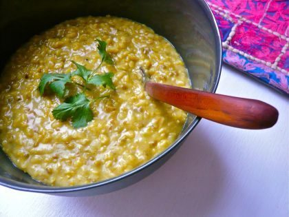

 Kitchari is a nourishing main dish
From hummus to minestrone, from chili con carne to kitchari, beans (known as dal in Indian cuisine) provide a delicious source of high quality nourishment. And during the colder winter months, our bodies require some high-octane fuel. As a staple food crop for humans throughout the world, beans have long been a rich source of protein, iron, and B vitamins. The cultivation of beans also nourishes the soil in which they grow. In Indian cuisine, dozens of varieties of dal are used.
**Ease their Digestion**Their concentrated nutrition means they can be difficult for some of us to digest. To avoid the flatulence for which they’re famous, here are a few hints:

1. Soak the beans well in water before cooking - overnight (or longer) for larger beans, an hour or so for smaller or split beans. (You can even sprout the beans, changing the water once or twice a day.)
2. Add heating, digestive spices (cumin, ginger, mustard seeds) to the cooking pot.
3. Eat only the quantity that you can digest.

Split mung beans are the lightest and easiest to digest. They combine well with rice in the Ayurvedic healing dish called Kitchari (spelling varies: kidjeree, kitcharee, kichidi are some variations). This nourishing main dish can actually be used as a mono-diet for a few days to help the body come back into balance.
Searching for a recipe, you’ll find hundreds. Kitchari is a common staple in India and Nepal; women will prepare it with whatever beans and grains are available in their area, not feeling limited to split mung beans and basmati rice. The ratio of beans and rice can also vary; a 1:1 ratio is common, but for a lighter dish, use more rice than dal. To make a heartier meal, you can use a larger proportion of the beans.
**Here is a basic Kitchari recipe:**
**Ingredients**
1 cup basmati rice
1 cup split mung beans
1 cup chopped green beans
1 cup chopped carrots
2 T ghee
1½ tsp cumin seeds
1 tsp fennel seeds
1 tsp mustard seeds
½ tsp turmeric powder
2 tsp coriander powder
1 T grated ginger
4-6 cups water
1-2 tsp salt
4 pods cardamom (peeled & ground) (~1/4 tsp ground)
Finely chopped cilantro
**Method**

- Soak rice and mung beans for 1-2 hours or overnight.
- Wash green beans and carrots and chop into 1-inch pieces.
- In a large saucepan, heat the ghee and add cumin, fennel and mustard seeds; sauté for about 1 minute.
- Add rice, mung, turmeric and coriander; sauté for about 2 minutes.
- Add ginger, carrots and green beans; sauté for about 1 minute.
- Add 4 cups water and bring to a boil.
- Reduce to medium heat, cover and cook for about 20 minutes until the mixture is tender.
- Add water as needed to keep from scorching.
- Add salt as desired at the end of cooking.
- Before serving, garnish with cardamom and cilantro.

More inspiring recipes are available in *The Salt Spring Experience: Recipes for Body, Mind and Spirit*. Amadea Morningstar’s Ayurvedic cookbooks also include some delicious bean dishes.
Wishing you happy, healthy and holy.
– Pratibha
 Pratibha Queen
**Pratibha Queen** is a yoga instructor and Ayurvedic practitioner, who attends Salt Spring Center of Yoga retreats on a regular basis. Feel free to email with any questions that arise as you engage in health practices to support your yoga practice: pratibha.que@gmail.com.
*(Photo of kitchari from [Taste Book](http://www.tastebook.com/recipes/2237332-Savory-Kicheree))*
