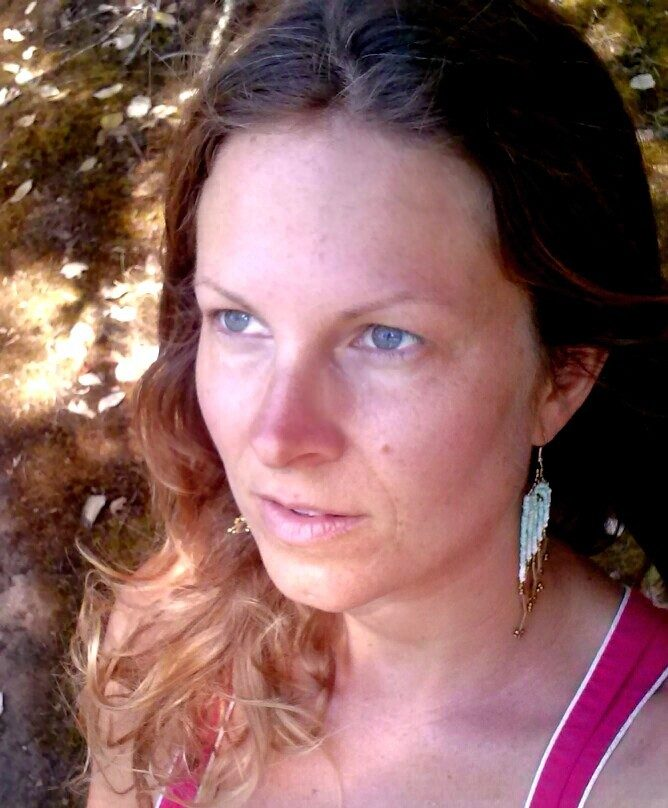

 Karma Yogi Christine
My background is in child protection social work, which I did for 4 years in Vancouver. An accumulation of physical and emotional suffering propelled me to take a break from the work and listen closer to my body and heart. My instincts told me to get involved in natural building with the Mud Girls on Salt Spring Island and so I did just that. The experience connected me more with the natural cycles of the earth, and with people who were using resourcefulness and creativity to build their own homes. It was very inspiring.
This joy of connecting with the earth and people led me to study permaculture and with that an intention to live more mindfully. I then saw that the foundation of this journey was to be a spiritual one. This led me to ashtanga yoga, first at Mount Madonna Center and then to the Salt Spring Centre. I was looking to be of service and learn in community with a spiritual intention. I’d had experience with yoga previously, but at this point I wanted to be steeped in it.
At MMC I was really drawn to the temple and found myself there, whenever my karma yoga schedule allowed, singing to Hanuman and Ganesha. I was finding a sense of peace while in ceremony. I was also more deeply seeing the value of friendship with the understanding that relating to one another with kindness and compassion is important in building sustainable and loving communities.
Here at SSC I have been enjoyoing satsang, study of the Bhagavad Gita and the temple. My interest in ceremony has led me to practicing arati and being more immersed in the teachings of Babaji. Honestly, I do want to learn how to farm, but farming is secondary to me; the spiritual teachings are what I’m drawn to. I’d like to be of service to spiritual community in any capacity I’m capable of. I do love being outdoors in the dirt with the birds and plants though.
As I reflect on this journey, I see that in being open to the divine plan, something I can’t even imagine comes onto my path holding all the teachings I need for my growth. It’s not comfortable or easy, but it helps me to awaken, to be present for all that comes.
