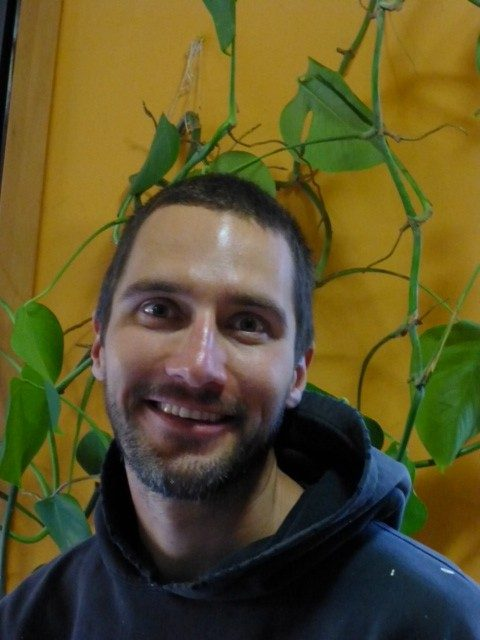

 Karma Yogi Ryan
I first heard about the Centre about six or so years ago, initially from a fellow karma yogi at Yashodhara Ashram. I checked the Centre’s website frequently, but the timing never worked out. I was doing forest fire fighting, which filled spring and summer. The best time for me was winter, but the Centre wasn’t open then.
I had been travelling for a year and a half, seeking out communities in Asia. Coming back to Canada, I still had the intention of coming to this community. I finally arrived at the Centre in the KYSS program on August 27, 2012 and enjoyed six weeks of permanent sun. I immediately fell in love with the island and knew I wanted to stay. After the Centre’s program season ended, I did a work exchange for a really nice family on the island, knowing I’d been accepted to come back to the Centre for the full 2013 season.
I’ve been working as assistant maintenance manager and landscaper. I enjoyed the variety of the work - trails, campground, flower beds. The temple committee has now tackled the terraces in the garden, beautifying them.
I love living in community. I love that the conch blows and there’s a perfect, warm meal provided and I only have to do dishes once a week. It’s incredible! I found a great connection to the other karma yogis, who have lots of fun at the centre - going for a hike, to the beach, to dances. I really enjoy teaching Friday morning asana classes, learning Qi Gong and deepening my appreciation for kirtan.
When the season ends I’m going to travel back to Saskatchewan to visit my family, and from there I’ll head off to Hawaii to work in a yoga community called Polestar.
I’m inspired by sustainable lifestyle, enjoying the moment, feeling happy and free and co-creating community. There are challenges living in community, but I don’t find it that difficult; working together feels great!
