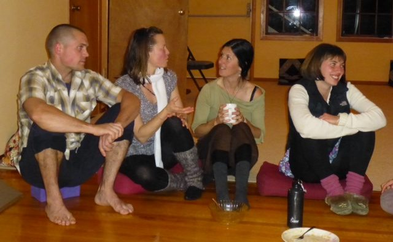
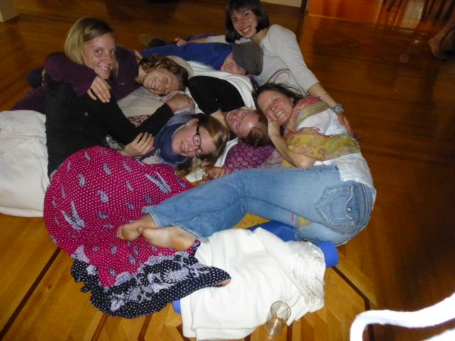
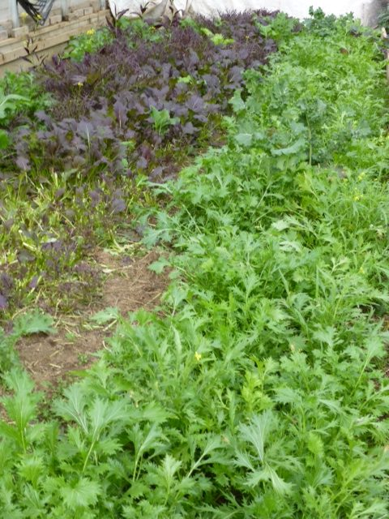
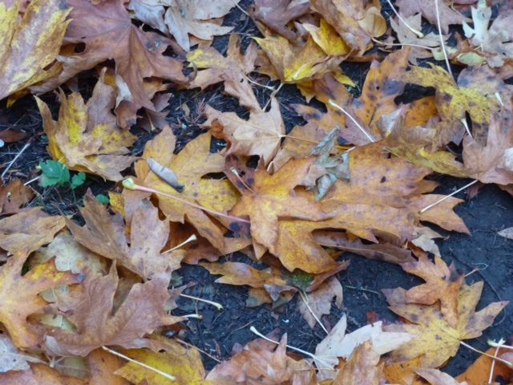
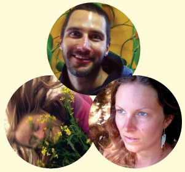
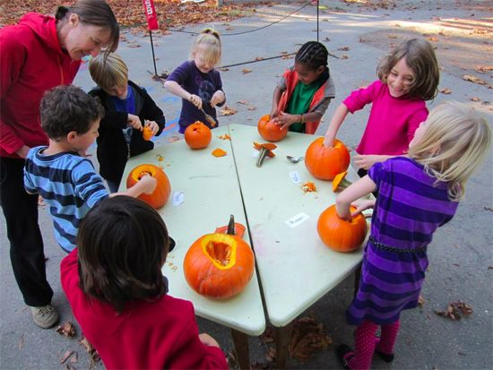

Hello everyone,
We are enjoying the last days of fall before winter sets in. The days are gradually getting shorter, nighttime coming earlier. During these months, we need to remember to keep the light burning inside our hearts.
Our Thanksgiving gratitude circle and vegetarian potluck was wonderful, as always; we have so much to be thankful for. Our meal circle was large, reminding me of summer retreat circles, although this one was in the satsang room rather than outside. For the Americans reading this, warm wishes to you for your Thanksgiving later this month.
 Dinner around the wood stove. David, Tana, Jenn and Leah.
The karma yogis at the Centre enjoy our delicious fall meals sitting around the fire in the satsang room. By mid month, after the program season ends, most karma yogis will be leaving, moving on to their next adventures. As happens every year, only a handful of people will be left at the centre during the quieter winter season.
 A karma yogi cuddle puddle
The farm will soon be put to bed; the front field will be plowed and planted with a cover crop. The field below the house still has vegetables growing in it, with a greenhouse full of greens for salads and for steaming.
 salad greens thriving in the greenhouse
I wanted to take a photo of the trees wearing their blazing golden leaves, but I waited a bit too long, so here instead is a photo of the next phase of the changing colours.
 The changing season
As the seasons change, we are reminded again of the ongoing cycles of nature. If you've been receiving regular updates you know that Babaji’s health has declined. As I write this, the current report is that his condition has stabilised and he remains peaceful. He is being well cared for by a dedicated team of caregivers. Regular updates are available on our website, [Baba Hari Dass health update](https://saltspringcentre.com/2013/10/baba-hari-dass-health-update/), listed under News and Update.
This is a time of reflection for many of us who have spent our adult lives with Babaji as well as all the other people who have met him over the years. Many of you, whether you’ve met Babaji or not, have been touched by his teachings in one way or another. The Centre exists because of his inspiration and guidance, and his teachings permeate the place. To honour him and all spiritual teachers, I invite you to read the article called [Honouring the Teacher](https://saltspringcentre.com/2013/10/honouring-the-teacher/).
 Karma Yogis Christine, Sherri and Ryan
Other articles offered for your enjoyment and learning include [Beans, Beans, the Musical Fruit](https://saltspringcentre.com/2013/10/beans-beans/) by Pratibha, an Ayurvedic perspective on cooking beans of all kinds (and making them digestible!), including a simple recipe for kitcheri, a balancing meal that works well for everyone. This month’s Asana of the Month is [dandasana (staff pose)](https://saltspringcentre.com/2013/10/asana-of-the-month-dandasana/) contributed by Varenka Jeevani Shwartz. Varenka uses this pose to begin a series of sitting poses, and in this article she adds several variations.
Also this month we continue introductions to some of our karma yogis in the article [Meet our Karma Yogis](https://saltspringcentre.com/tag/meet-our-karma-yogis/), the focus this time being on three of our full-season karma yogis: Christine and Sherri, two of our farm yogis who have been here since March, and Ryan, a returning KY from last year who has been working all season in maintenance and landscaping. The ‘[Our Centre Community](https://saltspringcentre.com/category/sscy-community/)’ feature will return in December (I hope).
 Halloween math - guessing how many seeds are in the pumpkins
The school, as always, is a busy place. Special events in November include a Peace Day celebration on November 12 organized by the Owls (the oldest kids in the school), the beginning of six weeks of yoga classes in the Garden House, as well as the annual Advent celebration led by Usha, a school tradition since the early years of the school. If you’re on the island on the evening of November 26, please join us - children, parents, community - to sing songs of light as the children walk through a spiral of cedar boughs and stars to light their candles and place them around the circle. It is a very uplifting occasion, reminding all of us to keep the light burning.
This little light of mine, I’m gonna let it shine,
This little light of mine, I’m gonna let it shine,
This little light of mine, I'm gonna let it shine.
Let it shine, let it shine, let it shine!
Love,
Sharada.
