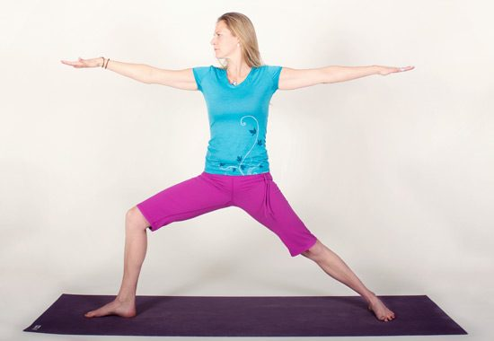
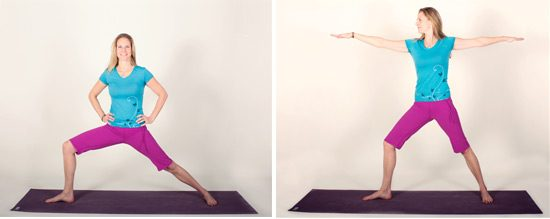
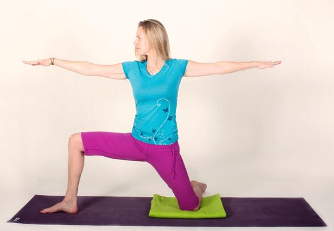
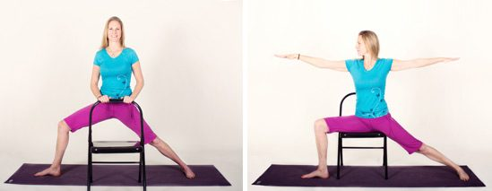

### Virabhadrasana 2 (veer-ah-bah-DRAHS-anna) - Warrior 2

[caption id="attachment\_8675" align="alignnone" width="550"] Priya demonstrates Virabhadasana 2[/caption]
Steady and strong, with strength and stamina. Virabhadrasana 2 can teach us a lot about the dynamics of bringing wisdom into the actions of our everyday lives. It is a powerful pose, no doubt, but as you explore the pose's alignment and inner attitude, the heart of the peaceful warrior begins to reveal itself offering confidence to face your fears, courage to move forward and compassion to embrace one another.
**Benefits**
Virabhadrasana 2 strengthens the legs, ankles, knees, arms, shoulders and aims to increase elasticity in the back and groins. Overall circulation in the body is developed, mental focus plus stamina is gained and the 3 doshas - kapha, vata and pitta (\* Ayurvedic science that aligns the mind-body- spirit\*) are brought back into balance.
When Babaji was asked about the pose he wrote -- it is good to work with the vayus, especially apana (with the necessary lifting of the pelvic floor and bringing in the lower belly to stabilize the trunk of the body) and udana (with the head turned to the side and the pressure put at Vishuddha chakra)--.
Virabhadrasana 2 tones udana, prana, apana and samana vayu. The Five Vayus (udana, prana, samana, apana, vyana) are the energies (prana) of the body that regulate and control all bodily functions. The word vayu means “wind”, so the vayus can be thought of as the “energy winds” of the body. When these energies are balanced, the body is healthy and all of its functions are optimized. Through understanding our own imbalances of these pranas, we are able to restore the balance of these energies and the health of the body.
**Entering the Asana**

1. Stand in the middle of your mat, grounding yourself in Tadasana (Mountain Pose). Initiate your training as a spiritual warrior here as you let go of life's external influences and distraction, bringing awareness to your core and solar plexus chakra (manipura) - related to the ability to be confident and in-control of our lives.
2. Step the feet one leg length apart with toes facing forward and heels aligned to one another. Engage the thighs as you firmly ground down through the feet. Keep your arms and shoulders relaxed and place hands on the hips. Hips stay facing forward and remain level. Bring your awareness to maintaining a Tadasana torso and allowing the focus to initially be on the legs.
3. Rotate your left leg out 90 degrees from the hip socket. Rotate the right foot in just slightly. The heel of left foot aligns with the arch or big toe knuckle of the back foot.
4. Legs stay firm, torso and hip points remain facing forward. Become aware of your breathing, establishing your own natural rhythm. Breathing is full and gentle, in and out, inhale and exhale.
5. Inhale and lengthen through the torso.
6. Exhale, bend the left knee and align the knee over ankle. Adjust your stance accordingly. Be sure to keep your big toenail visible. To keep the knee joint safe and to avoid twisting and collapsing in the front knee, take your left hand onto the inside of left knee and gently guide it toward the little toe side. In the full pose, the left thigh is parallel to the floor and the shin is perpendicular.
7. Inhale, raise the arms out to the sides, shoulder height and parallel with the floor, palms facing up, eye of the elbow facing the ceiling. Then with the rest of the arm stable, turn your palms down from the forearm. Keep the shoulders and chest centred over the hips. Then turn your head, and gaze toward the left hand. Breathe, feeling the length of your inhaling and exhaling.
8. Explore the feeling of your body weight from front to back. Distribute the weight evenly between the legs. Connect through all of the corners of your feet while lifting through the arches, discovering a point of equilibrium.
9. Maintain the natural curvatures of the spine, not leaning too far forward or back. Avoid over arching the low back by engaging into the core and lifting the lower belly button up, lengthening the spine. This action will awaken your centre, so you can begin to extend out of your lower back and expand the whole torso.
10. Draw the shoulders down from the ears, lengthening out through the arms.
11. Continue to be aware of your breathing, steady and slow, for 3-5 breathes. It is in the clear space of awareness that the wise actions within each moment can be found. In the deep lunge and open arms of Virabhadrasana 2, you may hear your internal warrior teacher giving you insights to bring you into balance not only in the present moment, but in your life as a whole.

**Coming out of the Asana**

1. Bring hands to the hips; stabilize through the feet.
2. Inhale, straighten left leg. Exhale, turn toes back to parallel.
3. Heel toe feet back together.
4. Return to Tadasana and repeat on the other side.

**Modifications**
Allowing the hands to rest at the hips, shorten your stance, or your gaze can remain in the direction the chest is facing.
[caption id="attachment\_8682" align="alignnone" width="550"] Modifications of the pose[/caption]
You may also initiate the posture from a kneeling position, or utilize props.
[caption id="attachment\_8681" align="alignnone" width="550"] From a kneeling position[/caption]

**Chair:** a) rest your arms on. b) sit on

[caption id="attachment\_8683" align="alignnone" width="549"] Using a chair as a prop[/caption]

**Wall:** a) place the body against. b) back foot pressing into wall.

**Your instructor,** **Tricia Hari Priya Ramier, E~RYT 200 & 500**
Tricia is a 200hr graduate of the Salt Spring Centre of Yoga and a RYT 500 hr graduate of Mount Madonna Centre in California. She is trained in classical ashtanga and hatha yoga systems, yin yoga, earned a Diploma in Human Kinetics and is excited about her path to become a yoga therapist.
In 2011, Tricia and her best friend opened the doors to Williams Lake’s first dedicated yoga studio ~[Satya Yoga Studio](http://satyayogastudio.ca/). In her yoga classes, Tricia weaves together mindfulness, alignment, strength and softness in a flow style practice. She guides students in a rhythm that allows them to move in harmony with their breath and to discover the obstacles / opportunities that are waiting to be met. The word Satya means truth, and she invites you to discover your truth.
*Photos by Jana Roller*
