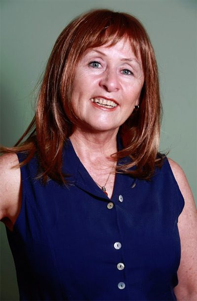
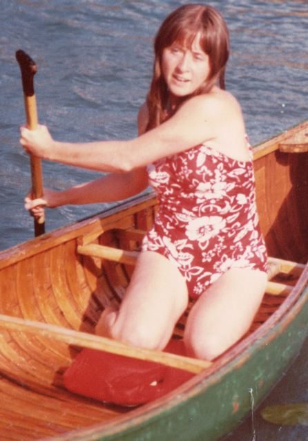
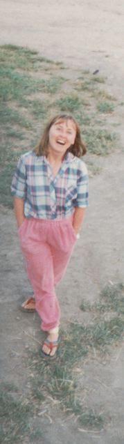
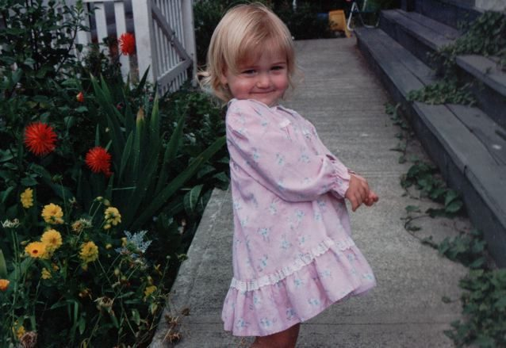
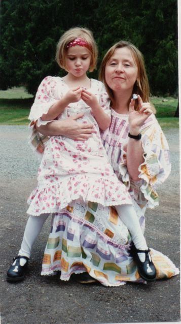
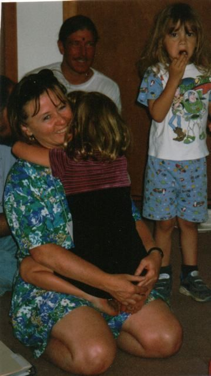
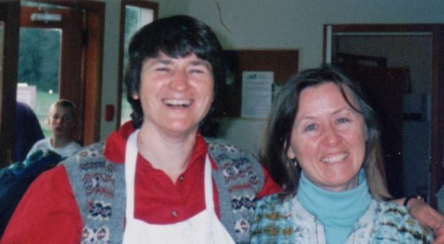

 Padma, part of our centre community
My grandmother was my first guru. I learned rhyming prayers to bless everyone I knew each night, that doing good leads to happiness and mischief to sadness. I couldn’t hide anything from her because she was a gifted psychic. She knew my hidden thoughts and still loved me – so precious. I wondered why my Catholic grandmother would often tell me how wonderful Jewish people were (much later I would learn a family secret - that her husband who died young was a non-practicing Jew tired of his dark-haired family being ostracized in Sweden).
My father was also my teacher. A somewhat cynical, yet very ethical atheist, he would ask me lots of questions about what I thought and wouldn’t let me simply take things on faith. I didn’t appreciate that my grandmother had to confess her psychic abilities because it was believed that such gifts were from the devil. Nor did I appreciate the criticism that atheists received. I longed for the peace that existed between my father and grandmother, to come together in a spiritual discipline that could applaud these and all different natures - majorities and minorities. Although different than his, my father respected my grandmother’s beliefs and agreed that I be brought up Catholic and attend Loretto Academy, a private Catholic school. My classroom window overlooked the Niagara River just before it plunged over the falls.
 Padma competing in the canoe races at the 1978 Oyama retreat
Loretto was where I met my spiritual sister, Varuna. Although sincere, my incessant questions in religion class were disruptive. Varuna was a protestant and wasn’t required to go to religion class, but she wanted to learn about religion, so the nuns arranged for Varuna and me to go next door for private religion classes. Next door was a Jesuit seminary that trained priests. We had private classes with Father Keith and we weren’t required to memorize dogma. He asked us to examine our hearts and minds and discover the truth for ourselves. He told us to examine our dreams for clues to our unique spiritual path. When I told him about a dream where I sat peacefully on the floor in a room with no furniture, he said I had a contemplative nature and directed me to read The Lives of the Saints.
A few years after high school, Varuna excitedly called to tell me she had discovered that the place I was dreaming about was a yoga studio. I believe it was 1969 when Varuna took me to a Kundalini yoga class in Toronto and it certainly seemed a lot like my dream. I started searching out all kinds of yoga classes, loved the practices and in 1974 took Yoga Teacher Training with Swami Vishnu Devananda in Paradise Island, Bahamas. After that I taught yoga classes in Vancouver community centres.
I think it was 1978 while I was working on the Queen Charlotte Islands that Varuna told me that I must see Baba Hari Dass who was meeting people in the back of Jai clothing store, as I would be visiting Vancouver for a short time when he was there. I remember opening a door in the back of Jai that made a horrible squeaking sound and looking inside and seeing about 40 people on the floor meditating quietly with Babaji at the front. I didn’t know what to do, because no matter if I came in or waited outside, the door would again squeak…….so I decided to enter.
There I was – enveloped in powerful meditative energy, face-to-face with Baba Hari Dass – experiencing that same peaceful feeling I had with my grandmother – of being known deeply. I had met my Guru.
 At the Centre, 1986
That New Year I went to Camp Swig near Santa Cruz for a retreat where I would see more of Babaji. Soon after the retreat my grandmother died. On her passing I experienced a horrible feeling of being alone in a worldly world. I needed someone wise in this world to guide me……so I wrote to tell Babaji that he was my guru. Babaji wrote back and told me I should move to Vancouver to be close to the satsang. Thus began my wonderful adventure with Baba Hari Dass and Dharma Sara Satsang.
Although I’d studied quite a lot of Yoga already, learning from Babaji was especially wonderful. He answered the question beneath the question I thought I was asking, giving me even more to ponder. I loved the practices of asana and pranayama, but wasn’t drawn to meditation. I remember asking him why we should meditate if we didn’t really want to……and he told me to try it out and experience why myself – the perfect answer for someone unimpressed with dogma!
Here are some of the factoids encountered while traversing this river of spiritual discovery called life – :
I spent 1980/81 living in the Euclid Avenue Toronto Ashtanga Yoga Fellowship satsang house while studying massage therapy.
I returned to Vancouver in 1981 and practiced massage at Dharma Sara’s Holistic Centre on 4th Avenue, where we held yoga classes and satsangs. On weekends we city folk, would often go over to “The Land” (The Salt Spring Centre for the Creative Arts and Sciences as it was then known) to reclaim it from blackberry bushes.
Eventually I lived in the Laurel Street satsang house with AD, Kalpana, Maheshwar, Shivani and others. Those were the days of Yogaerobics classes, where I lead fast-paced yoga moves to Madhab’s music and then we’d gab for hours after.
One of our gab sessions led to an idea for one of the first programs at Salt Spring Centre. We called it “More than Skin Deep”. It was a weekend where participants would get massage and natural facials, but also learn yoga. Participants liked it! - although a few things were dropped. Cold water hydrotherapy wasn’t a big hit. The name soon became Women’s Weekends and they were held for quite a few years and eventually transformed into today’s Yoga Getaways.
It may have been 1982 when I dropped off a press release and brochure to the Vancouver Sun…..resulting in a two-page article with colour photos of our Women’s Weekends. It brought lots of people to the program.
I think it was 1984 when I moved to Salt Spring and took part in a government grant where I learned computer skills and then worked developing and servicing programs – a very fun time – hard work too – creative – fine-tuning our programs and giving people, especially over-worked women from the mainland, that special time to relax and revitalize. Many returned to our annual and semi-annual yoga retreats.
A group of amazing people came together to serve the people in the programs - the Health Collective. As a resident of the land, I coordinated the Health Collective during the program weekends. Before Chikitsa Shala was built, we used little spaces all over giving massage, swedan, reflexology and facials. We would also work at retreats and for islanders, and fundraised to purchase the yurt years ago when Craig offered to sell his prototype to Salt Spring Centre for the cost of materials.
In 1985 I bought a small house on Salt Spring and planned on staying put.
In 1986, Doug from North Carolina came to the Centre to visit his friend Ambika, but she was off-island at the time. I married him, sold my Salt Spring house, and followed him to the US where we experimented with householder yoga for 20 years. Ultimately we decided this style of yoga was too difficult.
However, we discovered a very joyous aspect of householder yoga with the birth of our daughter Arpita. Although we were living in Seattle at the time, (1991), it was wonderful to have the satsang snuggly delivered from Salt Spring for Arpita. Raising such a bright, spirited and creative child was a privilege and a rewarding challenge.
 Jessy Arpita, 1993
 Padma and Arpita (still called Jessy), 1997
 Padma and Arpita (Jessy), 1997.
For kindergarten and first grade we returned to Salt Spring, and Arpita attended school at the land (the Salt Spring Centre School) and I again worked for programs. I wish I had taken a picture the day Arpita, Ceilidh and Sarah took mud baths and came streaking by the program house during a Women’s Weekend – a creative new spa treatment! Alas, no software jobs for Doug resulted in our moving to Texas in 1998. I missed not seeing Babaji or Salt Spring satsangis for a long time. I studied Traditional Chinese Medicine in Seattle and continued studies in Austin, Texas, eventually receiving my MS in Oriental Medicine.
In 2008 I returned to Niagara Falls to be with my mom during her last year. My life had always been so busy – working, actively involved in yoga and family life. All of a sudden I was focusing on what was important to my mother and all the day-to-day simple things of just being with someone who appreciated each day. I think that wonderful time helped me learn a little more about appreciating everything that comes to you – both happy times and difficult times. One thing we know for sure – they all pass.
 Padma and fellow centre community member Kishori, 1998
In 2010 I spent about six months at Salt Spring Centre again involved in programs. This time I was happy to be sharing that karma yoga experience with my daughter, Arpita. It’s wonderful that she also finds joy in karma yoga at Salt Spring Centre.
These days I find myself living in Niagara Falls, in the house that my father built the year I was born. I find satsang with a number of groups – many Buddhist. I spend Sunday nights doing vipassana meditation, Thursdays with the Thai Buddhists, Sunday mornings doing tai chi and qigong at the Chinese Buddhist temple. Wednesdays I study Vedanta with the Chinmaya Mission and Fridays and take a Yoga class at the Hindu Samaj. There are lots of Asians in Niagara Falls. I teach meditation courses through the local university’s Continuing Education and the occasional yoga workshop, mostly to my clients. I really feel that Satsang is important. Dharma Sara used to be my sole satsang...and now it takes several groups to fill that need.
Last New Year, Arpita and I were at Mount Madonna. Babaji wrote me a note saying that when I’m at Mount Madonna I should do a certain practice, but wherever I find myself, I can practice the way they do there. It feels so wonderful to know that Babaji has always understood me and leads me through this world with such wisdom. I have been very blessed to meet him and all the wonderful people of Dharma Sara. In Texas I lived on Tumbleweed Trail. Sometimes I feel that I’ve tumbled through life in a somewhat nomadic way. Perhaps I will again find myself spending a lot more with the wonderful people in Dharma Sara.
