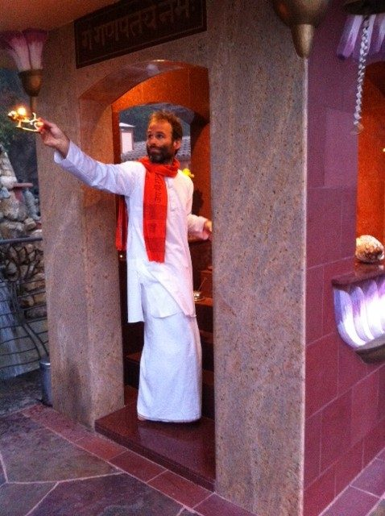
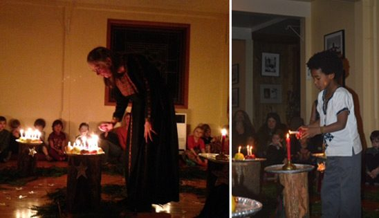

Hello everyone,
Life is quiet at the Centre now that we’re into our non-program winter season. Our community is once again small, and we sit together around one table at meal time.
 Winter sky
It’s dark by 4:30, and here in the country where there are no streetlights, flashlights are a necessity. We are fortunate to have a wood stove to keep us warm and cozy, especially when the power goes out, which is a pretty common occurrence whenever the weather is stormy. No snow yet, but who knows?
Arati continues at both the Ganesh and Hanuman temples, our dedicated temple crew having been inspired by a recent visit to MMC for further study and practice with Janardan.
 Raven doing arati
If you check [Babaji’s health updates](https://saltspringcentre.com/2013/11/baba-hari-dass-health-update/), you will see that his condition has stabilized. Although he’s not writing anymore, he still twinkles and his love is palpable. Later this month Mount Madonna’s New Year’s Retreat will carry on, for the first time without Babaji’s physical presence.
Toward the end of November, the Centre hosted the Centre School’s annual advent celebration of light that Usha initiated in the earliest years of the school; this tradition honours the many cultures that hold celebrations of light. Usha still guides the singing as the children walk the spiral of cedar boughs and stars. Next week the school will hold its annual Winterfest, a seasonal event for families, with craft tables for the children, music by local musicians, a wonderful concession with lots of goodies and a raffle draw for the many prizes that have been donated.
 Usha leading the Advent celebration of light; Sisaye lighting his candle
This month we will again hold our annual winter potluck and gift game. The gift game is known as the non-attachment game because there’s no guarantee that the gift you pick will remain yours at the end of the game. This event is a wonderful opportunity for the satsang community of Salt Spring to come together as a family to share food and to play. If you will be on the island on Dec. 11 and would like to join us, please contact Sharada for details (sharada@saltspringcentre.com).
We have several special offerings in this month’s edition. Pratibha has shared another informative Ayurveda article, called ‘[Keeping Kapha Content](https://saltspringcentre.com/2013/11/keeping-kapha-content-immunity-soup/)’, including a recipe for ‘Immunity Soup’ to support us in the cold winter months. December’s ‘Asana of the Month’ is [warrior 2 - virabhadrasana](https://saltspringcentre.com/2013/11/asana-of-the-month-virabhadrasana-2/) - contributed by Tricia (Hari Priya) Ramier, one of the Centre’s excellent YTT teachers. The feature ‘Our Satsang Community’ returns this month, with an article by [Diana Padma Bridges](https://saltspringcentre.com/2013/11/our-centre-community-padma-diana-bridges/), a member of our satsang since the 70’s, who has lived and worked at the Centre at various times over the years and remains closely connected.
Please read also ‘[Connection and Belonging](https://saltspringcentre.com/2013/11/connection-and-belonging/)’, reminding us of the importance of staying connected - to ourselves and each other. Also included in this issue is a beautiful reflection on the oneness of life, by Johanna Peters, called ‘[The Universe Reflected in One Grassy Knoll](https://saltspringcentre.com/2013/11/the-universe-reflected-in-one-grassy-knoll/)’. Thank you, Johanna, for the lovely reminder (and for bringing us a taste of summer sunshine in December.)
As we move through this season that’s often filled with busyness and stress, here’s a reminder from Babaji: *The best way for a householder to live a spiritual life is to serve their family with a feeling that God is in them. Contentment, compassion and tolerance are to be practiced in all acts of life. In this way life will get purer every day and peace will be attained. Wish you all happy.*
Love,
Sharada
