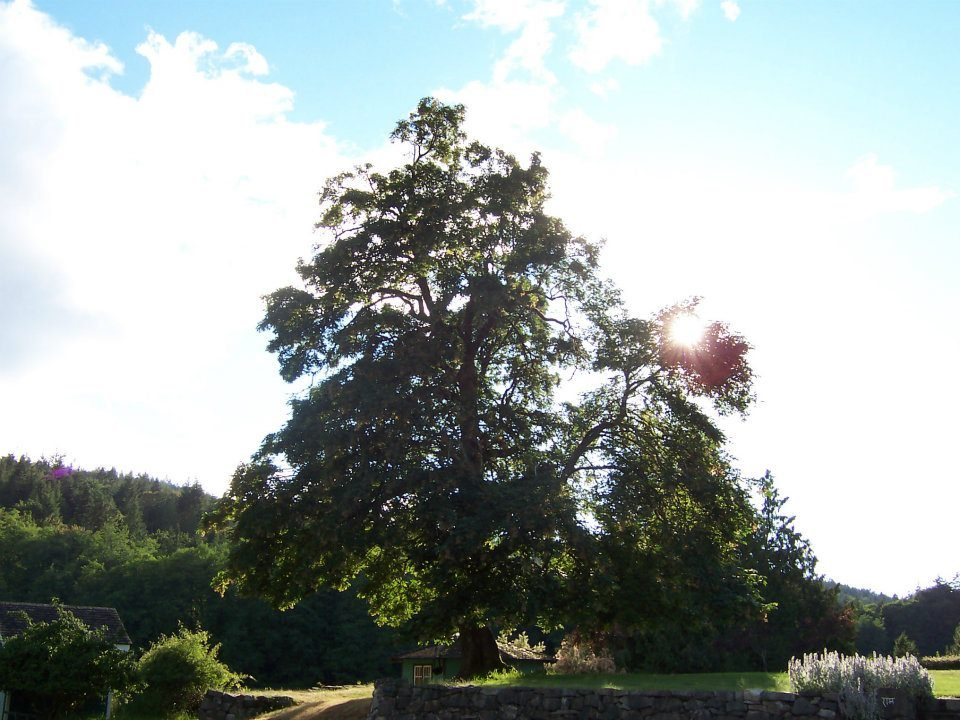

An ancient tree holds the grounded energy of this place. Its roots grow deep and wide, connecting all of us who are here, and reminding us of our eternal connection with all living things past, present, and future--stretching out into infinite space. The warm sun soothes and touches our skin, lighting up this little grassy mound that feels like the centre of the universe. The rays of light, though invisible, become fully tangible when they make contact with the body. This is a place where there is no need to define where we are in relation to anything else. It is a place where time and space have no relevance or meaning, and the eternity of the present moment is all that can and will ever be known. It is a place where the concreteness of the physical world merges with the no-thingness of the divine.
My hands caress the grass beneath me and feel the life contained in each thin blade. How beautiful to have my body supported by this living, growing carpet! I am but one of the countless life forms that this small grassy knoll supports. Beneath me the grass and dirt are teeming with insects and microorganisms---each one a unique and complete universe unto itself. This place reminds me how tiny and insignificant I am, and at the same time I am reminded of my own infinite expansiveness. What is it about this place that reflects so much truth and beauty?
Looking up, I see others just like myself, experiencing the same joy that I feel. The sweet sound of laughter drifts over to me. I have never heard a sound more perfect and wonderful in my life! The farm yogis cross in and out of the bountiful rows of vegetables, covered in mud and reveling in the joy of witnessing the fruits of their labour in full bloom. It seems to me that each day they become more and more a part of the land that they work with their bare hands. I wouldn't be surprised if one day they started to grow roots and shoot up towards the sky in exalted liberation--joining earth to sky, heaven to earth.
This place has stamped its memory into my being, and returning there in my mind awakens my body and my senses to experience it again as if for the first time. What I love most about this place is the way it makes me feel so alive. Like every cell of my body has come to life and is humming with the effervescent sparkle of being. The simplicity of the moment uncovers all of life's beauty and depth. I am overcome by it.
The rustle and movement of the people around me bring time back into my experience, and I am reminded that I have a job to do. The kitchen calls. There are vegetables to be chopped and hungry yogis to be fed. But as I move to go, to return to the world of time, duty and productivity, the quality of this timeless space remains, and I am reminded of its permanence.
Even as I return to the mundane tasks of everyday life, I recognize the truth of this place within myself. I know that what it has revealed to me cannot be lost because it exists at the core of my very own being. It remains within me wherever I go, and its perfection calls me back to myself whenever I forget to see the magic and beauty around me.
**- Contributed by Johanna Peters**
 
Johanna became connected to SSCY through a series of serendipitous events that allowed her to work at the centre as a karma yogi. She remains connected to the centre and Babaji’s teachings by attending Satsang in Vancouver, and has learned the most about the true spirit of karma yoga through her work with children. Combining her love of yoga and working with kids, she had the privilege of co-ordinating the kids program at this year’s Annual Community Retreat. The centre continues to be a place of spiritual nourishment, inspiration and connection for Johanna, and the support it provides has allowed her life to blossom and flourish in the most unexpected and delightful ways.
