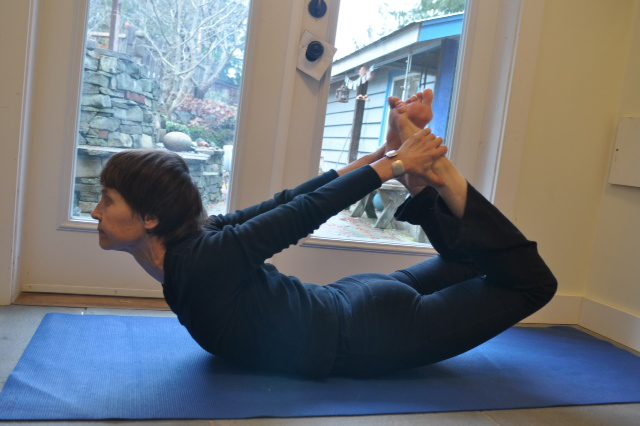
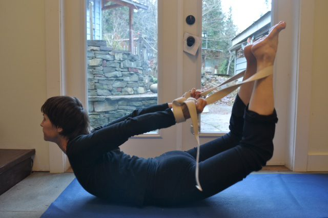
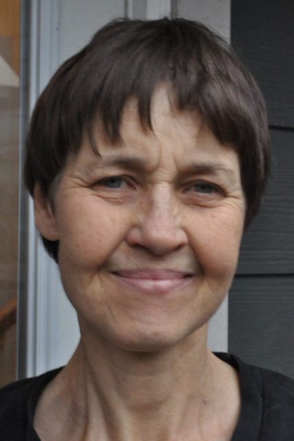

### Dhanurasana - Bow Pose as taught by **Jenny Shanti Collver**

[caption id="attachment\_8805" align="alignnone" width="576"] Dhanurasana pose[/caption]
Dhanurasana is a back bend which requires flexibility in the shoulders and thighs.
**Benefits**Bow Pose energizes the body and counteracts the effects of too much sitting. Stretching the front of the body increases blood flow to the digestive tract, enhancing the efficiency of the liver, intestines and stomach. Contracting the back of the body stimulates the kidneys and adrenals.
**Logos (shape, essence)**
The pose arches the body backwards into the shape of a bow as the arms reach back to the ankles, resembling a taut bowstring. Vishnu is often depicted with a bow in his hand, which is said to represent the five senses. The arrow represents our feelings, shooting out into the world.
**Entering the Pose**

1. To prepare the body for Dhanurasana, practice Salambasana (Locust), Bhujangasana (Cobra) and Balasana (Extended Child's Pose).
2. Fold a blanket into quarters and place it on the mat. Lie on the blanket, resting on your forehead.
3. Lift one leg a few inches off the mat and extend it back. Repeat with the other leg. The legs are slightly more than hip width apart. The belly feels long on the mat and the pubic bone is comfortable on the blanket.
4. Focus attention on the sacrum, pressing down on the top of the thighs and the lower abdomen. As you bend the knees, reach back to grasp the ankles.
5. With an inhale, keep pressing the top of the thighs and the lower abdomen onto the blanket and lift up, opening the chest as the shoulders pull back and the knees rise off the mat. Keep the neck long and the face soft. The front of the shoulder joint is vulnerable in this bound pose, so mobilize the shoulder blades out and up. Use knee extension to deepen extension in the hips and spine. When the feet and hips are in a line and the toes are flexed, the knees are safe. Don't allow the knees to bow out.

**Releasing the Pose**

1. Exhale, relax and release the bow. Lengthen both legs, bend the elbows, stack the hands and rest the forehead straight down on the hands for a few breaths.
2. Repeat the pose, staying up for 2 breath cycles, releasing on an exhale. Gradually increase the number of slow breaths you spend in the pose.

**After the Pose**
Roll to the back, bend the knees into the chest and gently roll side to side, massaging the lower back.
**Modifications**
[caption id="attachment\_8804" align="alignnone" width="576"] Modify with a strap[/caption]

1. If the shoulders or quadriceps are tight or the knees are sore, try half bow. Lie on your belly and extend the legs back and both arms forward. Bend the right leg, flex the right foot and reach the right arm back to grasp the ankle. Inhale and lift the right shoulder and the head, moving the right heel away from the buttock. Keep the left arm and leg extended, pressing them into the floor. Hold each side for 3 breath cycles.
2. Try a diagonal bow pose by holding the right ankle with the left hand, then holding the left ankle with the right hand.
3. Or use a strap. Place a strap under the ankles as the legs extend back and you lie on your face. Place one end of the strap into each hand, keeping the legs hip width apart. Bend the knees and flex the feet. Hands are on the strap, as close to the feet as is comfortable. Inhale, press the top of the thighs and lower abdomen onto the blanket, and extend the tailbone towards the feet to broaden the low back.
4. Inhale move the shins away from the buttocks and rise up. Exhale and relax down. Repeat, increasing the number of breaths in the pose with each repetition.

**Cautions**
Don't practice bow pose in the last two trimesters of pregnancy. Also, this pose might be uncomfortable for nursing mothers. Get advice from your doctor if you have diagnosed disc disease or spondylolyis.
**About Jenny Shanti Collver**
[caption id="attachment\_8806" align="alignright" width="256"] Instructor, Jenny Shanti Collver[/caption]
Jenny Shanti Collver has been practicing Yoga since 1973 in Vancouver. She worked at the Salt Spring Centre School as Usha's assistant from l987 to 2002. She obtained her 200 hour RYT at the Salt Spring Centre of Yoga in 2007 and taught yoga for a few years at the Ganges Yoga Studio. She studied Restorative Yoga with Judith Lasater in 2007, and is certified to teach as a Relax and Renew trainer. Jenny worked with Cathy Valentine in 2012, completing her 500 RYT in the Traditional Yoga Apprenticeship in practice and teacher training.
For the last few years, Jenny has been teaching yogis from the Salt Spring community, karma yogis and yogis on personal retreat at the Salt Spring Centre of Yoga. The study of Yoga asana and the aging yogi is Jenny's most recent study.
She lives on a small farm on Salt Spring Island, where she raised her two daughters, Arianne and Melaina. For many years she has raised angora goats (whose hair she dyes, spins and weaves), donkeys, dogs and cats.
