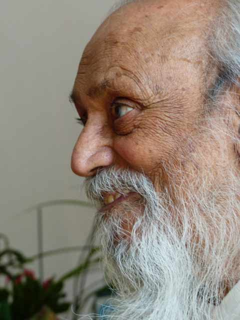

[caption id="attachment\_8803" align="alignright" width="307"] Babaji[/caption]
The beginning of a new year is a time to reflect on how the past year has gone and to resolve to make some changes in the one that’s just beginning. Generally our resolutions have to do with losing weight, starting an exercise program (again) or committing to some path of action. The new year can also be a reminder to ‘come back to where you once belonged’ (Beatles, circa 1967), asking the big questions: Why am I here? What is my purpose in life? Who am I?
In the Sufi master Rumi’s ‘Table Talk’; (quoted in ‘The Tibetan Book of Living and Dying) there is the following passage:

“The master said there is one thing in this world which must never be forgotten. If you were to forget everything else, but were not to forget this, there would be no cause to worry, while if you remembered, performed and attended to everything else but forgot that one thing, you would in fact have done nothing whatsoever. It is as if a king had sent you to a country to carry out one special, specific task. You go to the country and you perform a hundred other tasks, but if you have not performed the task you were sent for it is as if you have performed nothing at all. So man has come into the world for a particular task, and that is his purpose. If he doesn’t perform it, he will have done nothing.’ Sogyal Rinpoche goes on to say ‘The task for which the “king” has sent us into this strange, dark country is to realize and embody our true being.”

As we flounder on our path to realizing our true being, Babaji reassures us: *Everyone makes mistakes in life. That’s the way people learn. If one says, “I am a sinner, I am not worthy of attaining liberation,” then one can’t progress. Liberation is for sinners. Liberation is not for those who are already liberated. So counting your sins and doing nothing will not do any good. Don’t dwell in the past and don’t worry about the future. Just make your present positive and peaceful.*
Liberation is waking up from the dream of ourselves as separate, individual egos, each with our own story of who we are. Whether one talks about realizing one’s true nature, Self realization or finding God, the awakening is the same.
In answer to the question, “How do I find God?”, Babaji answered: *Open your heart in front of God and your prayer will be heard. A yogi searches for God in the world and says, “This is not God…..this is not God…….this is not God,” and thereby rejects everything. As soon as God is found, the yogi says, “this is God…..this is God…..this is God.” God is seen in everything, and everything is accepted.*
There is a lovely story in the book “One Hundred Wisdom Stories from Around the World”, compiled by Margaret Silf, called “God in Hiding”:

“A legend tells how, at the beginning of time God resolved to hide himself within his own creation.

As God was wondering how best to do this, the angels gathered round him.

‘I want to hide myself in my creation,’ he told them. ‘I need to find a place that is not too easily discovered, for it is in their search for me that my creatures will grow in spirit and in understanding.’

‘Why don’t you hide yourself deep in the earth?’ the first angel suggested.

God pondered for a while, then replied, ‘No. It will not be long before they learn how to mine the earth and discover all the treasures that it contains. They will discover me too quickly, and they will not have enough time to do their growing.’

‘Why don’t you hide yourself on their moon?’ a second angel suggested.

God thought about this idea for a while, and then replied, ‘No. It will take a little longer, but before too long they will learn how to fly through space. They will arrive on the moon and explore its secrets, and they will discover me too soon, before they have had enough time to do their growing.’

The angels were at a loss to know what hiding places to suggest. There was a long silence.

‘I know,’ piped up one angel, finally. ‘Why don’t you hide yourself within their own hearts? They will never think of looking there!’

‘That’s it!’ said God, delighted to have found the perfect hiding place. And so it is that God hides secretly deep within the heart of every one of God’s creatures, until that creature has grown enough in spirit and in understanding to risk the great journey into the secret core of its own being. And there, the creature discovers its creator, and is rejoined to God for all eternity.”

Babaji says: *Searching for God outside is like looking for your son who is sitting on your shoulders. Our search for God outside is simply a method of finding God inside.*
*God is not somewhere else; you are God. You are God and you are in God. It’s simply a matter of acceptance. Accept yourself, accept others and accept the world. You will see everything is full of love and love is God.*
contributed by Sharada
