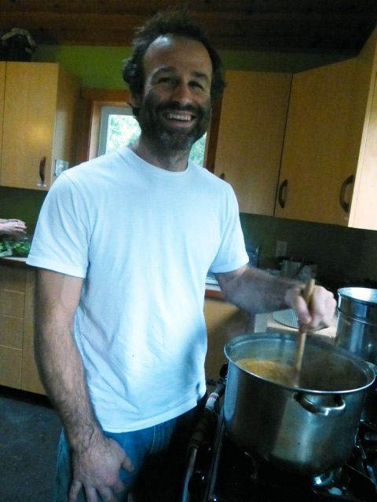
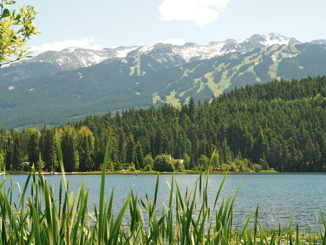
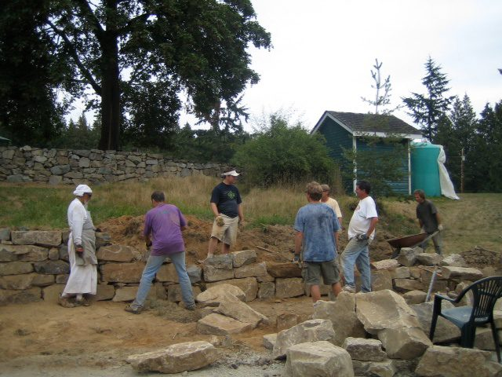
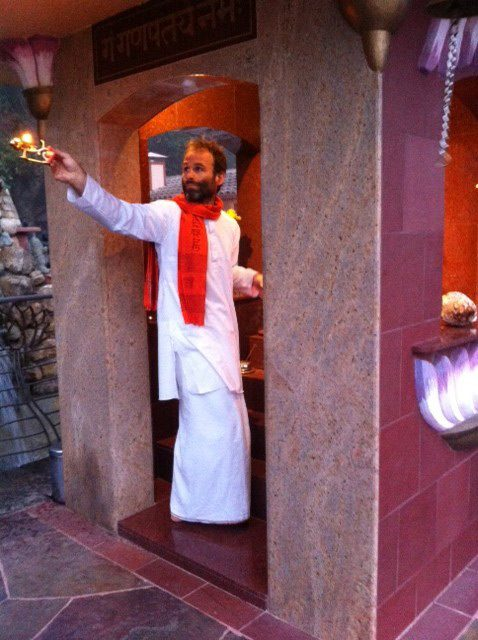

 Raven, part of our centre community.
In 1991, I was living in Vermont as an undergraduate student and college hockey player when I started to hear tell of “a yogi who was living up in the hills nearby.” My friends would return from visiting with him with soft, glowing eyes, warm hearts and kind laughter. Despite being a musclebound jock, I still had a huge soft spot, and their smiles and radiance spoke to a deep part of me. They would tell me about how he took them into his tiny house, how it had a wood burning stove, how his family was there and there was “macrobiotic food” cooking away. I was entranced, but somehow couldn't generate the avenues to make it up there. If I recall correctly, I even tried to find the place, asking around at the corner store in the area where I thought he lived – to no avail. Ultimately, I had to content myself with learning from my friends one of the techniques he had taught them. It was called, “alternate nostril breathing.” I graduated without meeting this man, but these were the first glimmerings of my practice of yoga and of a particular magnetism which I ended up finding out more about only recently.
I've always had an appreciation for radiance. When I was three or four, I remember walking up the driveway of our suburban Toronto house and seeing the neighbours walking down theirs. Something about them was radiant and peaceful and moved me enough to tug at my mother's sleeve and communicate a wondering. It must have been something along the lines of, “wow, what's up with them?!” Because she looked at them, then me and said, “oh... they don't smoke or drink.” It wasn't really a comment about smoking or drinking per se, but rather said something about discipline, about the possibility of living an alternative life... a life of radiance... the possibility of not “running with the herd” as Andrew Cohen would say at a later time. To this day, I recall my young mind saying, “when I grow up, I'm not going to smoke or drink.”
 Early darshan with a Saint. Me and my brother Billy.
We lived the suburban dream of commuting to achieve success in school, playing on sporting teams to achieve the Christian ideal of the healthy body, and periodically attending churches to achieve, perhaps, a moment of relative peace, relative beauty, relative community. But behind the scenes, there was something lurking. As one of my current heroes, Charles Eisenstein, writes, “I (like many others) felt a wrongness in the world, a wrongness that seeped through the cracks of my privileged, insulated childhood. I never fully accepted what I had been offered as normal. Life, I knew, was supposed to be more joyful than this, more real, more meaningful, and the world was supposed to be more beautiful. We were not supposed to hate Mondays and live for the weekends and holidays. We were not supposed to have to raise our hands to be allowed to pee. We were not supposed to be kept indoors on a beautiful day, day after day.” I remember a small placard in the change area to our suburban swimming pool.
Behold the fisherman
He riseth early in the morning,
He waketh the whole household.
Many are his preparations,
Bountiful his expectations,
BUT
He returneth late in the evening,
Smelling of strong drink,
And the truth is not in him.
Reciting this aloud at eight years old seemed to bring a certain delight to my family, and an avenue of self-expression for a certain background anxiety for me. What was it about our preparations and expectations that was 'driving us to drink?' I began to see that “the truth” was powerful and important.
A highlight of my youth was brief exposures to nature through my father. Each summer, we would go on camping trips in North Ontario. Sometimes to a river near Georgian Bay. Sometimes to a beach on Lake Huron. Just the other day, spreading the grass mats out for Arati at the centre, their scent took me back to this beach. I could feel the sand between my toes... smell the apple fritters my dad brought back from the local bakery... feel the sun and wind of Lake Huron. Swimming in those waters, smelling the pines, feeling the sun and hearing the sounds of the forest at night would plant the seeds of connection to the elements and to ecology, a relationship which has been crucial to my awakening and healing.
 The beach on Lake Huron.
In the ninth grade, our English teacher had us read “Siddhartha,” by Herman Hesse. The most compelling thing about it to me was the way it introduced the sound: “Om”. Something in me intuitively understood and resonated with it. Our homework was to create a “book cover”. Mine was the word “Om”, stylized, with a person walking down a path into the “O”.
Fortunately, during that time, I saw the beauty of life and nature, because by the time I reached 16, like most teenagers perhaps, I was feeling an immense amount of anguish and pain. In the midst of striving to “be somebody” in academics and on the hockey rink, as Charles writes, “the Age of Aquarius had morphed into the age of Ronald Reagan.” I was surrounded by the mid-eighties messages of hyper consumerism and the rise of the corporate state. Gordon Gekko's “greed is good” speech in the movie “Wall Street” was not necessarily being seen as a recipe for failure. Moreover, my burgeoning love affair with the natural beauty of Northern Ontario was up against ever increasing evidence of despoilment and the ravages of industry. The spiritual bankruptcy of my surroundings seemed complete.
I was indeed very fortunate, because in the maelstrom of inner turmoil, two things happened. One was that I heard the most beautiful sound outside. It was a small bird, and its chirp was astonishing. It seemed to show me that despite appearances, there is a beautiful, benevolent force and existence at the core of life that is imperishable. The other thing that happened was that somehow I had the insight to realize that one day I would die naturally - that one way or another the pain and anguish would have an end, and that that day would come soon. I made up my mind that if the pain was going to stick around, tempting me to deny this imperishable beauty I had discovered, then just to spite it I would live with it. I would “just allow.” I seemed to have come upon a version of the insight, “this too shall pass.” This was the best thing I could have ever done. I found myself able to move on. It was perhaps the beginning of the realization of the power of surrender.
In my late teens, I fell in love, but was perhaps doubly confused and frustrated, not only when the relationship didn't last the apparently necessary move to university, but also when the love I was feeling didn't seem to engender a matching level of integrity, truth and honesty. I found myself asking, “what does it take to live a life of true love and affection?”
 Armoured up.
It was at this time that I started to hear about the yogi in the hills, and while I was working to attend to my academic duties, I also fanned the flames of a creative revival of sorts: I started a rock band with some friends. After two and a half seasons, I left the hockey team. I took up “big brother” service with a young boy in the neighbourhood. I wrote poetry. I explored dance and theatre. I managed to explore some courses which hinted at the possibility of true freedom... true peace, true affection... I studied Thoreau , Shakespeare, and many others whose work hinted at transcendence and the Creator at the heart of nature. I saw the beginnings of the enquiry into true nature – into release from suffering, into the “fullness of life,” but nonetheless, graduated with a sense that something was missing.
I had an opportunity to teach English at a secondary school just outside of New York City, but decided to turn it down. Something in me knew that I had more to discover. On the plane ride out west that fall, through a bizarre coincidence, I sat next to a man who at the end of the flight said to me “You should check out J. Krishnamurti... I think you'll like him.” The library in Whistler had one text by the man: “Education and the Significance of Life.” Very quickly, his message began to become clear: all conflict on the planet has the same source – a search for “psychological security.” I was immediately captured and astonished. Why don't they teach this stuff in college, I wondered? Krishnamurti's work supported my first headlong dive into the realization and practice of true-nature, of Self, of Yoga. The fullness of life which I was seeking was to be found in exposing the falseness of the idea of the “personal, psychological ME.” He wrote: “The self is made up of a series of defensive and expansive reactions, and its fulfilment is always in its own projections and gratifying identifications. As long as we translate experience in terms of the self, of the "me" and the "mine", as long as the "I", the ego, maintains itself through its reactions, experience cannot be freed from conflict, confusion and pain. Freedom comes only when one understands the ways of the self, the experiencer. It is only when the self, with its accumulated reactions, is not the experiencer, that experience takes on an entirely different significance and becomes creation.”
I got the message, and was entranced by the grace and skill with which he led his life and spoke with people. I embarked on a journey of studying his work very deeply, and despite his harsh critique regarding the manner in which the west was adopting “Eastern spirituality” and Yoga, I simultaneously moved into the insights and practice of Patanjali yoga.
For eight years, I spent my winters in the mountains, finding enough work to “pay the rent” as I deepened my practice and study. I was a builder, a taxi driver, a daycare worker, a lift operator on the mountain. My summers were spent in Ontario as a wilderness camp guide, director, and coordinator. The health, healing and vigour that I was discovering through leading a “simple life close to nature” found my appreciation for natural beauty growing. I began to see the power and importance of a certain conscious austerity. True to my childhood vow, I found myself neither smoking nor drinking - not a sign of integrity in and of itself, but an expression of a deeper focus, a deeper calling and urgency. My youthful hunch of a certain “wrongness” - a certain lack of truth – was finding its sources. I came to see, like my hero Charles, that our culture's apparent wealth and security was merely “a bubble built on top of massive human suffering and environmental degradation.” He goes on to say, “... as my horizons broadened, I knew that millions were not supposed to be starving, that nuclear weapons were not supposed to be hanging over our heads, that the rainforests were not supposed to be shrinking, or the fish dying or the condors and eagles disappearing. I could not accept the way the dominant narrative of my culture handled these things: as fragmentary problems to be solved, as unfortunate facts of life to be regretted, or as unmentionable taboo subjects to be simply ignored.” We all have a need for integrity, for truthful, loving action. I could see that the solution for me lay in living and understanding yoga and the liberation teachings to the core.
In attempting to live a life which was vulnerable to truth, I lived with a tension. Krishnamurti's words regarding yoga rang in my ears: “It's about unitive consciousness, not all this other racket.” And yet push seemed to be coming to shove. My enthusiasm for wilderness guiding and life in a sporty ski town seemed to have taught me all it could. It was time to move on, but to what? In the summer of 2003, I was burning. Everyday I would sit, somewhat embarrassed, in between two cabins on the shore Alta lake in Whistler, obviously having a crisis. Feeling the burn of “not knowing.” Finding the breath. Letting the mental noise pass by like so many clouds. The scent of the mountain wildflowers was intoxicating, the fluff from the cottonwood trees was blowing over me like warm snow.
 Alta Lake, Whistler. Great spot for a crisis.
Despite my fear that I was getting involved in “all that other racket”, I decided to do a yoga teacher training, and stumbled upon one in the Kripalu tradition – a tradition with which I had had a good deal of experience. During the training, and with my new circles of friends in the city, I started to hear about the “Salt Spring Centre”. A friend of mine said, “you could go there.”
I decided to go, was accepted, and was immediately impressed by the kindness, inspiration and creativity of the people whom I began to meet. I found a home for my enthusiasm for study, practice, and for serving and supporting people in theirs. I began to explore Babaji's written work, and there was an Eckhart Tolle video group in the yurt every Monday evening. A consistent invitation bubbled through it all: Attaining peace through the “perennial teaching” - the teaching of “true nature.” The teaching of the Self which exists despite thought, imagery and thinking. At one point, Eckhart questioned, “what does it mean to be enlightened?” He said, “it means you are very present.” Like Krishnamurti, Babaji wrote, “violence and ego consciousness can't be separated. So long as there is individuality to be defended, there will be violence.”
When at long last the day arrived when I would see and meet Babaji, I was working in the kitchen and was told that I would see him out on the mound, under the maple tree. Washing dishes at the sink, I peered out towards the mound and saw him sitting there. A feeling of relief and delight washed over me. Instantly I could sense that he didn't need anything from me – that he didn't have any psychological agendas, that he wasn't stirring up any drama – any racket. I could see that he wasn't pushing anything away, wasn't living in any ideas, and wasn't living in any expectations. He was simply “very present.”
Since that day, over nine years ago, I have had the great fortune to be able to serve regularly at the centre. With Babaji's support, my principal aim has been to attain peace - to be in my deepest spiritual enquiry, my deepest warmheartedness, and to support others in being in theirs. Meeting and working with Babaji has been a delight. I've returned year after year to be a resident and to work primarily in the garden and kitchen. I have also enjoyed regular participation at satsang, kirtan evenings, yajnas and celebrations. In that time, I have consistently received warmth and support from the many people who are inspired by Babaji and who mirror and embody his selflessness. The Sattvic climate generated by the people and practice at the centre and the focus on cultivation of positive qualities has supported my deepest values and awakening. I am so grateful to all who have done 'the work' of being kind. The work of supporting and holding space for Yoga and Self-realization.
 Working with Babaji and the rock crew on Babaji's most recent trip to Salt Spring.
So there is a punchline to the story of the yogi who lived up in the hills of Vermont. A few months ago, I found myself reminiscing about those times (over twenty years ago!) and I thought, “hmmn... what was that fellow's name again? Prem something... Prem Prakash!” On a whim, I “googled” his name and found that he had continued his teaching career and had started a yoga school. I looked at his bio and was delighted to see that his Guru is none other than Baba Hari Dass! So as I turned my youthful attention to the possibility of a life of meaning, Babaji's grace was instantly there, calling to me from across the miles through the radiant eyes, smiles and hearts of some students of his student. May we all surrender to our love - to living the teachings - and know the effect our simple exchanges have on each other as we fall into grace - into the fullness of life.
 Performing Arati in the Temple at Mount Madonna.
